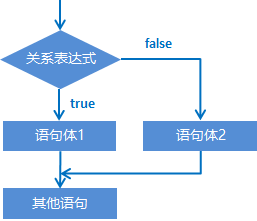

## 第一章 运算符

### 1.1 逻辑运算符

#### 1.1.1 而且和或者

分类：

​	& 逻辑与，建议读作并且、而且。

​		表示需要同时满足左边和右边才可以。

​	|  逻辑或，建议读作或者。

​		表示两边的条件只要满足其中一个就可以了。

代码示例：

```java
//& 而且
//规则：两边都为真，结果才是真。只要有一个为假，结果就是假
System.out.println(true & true);//true
System.out.println(false & true);//false
System.out.println(true & false);//false
System.out.println(false & false);//false

// |  或者
//规则：两边都为假，结果才是假，只要有一个为真，结果就是真
System.out.println(true | true);//true
System.out.println(false | true);//true
System.out.println(true | false);//true
System.out.println(false | false);//false
```

##### 应用场景一：

​	用户在登录的时候，需要用户名和密码这两个同时输入正确了，那么才是可以的。

​	此时就是两个条件同时满足，用并且。

##### 应用场景二：

​	丈母娘跟女婿提要求：需要有房子，或者有车子就可以穿走我的小棉袄。

​	此时就是两个条件中只要满足其中一个即可，用或者

#### 1.1.2 异或

这个知识点不重要，后面几乎用不到，所以我们只要了解

运算规则：

​	相同为false，不同为true

代码示例：

```java
System.out.println(true ^ true);//false
System.out.println(false ^ true);//true
System.out.println(true ^ false);//true
System.out.println(false ^ false);//false
```

#### 1.1.3 非/取反

运算规则：

​	改变true和false的结果。

​	如果是true，取反之后变成false

​	如果是false，取反之后变成true

代码示例：

```java
System.out.println(true);//true
System.out.println(!true);//false
System.out.println(!false);//true
```

建议：

​	最多只能用一次。用多了没有任何意义。

代码示例：

```java
System.out.println(!!true);
```

### 1.2 短路逻辑运算符

##### 分类：

​	&& 短路且、短路与

​	||  短路或

##### 特点：

​	只要左边能确定表达式最终的结果，那么右边不会参与计算。

&&：

​	左边为true，那么右边会参与计算。

​	左边为false，那么右边不会参与计算。

||：

​	左边为true，那么右边不会参与计算。

​	左边为false，那么右边会参与计算。

##### 常用的逻辑运算符：

​	&&   ||     !

##### 练习：

需求：

​	数字6是一个真正伟大的数字，键盘录入两个整数。

​	如果其中一个为 6，最终结果输出true。

​	如果它们的和为 6的倍数。

​	最终结果输出true。

​	其他情况都是false。

代码示例：

```java
//1.键盘录入两个整数
Scanner sc = new Scanner(System.in);
System.out.println("请输入一个整数");
int a = sc.nextInt();
System.out.println("请输入第二个整数");
int b = sc.nextInt();
//2.a==6 || b==6 || (a + b) % 6 == 0
//三个条件选一个
boolean result = (a == 6) || (b == 6) || ((a + b) % 6 == 0);
System.out.println(result);
```

### 1.3 三元运算符

三元运算符又叫三元表达式，还有其他名字：问号冒号表达式，三目运算符。

格式：

​	关系表达式  ？ 表达式1 ： 表达式2 ；

注意点：

​	三元运算符的结果一定要被使用，可以赋值给一个变量，或者直接打印输出。

执行流程：

​	先执行关系表达式。

​	如果结果为真，执行表达式1，此时表达式1的结果就是整个三元运算符的结果。

​	如果结果为假，执行表达式2，此时表达式2的结果就是整个三元运算符的结果。

代码示例：

```java
int a = 10;
int b = 20;
//利用三元表达式求a和b之间的较大值
int max = a > b ? a : b ;
System.out.println(max);


System.out.println(a > b ? a : b);
```

### 1.4 练习 - 两只老虎

需求：

​	动物园里有两只老虎，体重分别为通过键盘录入获得，请用程序实现判断两只老虎的体重是否相同。

代码示例：

```java
//分析：
//1，键盘录入
Scanner sc = new Scanner(System.in);
System.out.println("请录入第一只老虎的体重");
int weight1 = sc.nextInt();
System.out.println("请录入第二只老虎的体重");
int weight2 = sc.nextInt();
//2.比较
// String result = 体重1 == 体重2 ? "相同"  : "不相同";
String result = weight1 == weight2 ? "相同" : "不相同";
System.out.println(result);
```

### 1.5 练习-求三个值的较大值

需求：

​	一座寺庙里住着三个和尚，已知他们的身高分别为150cm、210cm、165cm，请用程序实现获取这三个和尚的最高身高。

代码示例：

```java
//1.定义三个变量记录和尚的身高
int height1 = 150;
int height2 = 165;
int height3 = 210;
//2.求出任意两个数字的较大值
int temp = height1 > height2 ? height1 : height2;
//3.再拿着这个较大值跟第三个数进行比较，求出三个数字的最大值
int max = temp > height3 ? temp : height3;
System.out.println(max);
```

### 1.6 运算符的优先级

小括号优先于所有。

想要让谁先运行，就把谁给括起来就可以了。

## 第二章 流程控制语句

在一个程序执行的过程中，各条语句的执行顺序对程序的结果是有直接影响的。所以，我们必须清楚每条语句的执行流程。而且，很多时候要通过控制语句的执行顺序来实现我们想要的功能。

### 2.1 流程控制语句分类

​	顺序结构

​	分支结构(if, switch)

​	循环结构(for, while, do…while)

### 2.2 顺序结构

顺序结构是程序中最简单最基本的流程控制，没有特定的语法结构，按照代码的先后顺序，依次执行，程序中大多数的代码都是这样执行的。

顺序结构执行流程图：


### 2.3 分支结构：if语句

#### if语句格式1

```java
格式：
if (关系表达式) {
    语句体;	
}
```

执行流程：

①首先计算关系表达式的值

②如果关系表达式的值为true就执行语句体

③如果关系表达式的值为false就不执行语句体

④继续执行后面的语句内容


示例：

```java
public class IfDemo {
	public static void main(String[] args) {
		System.out.println("开始");	
		//定义两个变量
		int a = 10;
		int b = 20;	
		//需求：判断a和b的值是否相等，如果相等，就在控制台输出：a等于b
		if(a == b) {
			System.out.println("a等于b");
		}		
		//需求：判断a和c的值是否相等，如果相等，就在控制台输出：a等于c
		int c = 10;
		if(a == c) {
			System.out.println("a等于c");
		}		
		System.out.println("结束");
	}
}
```

##### 练习1：老丈人选女婿

需求：

​	键盘录入女婿的酒量，如果大于2斤，老丈人给出回应，否则没有任何回应

代码示例：

```java
//分析：
//1.键盘录入女婿的酒量
Scanner sc = new Scanner(System.in);
System.out.println("请输入女婿的酒量");
int wine = sc.nextInt();//5
//2.对酒量进行一个判断即可
if(wine > 2) {
    System.out.println("不错哟，小伙子！");
}
```

##### 练习2：考试奖励

需求：

​	键盘录入一个整数，表示小明的考试名次，如果名次为1，小红可以当小明的女朋有了。

代码示例：

```java
//分析：
//1.键盘录入一个整数，表示小明的考试名次
Scanner sc = new Scanner(System.in);
System.out.println("请输入小明的名次");
int rank = sc.nextInt();
//2.对小明的考试成绩进行判断即可
if(rank == 1){
    System.out.println("小红成为了小明的女朋友");
}
```

##### 第一种格式的细节：

1. 如果我们要对一个布尔类型的变量进行判断，不要写==，直接把变量写在小括号中即可。

2. 如果大括号中的语句体只有一条，那么大括号可以省略不写

   如果大括号省略了，那么if只能控制距离他最近的那一条语句。

   **建议：**自己不要去写，如果别人这么写了，你要能看懂即可。

##### 练习3：无人汽车自动驾驶

代码示例：

```java
无人汽车自动驾驶，每一次遇到红绿灯的时候都会进行判断，根据不同的情况执行不同的代码。
boolean isLightGreen = false;
boolean isLightYellow = false; 
boolean isLightRed = true; 

if (isLightGreen){
   System.out.println("gogogo！");
}

if (isLightYellow){
   System.out.println("slow！");
}

if (isLightRed){
   System.out.println("stop！");
}

```

#### if语句格式2

```java
格式：
if (关系表达式) {
    语句体1;	
} else {
    语句体2;	
}
```

执行流程：

①首先计算关系表达式的值

②如果关系表达式的值为true就执行语句体1

③如果关系表达式的值为false就执行语句体2

④继续执行后面的语句内容



示例：

```java
public class IfDemo02 {
	public static void main(String[] args) {
		System.out.println("开始");		
		//定义两个变量
		int a = 10;
		int b = 20;
		//需求：判断a是否大于b，如果是，在控制台输出：a的值大于b，否则，在控制台输出：a的值不大于b
		if(a > b) {
			System.out.println("a的值大于b");
		} else {
			System.out.println("a的值不大于b");
		}		
		System.out.println("结束");
	}
}
```

##### 练习1：吃饭

需求：

​	    键盘录入一个整数，表示身上的钱。

​            如果大于等于100块，就是网红餐厅。

​            否则，就吃经济实惠的沙县小吃。

代码示例：

```java
//分析：
//1.键盘录入一个整数。表示身上的钱。
Scanner sc = new Scanner(System.in);
System.out.println("请输入一个整数表示身上的钱");
int money = sc.nextInt();
//2.对钱进行判断
if(money >= 100){
    System.out.println("吃网红餐厅");
}else{
    System.out.println("福建大酒店");
}
```

##### 练习2：影院选座

需求：

​	在实际开发中，电影院选座也会使用到if判断。

​	假设某影院售卖了100张票，票的序号为1~100。

​	其中奇数票号坐左侧，偶数票号坐右侧。

​	键盘录入一个整数表示电影票的票号。

​	根据不同情况，给出不同的提示：

​		如果票号为奇数，那么打印坐左边。

​		如果票号为偶数，那么打印坐右边。

代码示例：

```java
//分析：
//1.键盘录入票号
Scanner sc = new Scanner(System.in);
System.out.println("请输入票号");
int ticket = sc.nextInt();
if(ticket >= 1 && ticket <= 100){
    //合法
    //2.对票号进行判断
    if (ticket % 2 == 0) {
        //偶数
        System.out.println("坐右边");
    } else {
        //奇数
        System.out.println("坐左边");
    }
}else{
    //票号不合法
    System.out.println("票号不合法");
}
```

#### if语句格式3

```java
格式：
if (关系表达式1) {
    语句体1;	
} else if (关系表达式2) {
    语句体2;	
} 
…
else {
    语句体n+1;
}
```

执行流程：

①首先计算关系表达式1的值

②如果值为true就执行语句体1；如果值为false就计算关系表达式2的值

③如果值为true就执行语句体2；如果值为false就计算关系表达式3的值

④…

⑤如果没有任何关系表达式为true，就执行语句体n+1。


##### 练习1：考试奖励

需求：

​	小明快要期末考试了，小明爸爸对他说，会根据他不同的考试成绩，送他不同的礼物，

假如你可以控制小明的得分，请用程序实现小明到底该获得什么样的礼物，并在控制台输出。

分析：

​	①小明的考试成绩未知，可以使用键盘录入的方式获取值

​	②由于奖励种类较多，属于多种判断，采用if...else...if格式实现

​	③为每种判断设置对应的条件

​	④为每种判断设置对应的奖励

代码示例：

```java
//95~100 自行车一辆
//90~94   游乐场玩一天
//80 ~ 89 变形金刚一个
//80 以下  胖揍一顿

//1.键盘录入一个值表示小明的分数
Scanner sc = new Scanner(System.in);
System.out.println("请输入小明的成绩");
int score = sc.nextInt();
//2.对分数的有效性进行判断
if(score >= 0 && score <= 100){
    //有效的分数
    //3.对小明的分数进行判断，不同情况执行不同的代码
    if(score >= 95 && score <= 100){
        System.out.println("送自行车一辆");
    }else if(score >= 90 && score <= 94){
        System.out.println("游乐场玩一天");
    }else if(score >= 80 && score <= 89){
        System.out.println("变形金刚一个");
    }else{
        System.out.println("胖揍一顿");
    }
}else{
    //无效的分数
    System.out.println("分数不合法");
}
```

##### 练习2：商品的价格

​	在实际开发中，多种情况判断时，会用到if的第三种格式：

需求：

​	商场都会有VIP的会员制，根据不同的会员会有不同的折扣。

​	假设商品总价为1000。

​	键盘录入会员级别，并计算出实际支付的钱。

​	会员1级：打9折。

​	会员2级：打8折。

​	会员3级：打7折。

​	非会员：不打折，要打也是打骨折。

代码示例：

```java
//1.定义变量记录商品的价格
int price = 1000;
//2.键盘录入是否为会员(0为会员 1 为非会员 其他数字也认为是非会员)
Scanner sc = new Scanner(System.in);
System.out.println("请输入是否为会员 0为会员 1 为非会员");
int type = sc.nextInt();
if(type == 0){
    //代码执行到这里表示是会员，输入会员级别
    System.out.println("请输入会员级别");
    int vip = sc.nextInt();
    System.out.println("当前会员级别为：" + vip + "级");
    //3.根据不同的会员级别计算商品的价格
    if(vip == 1){
        System.out.println("实际支付" + (price * 0.9));
    }else if(vip == 2){
        System.out.println("实际支付" + (price * 0.8));
    }else if(vip == 3){
        System.out.println("实际支付" + (price * 0.7));
    }else{
        //当输入会员级别不是1,2,3的时候会执行到这里
        System.out.println("没有当前的会员级别");
    }
}else{
    //非会员,商品不打折
    //商品的价格不会发生任何的变化
    System.out.println("当前不是会员");
    System.out.println("实际支付" + price);
}
```

##### 练习3：自动驾驶

代码示例：

```java
无人汽车自动驾驶，每一次遇到红绿灯的时候都会进行判断，根据不同的情况执行不同的代码。
boolean isLightGreen = false;
boolean isLightYellow = false; 
boolean isLightRed = true; 

//形成一个整体之后，如果第一个判断为真，下面的判断就不会执行了
//提高了代码的运行效率
if (isLightGreen){
   System.out.println("gogogo！");
}else if (isLightYellow){
   System.out.println("slow！");
}else if (isLightRed){
   System.out.println("stop！");
}
```

### 2.4 分支结构：switch语句

##### switch语句结构（掌握）

- 格式

  ```java
  switch (表达式) {
  	case 1:
  		语句体1;
  		break;
  	case 2:
  		语句体2;
  		break;
  	...
  	default:
  		语句体n+1;
  		break;
  }
  ```

- 执行流程：

  - 首先计算出表达式的值 
  - 其次，和case依次比较，一旦有对应的值，就会执行相应的语句，在执行的过程中，遇到break就会结 束。 
  - 最后，如果所有的case都和表达式的值不匹配，就会执行default语句体部分，然后程序结束掉。 

##### switch语句练习-春夏秋冬

- 需求：一年有12个月，分属于春夏秋冬4个季节，键盘录入一个月份，请用程序实现判断该月份属于哪个季节，并输出。 
- 运行结果：

```
春：3、4、5
夏：6、7、8
秋：9、10、11
冬：1、2、12
```

- 示例代码：

```java
public class Demo1 {
    public static void main(String[] args) {
        //键盘录入月份数据，使用变量接收
        Scanner sc = new Scanner(System.in);
        System.out.println("请输入一个月份：");
        int month = sc.nextInt();
        //case穿透
        switch(month) {
            case 1:
            case 2:
            case 12:
                System.out.println("冬季");
                break;
            case 3:
            case 4:
            case 5:
                System.out.println("春季");
                break;
            case 6:
            case 7:
            case 8:
                System.out.println("夏季");
                break;
            case 9:
            case 10:
            case 11:
                System.out.println("秋季");
                break;
            default:
                System.out.println("你输入的月份有误");
        }
    }
}
```

- 注意：如果switch中得case，没有对应break的话，则会出现case穿透的现象。

##### switch的扩展知识：

- default的位置和省略情况

  default可以放在任意位置，也可以省略

- case穿透

- switch在JDK12的新特性

```java
int number = 10;
switch (number) {
    case 1 -> System.out.println("一");
    case 2 -> System.out.println("二");
    case 3 -> System.out.println("三");
    default -> System.out.println("其他");
}
```

- switch和if第三种格式各自的使用场景

当我们需要对一个范围进行判断的时候，用if的第三种格式

当我们把有限个数据列举出来，选择其中一个执行的时候，用switch语句

比如：

​	小明的考试成绩，如果用switch，那么需要写100个case，太麻烦了，所以用if简单。

​	如果是星期，月份，客服电话中0~9的功能选择就可以用switch

##### 练习1：休息日和工作日

需求：键盘录入星期数，输出工作日、休息日。

(1-5) 工作日，(6-7)休息日。

代码示例：

```java
//分析：
//1.键盘录入星期数
Scanner sc = new Scanner(System.in);
System.out.println("请输入星期");
int week = sc.nextInt();//3
//2.利用switch进行匹配
----------------------------------------------------
利用case穿透简化代码
switch (week){
    case 1:
    case 2:
    case 3:
    case 4:
    case 5:
        System.out.println("工作日");
        break;
    case 6:
    case 7:
        System.out.println("休息日");
        break;
    default:
        System.out.println("没有这个星期");
        break;
}
----------------------------------------------------
同时匹配多个值
switch (week){
    case 1,2,3,4,5:
        System.out.println("工作日");
        break;
    case 6,7:
        System.out.println("休息日");
        break;
    default:
        System.out.println("没有这个星期");
        break;
}
----------------------------------------------------
利用JDK12简化代码书写
switch (week) {
    case 1, 2, 3, 4, 5 -> System.out.println("工作日");
    case 6, 7 -> System.out.println("休息日");
    default -> System.out.println("没有这个星期");
}
```

### 2.5 循环结构：for循环

#### for循环结构（掌握）

- 循环：

  循环语句可以在满足循环条件的情况下，反复执行某一段代码，这段被重复执行的代码被称为循环体语句，当反复 执行这个循环体时，需要在合适的时候把循环判断条件修改为false，从而结束循环，否则循环将一直执行下去，形 成死循环。 

- for循环格式：

```java
for (初始化语句;条件判断语句;条件控制语句) {
	循环体语句;
}
```

- 格式解释：

  - 初始化语句：  用于表示循环开启时的起始状态，简单说就是循环开始的时候什么样
  - 条件判断语句：用于表示循环反复执行的条件，简单说就是判断循环是否能一直执行下去
  - 循环体语句：  用于表示循环反复执行的内容，简单说就是循环反复执行的事情
  - 条件控制语句：用于表示循环执行中每次变化的内容，简单说就是控制循环是否能执行下去

- 执行流程：

  ①执行初始化语句

  ②执行条件判断语句，看其结果是true还是false

  ​             如果是false，循环结束

  ​             如果是true，继续执行

  ③执行循环体语句

  ④执行条件控制语句

  ⑤回到②继续

#### for循环书写技巧：

- 确定循环的开始条件
- 确定循环的结束条件
- 确定循环要重复执行的代码

代码示例：

```java
//1.确定循环的开始条件
//2.确定循环的结束条件
//3.确定要重复执行的代码

//需求：打印5次HelloWorld
//开始条件：1
//结束条件：5
//重复代码：打印语句

for (int i = 1; i <= 5; i++) {
    System.out.println("HelloWorld");
}
```

#### for循环练习-输出数据

- 需求：在控制台输出1-5和5-1的数据 
- 示例代码：

```java
public class ForTest01 {
    public static void main(String[] args) {
		//需求：输出数据1-5
        for(int i=1; i<=5; i++) {
			System.out.println(i);
		}
		System.out.println("--------");
		//需求：输出数据5-1
		for(int i=5; i>=1; i--) {
			System.out.println(i);
		}
    }
}
```


#### for循环练习-求和

- 需求：求1-5之间的数据和，并把求和结果在控制台输出  
- 示例代码：

```java
public class ForTest02 {
    public static void main(String[] args) {
		//求和的最终结果必须保存起来，需要定义一个变量，用于保存求和的结果，初始值为0
		int sum = 0;
		//从1开始到5结束的数据，使用循环结构完成
		for(int i=1; i<=5; i++) {
			//将反复进行的事情写入循环结构内部
             // 此处反复进行的事情是将数据 i 加到用于保存最终求和的变量 sum 中
			sum = sum + i;
			/*
				sum += i;	sum = sum + i;
				第一次：sum = sum + i = 0 + 1 = 1;
				第二次：sum = sum + i = 1 + 2 = 3;
				第三次：sum = sum + i = 3 + 3 = 6;
				第四次：sum = sum + i = 6 + 4 = 10;
				第五次：sum = sum + i = 10 + 5 = 15;
			*/
		}
		//当循环执行完毕时，将最终数据打印出来
		System.out.println("1-5之间的数据和是：" + sum);
    }
}
```

- 本题要点：
  - 今后遇到的需求中，如果带有求和二字，请立即联想到求和变量
  - 求和变量的定义位置，必须在循环外部，如果在循环内部则计算出的数据将是错误的

#### for循环练习-求偶数和

- 需求：求1-100之间的偶数和，并把求和结果在控制台输出 }
- 示例代码：

```java
public class ForTest03 {
    public static void main(String[] args) {
		//求和的最终结果必须保存起来，需要定义一个变量，用于保存求和的结果，初始值为0
		int sum = 0;
		//对1-100的数据求和与1-5的数据求和几乎完全一样，仅仅是结束条件不同
		for(int i=1; i<=100; i++) {
			//对1-100的偶数求和，需要对求和操作添加限制条件，判断是否是偶数
			if(i%2 == 0) {
                //sum += i；
				sum = sum + i;
			}
		}
		//当循环执行完毕时，将最终数据打印出来
		System.out.println("1-100之间的偶数和是：" + sum);
    }
}
```

#### for循环练习-统计次数

需求：

​	  键盘录入两个数字，表示一个范围。

​           统计这个范围中。

​           既能被3整除，又能被5整除数字有多少个？

代码示例：

```java
//1.键盘录入两个数字，表示一个范围。
Scanner sc = new Scanner(System.in);
System.out.println("请输入一个整数");
int number1 = sc.nextInt();
System.out.println("请输入第二个整数");
int number2 = sc.nextInt();
//2.比较number1和number2找到最大值和最小值
int max = number1 > number2 ? number1 : number2;
int min = number1 < number2 ? number1 : number2;
int count = 0;
//3.循环得到这个范围之内的每一个数字
//拿着每一个数字去跟3和5进行整除，如果满足规则，表示找到了一个
for (int i = min; i <= max; i++) {
    //i 依次表示min~max这个范围之内的每一个数字
    if(i % 3 == 0 && i % 5 == 0){
        count++;
    }
}
//当循环结束之后，就表示这个范围内所有的数字都找完了
System.out.println(count);
```
