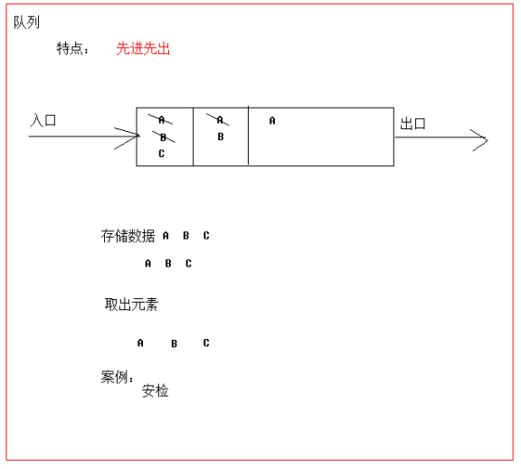

# day05

## 今日内容

- Collection集合
- 迭代器
- 数据结构
- List接口
- 泛型

## 教学目标
- [ ] 能够说出Collection集合的常用功能
- [ ] 能够使用迭代器对集合进行取元素
- [ ] 能够说出List集合特点
- [ ] 能够说出常见的数据结构
- [ ] 能够说出数组结构特点
- [ ] 能够说出栈结构特点
- [ ] 能够说出队列结构特点
- [ ] 能够说出单向链表结构特点
- [ ] 能够使用泛型创建集合对象
- [ ] 能够理解泛型上下限
- [ ] 能够阐述泛型通配符的作用

# 第一章 Collection集合（掌握）

## 1.1 集合概述

在前面基础班我们已经学习过并使用过集合ArrayList<E> ,那么集合到底是什么呢?

- **集合**：集合是java中提供的一种容器，可以用来存储多个数据。

集合和数组既然都是容器，它们有什么区别呢？

- 数组的长度是固定的。集合的长度是可变的。
- 数组中存储的是同一类型的元素，可以存储任意类型数据。集合存储的都是引用数据类型。如果想存储基本类型数据需要存储对应的包装类型。

## 1.2  集合常用类的继承体系

Collection：单列集合类的根接口，用于存储一系列符合某种规则的元素，它有两个重要的子接口，分别是`java.util.List`和`java.util.Set`。其中，`List`的特点是元素有序、元素可重复。`Set`的特点是元素不可重复。`List`接口的主要实现类有`java.util.ArrayList`和`java.util.LinkedList`，`Set`接口的主要实现类有`java.util.HashSet`和`java.util.LinkedHashSet`。

从上面的描述可以看出JDK中提供了丰富的集合类库，为了便于初学者进行系统地学习，接下来通过一张图来描述集合常用类的继承体系


注意:这张图只是我们常用的集合有这些，不是说就只有这些集合。

集合本身是一个工具，它存放在java.util包中。在`Collection`接口定义着单列集合框架中最最共性的内容。

## 1.3 Collection 常用API

Collection是所有单列集合的父接口，因此在Collection中定义了单列集合(List和Set)通用的一些方法，这些方法可用于操作所有的单列集合。方法如下：

- `public boolean add(E e)`：  把给定的对象添加到当前集合中 。
- `public void clear()` :清空集合中所有的元素。
- `public boolean remove(E e)`: 把给定的对象在当前集合中删除。
- `public boolean contains(Object obj)`: 判断当前集合中是否包含给定的对象。
- `public boolean isEmpty()`: 判断当前集合是否为空。
- `public int size()`: 返回集合中元素的个数。

> tips: 有关Collection中的方法可不止上面这些，其他方法可以自行查看API学习。

代码示例：

```java
public class Demo1 {
    public static void main(String[] args) {
        //强调：以后该怎么创建对象，还是怎么创建对象
        //现在我们是为了要学习Collection接口中的方法
        //所以才用多态方式创建对象的。

        Collection<String> list = new ArrayList<>();
        //add方法表示默认将元素添加到末位
        //返回值表示当前元素是否添加成功
        //ArrayList一定是添加成功的，所以返回true
        list.add("aaa");
        list.add("bbb");
        list.add("ccc");
        list.add("ddd");
        System.out.println(list);
        
        
        //清空方法
        //list.clear();
        //System.out.println(list);
        
        
        
        //删除方法 remove(对象)
        //注意：在Collection只有一个删对象的方法，没有通过索引删除的方法
        //因为Collection还有第二个分支：Set。而Set集合是没有索引的。
        //boolean result1 = list.remove("aaa");
        //System.out.println(result1);
        //boolean result2 = list.remove("eee");
        //System.out.println(result2);
        //System.out.println(list);
        
        
        
        //判断是否包含的方法
        //contains 判断是否包含
        boolean result3 = list.contains("aaa");
        System.out.println(result3);
        boolean result4 = list.contains("eee");
        System.out.println(result4);
        
        
        
        //判断集合是否为空
        System.out.println(list.isEmpty());
        
        
        
        
        //获取集合的长度
        System.out.println(list.size());

    }
}

```


# 第二章 Collection的三种通用遍历方式（掌握）

* 迭代器遍历
* 增强for遍历
* lambda表达式遍历
* 因为Collection没有索引，所以不能用普通for

注意：

​	基础班学习的普通for只适用于List集合，而Set没有索引，是不能用普通for遍历的。

## 2.1 Iterator接口

在程序开发中，经常需要遍历集合中的所有元素。针对这种需求，JDK专门提供了一个接口`java.util.Iterator`。

想要遍历Collection集合，那么就要获取该集合迭代器完成迭代操作，下面介绍一下获取迭代器的方法：

* `public Iterator iterator()`: 获取集合对应的迭代器，用来遍历集合中的元素的。

下面介绍一下迭代的概念：

* **迭代**：即Collection集合元素的通用获取方式。在取元素之前先要判断集合中有没有元素，如果有，就把这个元素取出来，继续在判断，如果还有就再取出出来。一直把集合中的所有元素全部取出。这种取出方式专业术语称为迭代。

Iterator接口的常用方法如下：

* `public E next()`:返回迭代的下一个元素。
* `public boolean hasNext()`:如果仍有元素可以迭代，则返回 true。

接下来我们通过案例学习如何使用Iterator迭代集合中元素：

~~~java
//1.创建集合
Collection<String> list = new ArrayList<>();
//2.添加元素
list.add("aaa");
list.add("bbb");
list.add("ccc");
list.add("ddd");
//3.遍历
//3.1获取迭代器对象（箭头，指针），默认指向集合的0索引位置
Iterator<String> it = list.iterator();
//3.2循环判断当前指向的位置是否有元素
while(it.hasNext()){
    //3.3获取元素并移动指针
    String str = it.next();
    System.out.println(str);
}
~~~

> tips: 
>
> 1. 在进行集合元素获取时，如果集合中已经没有元素了，还继续使用迭代器的next方法，将会抛出java.util.NoSuchElementException没有集合元素异常。
> 2. 在进行集合元素获取时，如果添加或移除集合中的元素 , 将无法继续迭代 , 将会抛出ConcurrentModificationException并发修改异常.

## 2.2 迭代器的实现原理

我们在之前案例已经完成了Iterator遍历集合的整个过程。当遍历集合时，首先通过调用t集合的iterator()方法获得迭代器对象，然后使用hashNext()方法判断集合中是否存在下一个元素，如果存在，则调用next()方法将元素取出，否则说明已到达了集合末尾，停止遍历元素。

Iterator迭代器对象在遍历集合时，内部采用指针的方式来跟踪集合中的元素，为了让初学者能更好地理解迭代器的工作原理，接下来通过一个图例来演示Iterator对象迭代元素的过程：


在调用Iterator的next方法之前，迭代器的索引位于第一个元素之前，不指向任何元素，当第一次调用迭代器的next方法后，迭代器的索引会向后移动一位，指向第一个元素并将该元素返回，当再次调用next方法时，迭代器的索引会指向第二个元素并将该元素返回，依此类推，直到hasNext方法返回false，表示到达了集合的末尾，终止对元素的遍历。

## 3.3增强for

**注意点：**

​	只有实现了Iterable接口的类，才能用增强for和迭代器遍历。

**核心：**

​	简化迭代器书写，底层其实也是一个迭代器。

**作用：**

​	可以用来遍历集合或者数组

**格式：**

```java
for(数据类型 变量名: 集合/数组){
	//遍历操作    
}
```

**代码示例：**

```java
//1.创建集合
ArrayList<String> list = new ArrayList<>();
//2.添加元素
list.add("aaa");
list.add("bbb");
list.add("ccc");
//3.遍历
for(String str : list){
    System.out.println(str);
}
```

## 3.4增强for的注意点：

​	增强for中的变量，仅仅是一个第三方变量而已，我们是遍历集合得到每一个元素，把每一个元素赋值给第三方变量，如果我们在循环的过程中，修改了第三方变量的值，是不会改变集合里面原本的值。

代码示例：

```java
//1.创建集合
ArrayList<String> list = new ArrayList<>();
//2.添加元素
list.add("aaa");
list.add("bbb");
list.add("ccc");
//3.遍历
for(String str : list){
    //此时没有索引的概念
    //str依次表示集合里面的每一个元素
    //System.out.println(str);
    //此时的str仅仅是一个第三方变量而已
    //我们是遍历集合得到每一个元素，把每一个元素赋值给第三方变量
    //如果我们在循环的过程中，修改了第三方变量的值，是不会改变集合里面原本的值。
    str = "QQQ";
}

for (int i = 0; i < list.size(); i++) {
    //利用普通for遍历，也是一样的，获取元素赋值给第三方变量
    String str = list.get(i);
    //修改第三方变量的值，不会影响集合中的元素
    str = "QQQ";
}

//4.循环结束之后打印集合
System.out.println(list);
```

## 3.5lambda表达式遍历集合

遍历用到的方法：

| 方法名                                    | 作用               |
| ----------------------------------------- | ------------------ |
| void forEach(Consumer<? super T> action): | 结合lambda遍历集合 |

代码示例：

```java
package com.itheima.a03arraylistdemo;

import java.util.ArrayList;
import java.util.function.Consumer;

public class Demo4 {
    public static void main(String[] args) {
        //1.创建集合
        ArrayList<String> list = new ArrayList<>();
        //2.添加元素
        list.add("aaa");
        list.add("bbb");
        list.add("ccc");

        //3.遍历集合
        //forEach方法在底层其实也是进行了循环遍历
        //在遍历的过程中，得到了每一个元素，再调用下面的accept方法
         System.out.println("----------匿名内部类-----------------");
        list.forEach(
            new Consumer<String>() {
                @Override
                public void accept(String s) {
                    //参数s，依次表示集合中的每一个数据
                    System.out.println(s);
                }
            }
        );

        System.out.println("----------lambda表达式-----------------");
        list.forEach(
            (String s) -> {
                //参数s，依次表示集合中的每一个数据
                System.out.println(s);
            }
        );

        System.out.println("----------lambda表达式简写格式-----------------");
        list.forEach(s -> System.out.println(s));
    }
}

```

## 3.6 练习-添加自定义对象并遍历

需求：

​	某影院系统需要在后台存储上述三部电影，然后依次展示出来。

​     	属性：电影名name  评分score  主演acotr

分析

①：定义一个电影类，定义一个集合存储电影对象。

②：创建3个电影对象，封装相关数据，把3个对象存入到集合中去。

③：遍历集合中的3个对象，输出相关信息。

代码示例：

```java
public class Demo5 {
    public static void main(String[] args) {
        //创建集合对象
        Collection<Moive> list = new ArrayList<>();
        //添加元素
        Moive m1 = new Moive("肖生克的救赎", 9.7, "罗宾斯");
        Moive m2 = new Moive("霸王别姬", 9.6, "张国荣、张丰毅");
        Moive m3 = new Moive("阿甘正传", 9.5, "汤姆.汉克斯");
        list.add(m1);
        list.add(m2);
        list.add(m3);

        //遍历
        //迭代器
        System.out.println("----------------迭代器-----------------");
        Iterator<Moive> it = list.iterator();
        while (it.hasNext()) {
            Moive moive = it.next();
            System.out.println(moive);
        }

        System.out.println("----------------增强for-----------------");
        for (Moive moive : list) {
            System.out.println(moive);
        }

        System.out.println("----------------匿名内部类-----------------");
        list.forEach(new Consumer<Moive>() {
            @Override
            public void accept(Moive moive) {
                System.out.println(moive);
            }
        });

        System.out.println("----------------lambda表达式-----------------");
        list.forEach((Moive moive) -> {
            System.out.println(moive);

        });
        System.out.println("----------------lambda表达式简写格式-----------------");
        list.forEach(moive -> System.out.println(moive));
    }
}

```


# 第三章 数据结构（掌握）

## 3.1 数据结构介绍

数据结构 : 数据用什么样的方式组合在一起。

## 3.2 常见数据结构

数据存储的常用结构有：栈、队列、数组、链表和红黑树。我们分别来了解一下：

#### 栈

- **栈**：**stack**,又称堆栈，它是运算受限的线性表，其限制是仅允许在标的一端进行插入和删除操作，不允许在其他任何位置进行添加、查找、删除等操作。

简单的说：采用该结构的集合，对元素的存取有如下的特点

- 先进后出（即，存进去的元素，要在后它后面的元素依次取出后，才能取出该元素）。例如，子弹压进弹夹，先压进去的子弹在下面，后压进去的子弹在上面，当开枪时，先弹出上面的子弹，然后才能弹出下面的子弹。
- 栈的入口、出口的都是栈的顶端位置。

这里两个名词需要注意：

- **压栈**：就是存元素。即，把元素存储到栈的顶端位置，栈中已有元素依次向栈底方向移动一个位置。

- **弹栈**：就是取元素。即，把栈的顶端位置元素取出，栈中已有元素依次向栈顶方向移动一个位置。

  

#### 队列

- **队列**：**queue**,简称队，它同堆栈一样，也是一种运算受限的线性表，其限制是仅允许在表的一端进行插入，而在表的另一端进行删除。

简单的说，采用该结构的集合，对元素的存取有如下的特点：

- 先进先出（即，存进去的元素，要在后它前面的元素依次取出后，才能取出该元素）。例如，小火车过山洞，车头先进去，车尾后进去；车头先出来，车尾后出来。
- 队列的入口、出口各占一侧。例如，下图中的左侧为入口，右侧为出口。



#### 数组

- **数组**:**Array**,是有序的元素序列，数组是在内存中开辟一段连续的空间，并在此空间存放元素。就像是一排出租屋，有100个房间，从001到100每个房间都有固定编号，通过编号就可以快速找到租房子的人。

简单的说,采用该结构的集合，对元素的存取有如下的特点：

- 查找元素快：通过索引，可以快速访问指定位置的元素

  

- 增删元素慢

- **指定索引位置增加元素**：需要创建一个新数组，将指定新元素存储在指定索引位置，再把原数组元素根据索引，复制到新数组对应索引的位置。如下图

- **指定索引位置删除元素：**需要创建一个新数组，把原数组元素根据索引，复制到新数组对应索引的位置，原数组中指定索引位置元素不复制到新数组中。如下图


#### 链表

- **链表**:**linked list**,由一系列结点node（链表中每一个元素称为结点）组成，结点可以在运行时i动态生成。每个结点包括两个部分：一个是存储数据元素的数据域，另一个是存储下一个结点地址的指针域。我们常说的链表结构有单向链表与双向链表，那么这里给大家介绍的是**单向链表**。

  

简单的说，采用该结构的集合，对元素的存取有如下的特点：

- 多个结点之间，通过地址进行连接。例如，多个人手拉手，每个人使用自己的右手拉住下个人的左手，依次类推，这样多个人就连在一起了。

- 查找元素慢：想查找某个元素，需要通过连接的节点，依次向后查找指定元素

- 增删元素快：

  树数据结构


# 第四章 List接口（掌握）

我们掌握了Collection接口的使用后，再来看看Collection接口中的子类，他们都具备那些特性呢？

接下来，我们一起学习Collection中的常用几个子类（`java.util.List`集合、`java.util.Set`集合）。

## 4.1 List接口介绍

`java.util.List`接口继承自`Collection`接口，是单列集合的一个重要分支，习惯性地会将实现了`List`接口的对象称为List集合。在List集合中允许出现重复的元素，所有的元素是以一种线性方式进行存储的，在程序中可以通过索引来访问集合中的指定元素。另外，List集合还有一个特点就是元素有序，即元素的存入顺序和取出顺序一致。

看完API，我们总结一下：

List接口特点：

1. 它是一个元素存取有序的集合。例如，存元素的顺序是11、22、33。那么集合中，元素的存储就是按照11、22、33的顺序完成的）。
2. 它是一个带有索引的集合，通过索引就可以精确的操作集合中的元素（与数组的索引是一个道理）。
3. 集合中可以有重复的元素，通过元素的equals方法，来比较是否为重复的元素。

> tips:我们在基础班的时候已经学习过List接口的子类java.util.ArrayList类，该类中的方法都是来自List中定义。

## 4.2 List接口中常用方法

List作为Collection集合的子接口，不但继承了Collection接口中的全部方法，而且还增加了一些根据元素索引来操作集合的特有方法，如下：

- `public void add(int index, E element)`: 将指定的元素，添加到该集合中的指定位置上。
- `public E get(int index)`:返回集合中指定位置的元素。
- `public E remove(int index)`: 移除列表中指定位置的元素, 返回的是被移除的元素。
- `public E set(int index, E element)`:用指定元素替换集合中指定位置的元素,返回值的更新前的元素。

List集合特有的方法都是跟索引相关，我们在基础班都学习过。

> tips:我们之前学习Colletion体系的时候，发现List集合下有很多集合，它们的存储结构不同，这样就导致了这些集合它们有各自的特点，供我们在不同的环境下使用，那么常见的数据结构有哪些呢？在下一章我们来介绍：

代码示例：

```java
public class Demo6 {
    public static void main(String[] args) {
        //1.创建集合
        List<String> list = new ArrayList<>();
        //2.添加元素
        list.add("aaa");
        list.add("bbb");
        list.add("ccc");

        //3.利用带有索引的方法添加元素
        //原本0索引上的数据，往后移动了一个位置
        //list.add(0,"QQQ");

        //通过索引删除，返回的是被删除的元素
        //System.out.println(list.remove(1));

        //修改执行索引上的元素
        //把被覆盖的元素给返回。
        //System.out.println(list.set(0, "QQQ"));


        //System.out.println(list.get(1));
        //我们可以通过get和size方法相结合，去利用普通for循环遍历集合。

        System.out.println(list);
    }
}

```

扩展点：

1，List接口中，有通过对象删除的方法，也有通过索引删除的方法，到底调用哪个，需要看不同的情况。

代码示例：

```java
//1.创建集合
List<Integer> list = new ArrayList<>();
//添加数据
list.add(1);
list.add(2);
list.add(3);
list.add(4);
list.add(5);

//2.删除
//请问，是删除1这个元素，还是把1索引上的元素进行删除
//在删除的时候，不会自动装箱
//如果写数字，那么就是通过索引进行删除
list.remove(1);

//就是想删除1这个对象,可以自己封装成一个Integer对象再进行删除
list.remove(Integer.valueOf(1));

System.out.println(list);
```

2，

```java
//1.创建集合
//在Collection中，删除方法只有通过对象删除的方法
//多态方式创建对象。
//在调用方法的时候：编译看左边，运行看右边
//而左边的父接口中，只有通过对象删除的方法
//所以，在实际运行的时候，运行的还是子类中通过对象删除的方法
Collection<Integer> list = new ArrayList<>();
//添加数据
list.add(1);
list.add(2);
list.add(3);
list.add(4);
list.add(5);

//此时是通过对象进行删除。
list.remove(1);

System.out.println(list);
```

## 4.3 List系列集合的遍历方式

① 普通for循环（因为List集合存在索引）

② 迭代器 

③ 增强for循环

④ Lambda表达式

## 4.4 ArrayList集合

`java.util.ArrayList`集合数据存储的结构是数组结构。元素增删慢，查找快，由于日常开发中使用最多的功能为查询数据、遍历数据，所以`ArrayList`是最常用的集合。

许多程序员开发时非常随意地使用ArrayList完成任何需求，并不严谨，这种用法是不提倡的。

## 4.5 LinkedList集合

`java.util.LinkedList`集合数据存储的结构是链表结构。方便元素添加、删除的集合。

> LinkedList是一个双向链表，那么双向链表是什么样子的呢，我们用个图了解下


实际开发中对一个集合元素的添加与删除经常涉及到首尾操作，而LinkedList提供了大量首尾操作的方法。这些方法我们作为**了解即可**：

- `public void addFirst(E e)`:将指定元素插入此列表的开头。
- `public void addLast(E e)`:将指定元素添加到此列表的结尾。
- `public E getFirst()`:返回此列表的第一个元素。
- `public E getLast()`:返回此列表的最后一个元素。
- `public E removeFirst()`:移除并返回此列表的第一个元素。
- `public E removeLast()`:移除并返回此列表的最后一个元素。
- `public E pop()`:从此列表所表示的堆栈处弹出一个元素。
- `public void push(E e)`:将元素推入此列表所表示的堆栈。
- `public boolean isEmpty()`：如果列表不包含元素，则返回true。

LinkedList是List的子类，List中的方法LinkedList都是可以使用，这里就不做详细介绍，我们只需要了解LinkedList的特有方法即可。在开发时，LinkedList集合也可以作为堆栈，队列的结构使用。

```java
public class Demo04LinkedList {
	public static void main(String[] args) {
		method4();
	}
	/*
	 *  void push(E e)： 压入。把元素添加到集合的第一个位置。
	 *  E pop()： 弹出。把第一个元素删除，然后返回这个元素。
	 */
	public static void method4() {
		//创建LinkedList对象
		LinkedList<String> list = new LinkedList<>();
		//添加元素
		list.add("达尔文");
		list.add("达芬奇");
		list.add("达尔优");
		System.out.println("list:" + list);
		//调用push在集合的第一个位置添加元素
		//list.push("爱迪生");
		//System.out.println("list:" + list);//[爱迪生, 达尔文, 达芬奇, 达尔优]
		
		//E pop()： 弹出。把第一个元素删除，然后返回这个元素。
		String value = list.pop();
		System.out.println("value:" + value);//达尔文
		System.out.println("list:" + list);//[达芬奇，达尔优]
	}
	
	/*
	 * E removeFirst()：删除第一个元素
	 * E removeLast()：删除最后一个元素。
	 */
	public static void method3() {
		//创建LinkedList对象
		LinkedList<String> list = new LinkedList<>();
		//添加元素
		list.add("达尔文");
		list.add("达芬奇");
		list.add("达尔优");
		//删除集合的第一个元素
//		String value = list.removeFirst();
//		System.out.println("value:" + value);//达尔文
//		System.out.println("list:" + list);//[达芬奇，达尔优]
		
		//删除最后一个元素
		String value = list.removeLast();
		System.out.println("value:" + value);//达尔优
		System.out.println("list:" + list);//[达尔文， 达芬奇]
	}
	
	/*
	 * E getFirst()： 获取集合中的第一个元素
	 * E getLast()： 获取集合中的最后一个元素
	 */
	public static void method2() {
		//创建LinkedList对象
		LinkedList<String> list = new LinkedList<>();
		//添加元素
		list.add("达尔文");
		list.add("达芬奇");
		list.add("达尔优");
		
		System.out.println("list:" + list);
		//获取集合中的第一个元素
		System.out.println("第一个元素是：" + list.getFirst());
		//获取集合中的最后一个元素怒
		System.out.println("最后一个元素是：" + list.getLast());
	} 
	
	
	/*
	 * void addFirst(E e)： 在集合的开头位置添加元素。
	 * void addLast(E e)： 在集合的尾部添加元素。
	 */
	public static void method1() {
		//创建LinkedList对象
		LinkedList<String> list = new LinkedList<>();
		//添加元素
		list.add("达尔文");
		list.add("达芬奇");
		list.add("达尔优");
		//打印这个集合
		System.out.println("list:" + list);//[达尔文, 达芬奇, 达尔优]
		//调用addFirst添加元素
		list.addFirst("曹操");
		System.out.println("list:" + list);//[曹操, 达尔文, 达芬奇, 达尔优]
		//调用addLast方法添加元素
		list.addLast("大乔");
		System.out.println("list:" + list);//[曹操, 达尔文, 达芬奇, 达尔优, 大乔]
		
	}
}
```

扩展点1：

​	利用迭代器删除元素

```java
ArrayList<String> list = new ArrayList<>();

list.add("a");
list.add("b");
list.add("b");
list.add("c");
list.add("d");

//利用迭代器方法进行遍历
//细节：如果利用迭代器遍历集合，想要删除元素，需要用迭代器里面的方法进行删除
Iterator<String> it = list.iterator();
while(it.hasNext()){
    String str = it.next();
    if("b".equals(str)){
        it.remove();
    }
}

System.out.println(list);
```

扩展点2：

​	利用列表迭代器添加数据

```java
package com.itheima.a03arraylistdemo;

import java.util.ArrayList;
import java.util.Iterator;
import java.util.ListIterator;

/*
*
*   并发修改异常出现的原因：
*       在利用迭代器遍历集合的过程中，利用集合的方法，对集合发生了改变（add，remove）。
*       会报并发修改异常
*
*   解决：
*       1.删除
*           利用迭代器的remove方法进行删除。
*       2.添加（了解）
*           在List接口中，还有一个叫做列表迭代器
*           可以利用它来添加数据
*
* */
public class Demo12 {
    public static void main(String[] args) {
        ArrayList<String> list = new ArrayList<>();

        list.add("a");
        list.add("b");
        list.add("c");
        list.add("d");

        /* Iterator<String> it = list.iterator();
        while(it.hasNext()){
            String str = it.next();
            if("b".equals(str)){
                list.add("QQQ");
            }
        }*/

        ListIterator<String> lit = list.listIterator();
        while(lit.hasNext()){
            String str = lit.next();
            if("b".equals(str)){
                lit.add("QQQ");
            }
        }

        System.out.println(list);
    }
}

```

# 第五章 泛型

**需要我们掌握的内容：**（掌握）

​	1，如何使用一个带有泛型的类

​	2，如何使用一个带有泛型的方法

代码示例：

```java
ArrayList<String> list = new ArrayList<>();
list.add("aaa");
list.add("bbb");
list.add("ccc");

//调用toArray方法把集合变成数组
Object[] objects = list.toArray();
//弊端：里面所有的都是Object类型，如果我需要使用字符串的方法，还需要向下转型

//我们就可以用泛型方法解决这个问题
//确定数据类型，省的自己强转了
String[] arr = new String[list.size()];
//给toArray方法传递了一个字符串类型的数组。
//方法把集合中的数据，放到数组中，给我们回了一个字符串类型的数组
String[] array = list.toArray(arr);
//遍历
for (int i = 0; i < array.length; i++) {
    System.out.print(array[i] + " ");
}
```

## 5.1  泛型概述

在前面学习集合时，我们都知道集合中是可以存放任意对象的，只要把对象存储集合后，那么这时他们都会被提升成Object类型。当我们在取出每一个对象，并且进行相应的操作，这时必须采用类型转换。

大家观察下面代码：

```java
public class GenericDemo {
	public static void main(String[] args) {
		Collection coll = new ArrayList();
		coll.add("abc");
		coll.add("itcast");
		coll.add(5);//由于集合没有做任何限定，任何类型都可以给其中存放
		Iterator it = coll.iterator();
		while(it.hasNext()){
			//需要打印每个字符串的长度,就要把迭代出来的对象转成String类型
			String str = (String) it.next();
			System.out.println(str.length());
		}
	}
}
```

程序在运行时发生了问题**java.lang.ClassCastException**。                                                                                             为什么会发生类型转换异常呢？                                                                                                                                       我们来分析下：由于集合中什么类型的元素都可以存储。导致取出时强转引发运行时 ClassCastException。                                                                                                                                                       怎么来解决这个问题呢？                                                                                                                                                           Collection虽然可以存储各种对象，但实际上通常Collection只存储同一类型对象。例如都是存储字符串对象。因此在JDK5之后，新增了**泛型**(**Generic**)语法，让你在设计API时可以指定类或方法支持泛型，这样我们使用API的时候也变得更为简洁，并得到了编译时期的语法检查。

- **泛型**：可以在类或方法中预支地使用未知的类型。

> tips:一般在创建对象时，将未知的类型确定具体的类型。当没有指定泛型时，默认类型为Object类型。

## 5.2  使用泛型的好处（掌握）

上一节只是讲解了泛型的引入，那么泛型带来了哪些好处呢？

- 将运行时期的ClassCastException，转移到了编译时期变成了编译失败。
- 避免了类型强转的麻烦。

通过我们如下代码体验一下：

```java
public class GenericDemo2 {
	public static void main(String[] args) {
        Collection<String> list = new ArrayList<String>();
        list.add("abc");
        list.add("itcast");
        // list.add(5);//当集合明确类型后，存放类型不一致就会编译报错
        // 集合已经明确具体存放的元素类型，那么在使用迭代器的时候，迭代器也同样会知道具体遍历元素类型
        Iterator<String> it = list.iterator();
        while(it.hasNext()){
            String str = it.next();
            //当使用Iterator<String>控制元素类型后，就不需要强转了。获取到的元素直接就是String类型
            System.out.println(str.length());
        }
	}
}
```

> tips:泛型是数据类型的一部分，我们将类名与泛型合并一起看做数据类型。

## 5.3 如何使用泛型类泛型方法和泛型接口

```java
1.如果在以后使用一个泛型类
那么在创建这个类对象的时候必须要指定类型


2.要会使用一个带有泛型的方法
ArrayList<String> list = new ArrayList<>();
list.add("aaa");
list.add("bbb");
list.add("ccc");

//Object[] arr1 = list.toArray();
//System.out.println(Arrays.toString(arr1));

String[] arr2 = new String[list.size()];
//会把集合中所有的数据添加到数组中，再进行返回
String[] arr3 = list.toArray(arr2);
System.out.println(Arrays.toString(arr3));


3.针对于一个泛型接口而言，我们如何使用？
//List接口上面有泛型
//怎么办呢？
//两种处理方式：
//第一种方式：
//如果此时实现类可以确定数据类型，那么就写死

//第二种方式：
//如果此时实现类不能确定数据类型，那么就把实现类变成泛型类
//让别人在创建实现类对象的时候再确认泛型。

public class MyArrayList implements List<String> {}

public class MyArrayList<E> implements List<E> {}
```

## 5.4  泛型通配符（了解）

当使用泛型类或者接口时，传递的数据中，泛型类型不确定，可以通过通配符<?>表示。但是一旦使用泛型的通配符后，只能使用Object类中的共性方法，集合中元素自身方法无法使用。


### 通配符基本使用

泛型的通配符:**不知道使用什么类型来接收的时候,此时可以使用?,?表示未知通配符。**

此时只能接受数据,不能往该集合中存储数据。

举个例子大家理解使用即可：

```java
public static void main(String[] args) {
    Collection<Intger> list1 = new ArrayList<Integer>();
    getElement(list1);
    Collection<String> list2 = new ArrayList<String>();
    getElement(list2);
}
public static void getElement(Collection<?> coll){}
// ？代表可以接收任意类型
泛型不存在继承关系 Collection<Object> list = new ArrayList<String>();这种是错误的
```

### 通配符高级使用

之前设置泛型的时候，实际上是可以任意设置的，只要是类就可以设置。但是在JAVA的泛型中可以指定一个泛型的**上限**和**下限**。

**泛型的上限**：

- **格式**： `类型名称 <? extends 类 > 对象名称`
- **意义**： `只能接收该类型及其子类`

**泛型的下限**：

- **格式**： `类型名称 <? super 类 > 对象名称`
- **意义**： `只能接收该类型及其父类型`

比如：现已知Object类，String 类，Number类，Integer类，其中Number是Integer的父类

```java
public static void main(String[] args) {
    Collection<Integer> list1 = new ArrayList<Integer>();
    Collection<String> list2 = new ArrayList<String>();
    Collection<Number> list3 = new ArrayList<Number>();
    Collection<Object> list4 = new ArrayList<Object>();
    
    getElement(list1);
    getElement(list2);//报错
    getElement(list3);
    getElement(list4);//报错
  
    getElement2(list1);//报错
    getElement2(list2);//报错
    getElement2(list3);
    getElement2(list4);
  
}
// 泛型的上限：此时的泛型?，必须是Number类型或者Number类型的子类
public static void getElement1(Collection<? extends Number> coll){}
// 泛型的下限：此时的泛型?，必须是Number类型或者Number类型的父类
public static void getElement2(Collection<? super Number> coll){}
```

# **ArrayList底层源码解析**

​	1.当我们利用空参构造创建集合对象的时候，在底层创建了一个长度为0的数组。

​	2.当添加了第一个元素的时候，底层的数组，扩容为10。一般也认为集合底层默认的长度为10

​	3.在添加的时候，如果没有存满， 那么不会扩容，直接添加把数组的后面

​	4.当数组存满之后，需要扩容，如果一次只添加一个，每次扩容1.5倍。

​	5.因为集合中每次可以添加很多数据，如果每次添加的数据比较多，在扩容的时候比原先的百分之50还要大。两者比较，谁大，听谁的。

# **LinkedList的底层源码解析**

​	1.在LinkedList中，有两个成员变量，一个是First，一个是Last。

​	   first表示头节点，last表示尾节点。

​	2.当我们添加一个元素的时候，在底层会创建一个Node节点对象。

​		节点对象里面有三个值：

​		第一个值：表示上一个节点的地址值。

​		第二个值：表示自己记录的值。

​		第三个值：表示下一个节点的地址值。

​	3.每一次添加的时候，就让前一个节点记录下一个节点的地址值。，下一个节点记录前一个节点的地址值。形成了一条链表。


