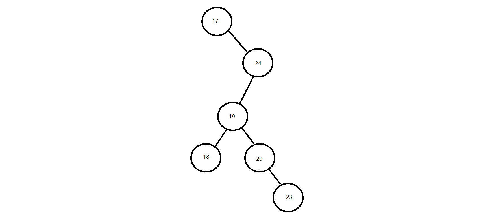
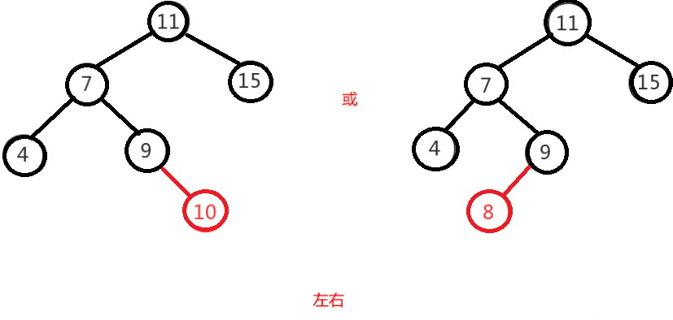
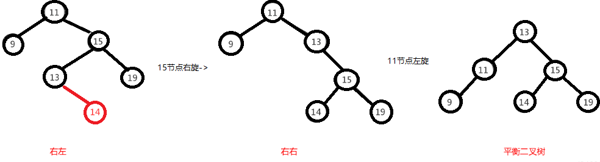

# day05

## 今日内容

- Set集合
- Collections工具类
- Map集合

## 教学目标
- [ ] 能够说出Set集合的特点
- [ ] 能够说出哈希表的特点
- [ ] 使用HashSet集合存储自定义元素
- [ ] 能够使用集合工具类
- [ ] 能够使用可变参数
- [ ] 能够使用Comparator比较器进行排序
- [ ] 能够使用Collections工具类
- [ ] 能够说出Map集合的特点

# 第一章 数据结构

## 1.1 树基本结构介绍

树具有的特点：

1. 每一个节点有零个或者多个子节点
2. 没有父节点的节点称之为根节点，一个树最多有一个根节点。
3. 每一个非根节点有且只有一个父节点

 

| 名词     | 含义                                                         |
| -------- | ------------------------------------------------------------ |
| 节点     | 指树中的一个元素                                             |
| 节点的度 | 节点拥有的子树的个数，二叉树的度不大于2                      |
| 叶子节点 | 度为0的节点，也称之为终端结点                                |
| 高度     | 叶子结点的高度为1，叶子结点的父节点高度为2，以此类推，根节点的高度最高 |
| 层       | 根节点在第一层，以此类推                                     |
| 父节点   | 若一个节点含有子节点，则这个节点称之为其子节点的父节点       |
| 子节点   | 子节点是父节点的下一层节点                                   |
| 兄弟节点 | 拥有共同父节点的节点互称为兄弟节点                           |

## 1.2 二叉树

如果树中的每个节点的子节点的个数不超过2，那么该树就是一个二叉树。


## 1.3二叉查找树/二叉排序树

二叉查找树的特点：

1. 左子树上所有的节点的值均小于等于他的根节点的值
2. 右子树上所有的节点值均大于或者等于他的根节点的值
3. 每一个子节点最多有两个子树

案例演示(20,18,23,22,17,24,19)数据的存储过程；


**增删改查的性能都很高！！！**

遍历获取元素的时候可以按照"左中右"的顺序进行遍历；

注意：二叉查找树存在的问题：会出现"瘸子"的现象，影响查询效率。




## 1.4平衡二叉树

（基于查找二叉树，但是让树不要太高，尽量元素均衡）

#### 概述

为了避免出现"瘸子"的现象，减少树的高度，提高我们的搜素效率，又存在一种树的结构："平衡二叉树"

规则：**它的左右两个子树的高度差的绝对值不超过1，并且左右两个子树都是一棵平衡二叉树**

如下图所示：


如下图所示，左图是一棵平衡二叉树，根节点10，左右两子树的高度差是1，而右图，虽然根节点左右两子树高度差是0，但是右子树15的左右子树高度差为2，不符合定义，

所以右图不是一棵平衡二叉树。


#### 旋转

在构建一棵平衡二叉树的过程中，当有新的节点要插入时，检查是否因插入后而破坏了树的平衡，如果是，则需要做旋转去改变树的结构。

左旋：

**左旋就是将节点的右支往左拉，右子节点变成父节点，并把晋升之后多余的左子节点出让给降级节点的右子节点；**


右旋：

**将节点的左支往右拉，左子节点变成了父节点，并把晋升之后多余的右子节点出让给降级节点的左子节点**


举个例子，像上图是否平衡二叉树的图里面，左图在没插入前"19"节点前，该树还是平衡二叉树，但是在插入"19"后，导致了"15"的左右子树失去了"平衡"，

所以此时可以将"15"节点进行左旋，让"15"自身把节点出让给"17"作为"17"的左树，使得"17"节点左右子树平衡，而"15"节点没有子树，左右也平衡了。如下图，

 


由于在构建平衡二叉树的时候，当有**新节点插入**时，都会判断插入后时候平衡，这说明了插入新节点前，都是平衡的，也即高度差绝对值不会超过1。当新节点插入后，

有可能会有导致树不平衡，这时候就需要进行调整，而可能出现的情况就有4种，分别称作**左左，左右，右左，右右**。


##### 左左

左左即为在原来平衡的二叉树上，在节点的左子树的左子树下，有新节点插入，导致节点的左右子树的高度差为2，如下即为"10"节点的左子树"7"，的左子树"4"，插入了节点"5"或"3"导致失衡。

 


左左调整其实比较简单，只需要对节点进行右旋即可，如下图，对节点"10"进行右旋，

 


 


##### 左右

左右即为在原来平衡的二叉树上，在节点的左子树的右子树下，有新节点插入，导致节点的左右子树的高度差为2，如上即为"11"节点的左子树"7"，的右子树"9"，

插入了节点"10"或"8"导致失衡。

 

左右的调整就不能像左左一样，进行一次旋转就完成调整。我们不妨先试着让左右像左左一样对"11"节点进行右旋，结果图如下，右图的二叉树依然不平衡，而右图就是接下来要

讲的右左，即左右跟右左互为镜像，左左跟右右也互为镜像。

 


左右这种情况，进行一次旋转是不能满足我们的条件的，正确的调整方式是，将左右进行第一次旋转，将左右先调整成左左，然后再对左左进行调整，从而使得二叉树平衡。

即先对上图的节点"7"进行左旋，使得二叉树变成了左左，之后再对"11"节点进行右旋，此时二叉树就调整完成，如下图:

 


##### 右左

右左即为在原来平衡的二叉树上，在节点的右子树的左子树下，有新节点插入，导致节点的左右子树的高度差为2，如上即为"11"节点的右子树"15"，的左子树"13"，

插入了节点"12"或"14"导致失衡。

 


前面也说了，右左跟左右其实互为镜像，所以调整过程就反过来，先对节点"15"进行右旋，使得二叉树变成右右，之后再对"11"节点进行左旋，此时二叉树就调整完成，如下图:

 


##### 右右

右右即为在原来平衡的二叉树上，在节点的右子树的右子树下，有新节点插入，导致节点的左右子树的高度差为2，如下即为"11"节点的右子树"13"，的左子树"15"，插入了节点

"14"或"19"导致失衡。

 


右右只需对节点进行一次左旋即可调整平衡，如下图，对"11"节点进行左旋。

 


## 1.5红黑树

#### 概述

红黑树是一种自平衡的二叉查找树，是计算机科学中用到的一种数据结构，它是在1972年由Rudolf Bayer发明的，当时被称之为平衡二叉B树，后来，在1978年被

Leoj.Guibas和Robert Sedgewick修改为如今的"红黑树"。它是一种特殊的二叉查找树，红黑树的每一个节点上都有存储位表示节点的颜色，可以是红或者黑；

红黑树不是高度平衡的，它的平衡是通过"红黑树的特性"进行实现的；

红黑树的特性：

1. 每一个节点或是红色的，或者是黑色的。
2. 根节点必须是黑色
3. 每个叶节点(Nil)是黑色的；（如果一个节点没有子节点或者父节点，则该节点相应的指针属性值为Nil，这些Nil视为叶节点）
4. 如果某一个节点是红色，那么它的子节点必须是黑色(不能出现两个红色节点相连的情况)
5. 对每一个节点，从该节点到其所有后代叶节点的简单路径上，均包含相同数目的黑色节点；

如下图所示就是一个

 


在进行元素插入的时候，和之前一样； 每一次插入完毕以后，使用黑色规则进行校验，如果不满足红黑规则，就需要通过变色，左旋和右旋来调整树，使其满足红黑规则；

# 第二章 Set接口

`java.util.Set`接口和`java.util.List`接口一样，同样继承自`Collection`接口，它与`Collection`接口中的方法基本一致，并没有对`Collection`接口进行功能上的扩充，只是比`Collection`接口更加严格了。与`List`接口不同的是，`Set`接口都会以某种规则保证存入的元素不出现重复。

`Set`集合有多个子类，这里我们介绍其中的`java.util.HashSet`、`java.util.LinkedHashSet`、`java.util.TreeSet`这两个集合。

> tips:Set集合取出元素的方式可以采用：迭代器、增强for。

## 2.1 HashSet集合介绍

`java.util.HashSet`是`Set`接口的一个实现类，它所存储的元素是不可重复的，并且元素都是无序的(即存取顺序不能保证不一致)。`java.util.HashSet`底层的实现其实是一个`java.util.HashMap`支持，由于我们暂时还未学习，先做了解。

`HashSet`是根据对象的哈希值来确定元素在集合中的存储位置，因此具有良好的存储和查找性能。保证元素唯一性的方式依赖于：`hashCode`与`equals`方法。

我们先来使用一下Set集合存储，看下现象，再进行原理的讲解:

```java
public class HashSetDemo {
    public static void main(String[] args) {
        //创建 Set集合
        HashSet<String>  set = new HashSet<String>();

        //添加元素
        set.add(new String("cba"));
        set.add("abc");
        set.add("bac"); 
        set.add("cba");  
        //遍历
        for (String name : set) {
            System.out.println(name);
        }
    }
}
```

输出结果如下，说明集合中不能存储重复元素：

```
cba
abc
bac
```

> tips:根据结果我们发现字符串"cba"只存储了一个，也就是说重复的元素set集合不存储。

### HashSet在开发中的使用场景：

​	可以利用HashSet的特性给数据去重

代码示例：

```java
//练习需求：给ArrayList进行去重
ArrayList<String> list = new ArrayList<>();
list.add("aaa");
list.add("aaa");
list.add("bbb");
list.add("bbb");
list.add("ccc");
list.add("ccc");
System.out.println(list);


//可以利用HashSet的特性给数据去重
HashSet<String> hs = new HashSet<>();
//把list集合中所有的元素全部添加到hs当中
hs.addAll(list);

//无序
System.out.println(hs);
```

## 2.2 HashSet集合存储数据的结构（哈希表）

什么是哈希表呢？

在**JDK1.8**之前，哈希表底层采用数组+链表实现，即使用数组处理冲突，同一hash值的链表都存储在一个数组里。但是当位于一个桶中的元素较多，即hash值相等的元素较多时，通过key值依次查找的效率较低。而JDK1.8中，哈希表存储采用数组+链表+红黑树实现，当链表长度超过阈值（8）时，将链表转换为红黑树，这样大大减少了查找时间。

简单的来说，哈希表是由数组+链表+红黑树（JDK1.8增加了红黑树部分）实现的，如下图所示。
 

看到这张图就有人要问了，这个是怎么存储的呢？

为了方便大家的理解我们结合一个存储流程图来说明一下：


总而言之，**JDK1.8**引入红黑树大程度优化了HashMap的性能，那么对于我们来讲保证HashSet集合元素的唯一，其实就是根据对象的hashCode和equals方法来决定的。如果我们往集合中存放自定义的对象，那么保证其唯一，就必须复写hashCode和equals方法建立属于当前对象的比较方式。

## 2.3  HashSet存储自定义类型元素

给HashSet中存放自定义类型元素时，需要重写对象中的hashCode和equals方法，建立自己的比较方式，才能保证HashSet集合中的对象唯一.

创建自定义Student类:

```java
public class Student {
    private String name;
    private int age;


    public Student() {
    }

    public Student(String name, int age) {
        this.name = name;
        this.age = age;
    }

    /**
     * 获取
     * @return name
     */
    public String getName() {
        return name;
    }

    /**
     * 设置
     * @param name
     */
    public void setName(String name) {
        this.name = name;
    }

    /**
     * 获取
     * @return age
     */
    public int getAge() {
        return age;
    }


    /**
     * 设置
     * @param age
     */
    public void setAge(int age) {
        this.age = age;
    }


    @Override
    public boolean equals(Object o) {
        if (this == o) return true;
        if (o == null || getClass() != o.getClass()) return false;
        Student student = (Student) o;
        return age == student.age && Objects.equals(name, student.name);
    }

    @Override
    public int hashCode() {
        return Objects.hash(name, age);
    }

    public String toString() {
        return "Student{name = " + name + ", age = " + age + "}";
    }
}

```

创建测试类:

```java
public class HashSetDemo1 {
    public static void main(String[] args) {
        //创建集合
        HashSet<Student> hs = new HashSet<>();

        //如果在Student类中，没有重写hashCode和equals方法
        //都是操作的都是地址值。
        //如果我们认为，属性相同，就是同一个对象，那么就需要重写hashCode和equals方法
        //添加元素
        hs.add(new Student("zhangsan",23));
        hs.add(new Student("zhangsan",23));
        hs.add(new Student("zhangsan",23));

        System.out.println(hs);
    }
}
```

## 2.4 LinkedHashSet

我们知道HashSet保证元素唯一，可是元素存放进去是没有顺序的，那么我们要保证有序，怎么办呢？

在HashSet下面有一个子类`java.util.LinkedHashSet`，它是链表和哈希表组合的一个数据存储结构。

演示代码如下:

```java
public class LinkedHashSetDemo {
	public static void main(String[] args) {
		Set<String> set = new LinkedHashSet<String>();
		set.add("bbb");
		set.add("aaa");
		set.add("abc");
		set.add("bbc");
        Iterator<String> it = set.iterator();
		while (it.hasNext()) {
			System.out.println(it.next());
		}
	}
}
结果：
  bbb
  aaa
  abc
  bbc
```

## 2.5 TreeSet集合

### 1. 特点

TreeSet集合是Set接口的一个实现类,底层依赖于TreeMap,是一种基于**红黑树**的实现,其特点为：

1. 元素唯一
2. 元素没有索引
3. 使用元素的自然顺序对元素进行排序，或者根据创建 TreeSet 时提供的 Comparator比较器
   进行排序，具体取决于使用的构造方法：

### 2.排序方式一：默认方式

默认的排序方式，也叫做自然排序。

是让Javabean类实现Comparable接口，重写里面的compareTo方法来实现的。

注意点：

1.Java已经写好的String，Integer已经定义好了默认规则。

​	String：按照首字母的字典顺序排序，如果首字母一样，则比较第二个字母。

​	Integer：升序

2.我们自己定义了Javabean类需要指定默认排序规则，否则会报错。

**代码示例1（存自定义对象）：**

```java
package com.itheima.a04treesetdemo;

public class Student implements Comparable<Student> {
    private String name;
    private int age;

    //...空参...
    //...有参...
    //...get和set方法...
    //...toString方法...

    @Override
    public int compareTo(Student o) {
        //按照年龄进行排序
        //this表示当前要添加的元素
        //o：已经在树里面存在的元素
        //如果结果是负数，那么就存左边
        //如果结果是正数，那么就存右边
        //如果结果是0，认为现在要添加的元素跟当前元素一直，就不存

        //System.out.println("this:" + this);
        //System.out.println("o:" + o);
        return this.age - o.age;
    }
}
```

**代码示例2（存Integer）：**

案例演示**自然排序**(20,18,23,22,17,24,19):

```java
public static void main(String[] args) {
	//无参构造,默认使用元素的自然顺序进行排序
	TreeSet<Integer> set = new TreeSet<Integer>();
	set.add(20);
	set.add(18);
  	set.add(23);
  	set.add(22);
  	set.add(17);
  	set.add(24);
  	set.add(19);
  	System.out.println(set);
}

控制台的输出结果为:
[17, 18, 19, 20, 22, 23, 24]
```

### **3.排序方式二：比较器排序**

​	创建集合对象时，传递Comparator实现类的对象，并重写compare方法。

并在使用的时候，默认用第一种，当第一种不能满足要求的时候，可以用第二种排序方式。

比如，Integer默认升序，如果我想降序排列，就需要用第二种了。

比如，String默认按照字典的顺序排列，如果我想按照字符串的长度排列，就需要用第二种了。

案例：

​	演示**比较器排序**(20,18,23,22,17,24,19):

```java
public static void main(String[] args) {
  	//有参构造,传入比较器,使用比较器对元素进行排序
  	TreeSet<Integer> set = new TreeSet<Integer>(new Comparator<Integer>() {
    	@Override
    	public int compare(Integer o1, Integer o2) {
      		//元素前 - 元素后 : 升序
      		//元素后 - 元素前 : 降序
      		return o2 - o1;
    	}
  	});
  	set.add(20);
  	set.add(18);
  	set.add(23);
  	set.add(22);
  	set.add(17);
  	set.add(24);
  	set.add(19);
  	System.out.println(set);
}

控制台的输出结果为:
[24, 23, 22, 20, 19, 18, 17]
```

## 2.6练习-存储学生信息按照总分排序

需求：

​	需求：键盘录入3个学生信息(姓名,语文成绩,数学成绩,英语成绩),按照总分从高到低输出到控制台

​	隐藏的排序规则：总分一致还得按照语文，数学，英语，姓名这样的顺序排序。

分析

①定义学生类

②创建TreeSet集合对象，通过进行排序

③创建学生对象

④把学生对象添加到集合

⑤遍历集合

注意：

​	在指定顺序的时候默认按照自然排序方式，当时自然排序不能满足我们的要求，就用比较器排序。

代码示例：

```java
public class Student implements Comparable<Student>{
    private String name;
    private double chinese;
    private double math;
    private double english;
    
    ...空参构造...
    ...带参构造...
    ...get和set方法...
    ...toString方法...    

    @Override
    public int compareTo(Student o) {
        //this o
        double sum1 = this.chinese + this.math + this.english;
        double sum2 = o.chinese + o.math + o.english;
        double sum = sum1 - sum2;

        //总分一样，看语文
        double result = sum == 0 ? this.chinese - o.chinese : sum;
        //语文一样，看数学
        result = result == 0 ? this.math - o.math : result;
        //学生一样，看英语
        result = result == 0 ? this.english - o.english : result;
        //英语一样，看姓名
        result = result == 0 ? this.name.compareTo(o.name) : result;
        return (int)result;
    }
}


public class TreeSetTest1 {
    public static void main(String[] args) {
        //1.创建集合
        TreeSet<Student> ts = new TreeSet<>();

        //2.
        //只要使用TreeSet就一定要指定排序规则。
        //首先默认按照自然排序
        Scanner sc = new Scanner(System.in);
        for (int i = 0; i < 3; i++) {
            System.out.println("请输入学生的姓名");
            String name = sc.next();
            System.out.println("请输入语文成绩");
            double chinese = sc.nextDouble();
            System.out.println("请输入数学成绩");
            double math = sc.nextDouble();
            System.out.println("请输入英语成绩");
            double english = sc.nextDouble();

            Student s = new Student(name,chinese,math,english);
            ts.add(s);
        }
        //打印
        System.out.println(ts);
    }
}
```

# 第三章  Collections类

## 3.1 Collections常用功能

- `java.utils.Collections`是集合工具类，用来对集合进行操作。

  常用方法如下：

- `public static void shuffle(List<?> list) `:打乱集合顺序。
- `public static <T> void sort(List<T> list)`:将集合中元素按照默认规则排序。
- `public static <T> void sort(List<T> list，Comparator<? super T> )`:将集合中元素按照指定规则排序。

代码演示：

```java
public class CollectionsDemo {
    public static void main(String[] args) {
        ArrayList<Integer> list = new ArrayList<Integer>();
   
        list.add(100);
        list.add(300);
        list.add(200);
        list.add(50);
        //排序方法 
        Collections.sort(list);
        System.out.println(list);
    }
}
结果：
[50,100, 200, 300]
```

我们的集合按照默认的自然顺序进行了排列，如果想要指定顺序那该怎么办呢？

## 3.2 Comparator比较器

创建一个学生类，存储到ArrayList集合中完成指定排序操作。

Student 类

```java
public class Student{
    private String name;
    private int age;
	//构造方法
    //get/set
 	//toString
}
```

测试类：

```java
public class Demo {
    public static void main(String[] args) {
        // 创建四个学生对象 存储到集合中
        ArrayList<Student> list = new ArrayList<Student>();

        list.add(new Student("rose",18));
        list.add(new Student("jack",16));
        list.add(new Student("abc",20));
		Collections.sort(list, new Comparator<Student>() {
  		  @Override
    		public int compare(Student o1, Student o2) {
        	return o1.getAge()-o2.getAge();//以学生的年龄升序
   		 }
		});


        for (Student student : list) {
            System.out.println(student);
        }
    }
}
Student{name='jack', age=16}
Student{name='rose', age=18}
Student{name='abc', age=20}
```

## 3.3 可变参数

在**JDK1.5**之后，如果我们定义一个方法需要接受多个参数，并且多个参数类型一致，我们可以对其简化.

**格式：**

```
修饰符 返回值类型 方法名(参数类型... 形参名){  }
```

**底层：**

​	其实就是一个数组

**好处：**

​	在传递数据的时候，省的我们自己创建数组并添加元素了，JDK底层帮我们自动创建数组并添加元素了

**代码演示:**

```java
  public class ChangeArgs {
    public static void main(String[] args) {
        int sum = getSum(6, 7, 2, 12, 2121);
        System.out.println(sum);
    }
    
    public static int getSum(int... arr) {
   		int sum = 0;
   	     for (int a : arr) {
         sum += a;
        }
   		 return sum;
    }
}
```

**注意：**

​	1.一个方法只能有一个可变参数

​	2.如果方法中有多个参数，可变参数要放到最后。

**应用场景: Collections**

​	在Collections中也提供了添加一些元素方法：

​	`public static <T> boolean addAll(Collection<T> c, T... elements)  `:往集合中添加一些元素。

**代码演示:**

```java
public class CollectionsDemo {
	public static void main(String[] args) {
      ArrayList<Integer> list = new ArrayList<Integer>();
      //原来写法
      //list.add(12);
      //list.add(14);
      //list.add(15);
      //list.add(1000);
      //采用工具类 完成 往集合中添加元素  
      Collections.addAll(list, 5, 222, 1，2);
      System.out.println(list);
}
```

# 第四章 斗地主发牌

## 4.1 案例介绍

按照斗地主的规则，完成洗牌发牌的动作。
具体规则：

使用54张牌打乱顺序,三个玩家参与游戏，三人交替摸牌，每人17张牌，最后三张留作底牌。

## 4.2 案例分析

- 准备牌：

  牌可以设计为一个ArrayList<String>,每个字符串为一张牌。
  每张牌由花色数字两部分组成，我们可以使用花色集合与数字集合嵌套迭代完成每张牌的组装。
  牌由Collections类的shuffle方法进行随机排序。

- 发牌

  将每个人以及底牌设计为ArrayList<String>,将最后3张牌直接存放于底牌，剩余牌通过对3取模依次发牌。

- 看牌

  直接打印每个集合。

## 4.3 代码实现

```java
public class CollectionsDemo3 {
    //准备牌盒
    static ArrayList<String> list = new ArrayList<>();
    
    static{
        //1.准备牌
        String[] colorArr = {"黑桃","红桃","梅花","方块"};
        String[] numberArr = {"3","4","5","6","7","8","9","10","J","Q","K","A","2"};
        for (String color : colorArr) {
            for (String number : numberArr) {
                list.add(color + number);
            }
        }
        list.add("大王");
        list.add("小王");
    }
    
    
    public static void main(String[] args) {
        //2.洗牌
        Collections.shuffle(list);
        //3.发牌
        ArrayList<String> diPai = new ArrayList<>();
        ArrayList<String> zhouXC = new ArrayList<>();
        ArrayList<String> zhouRF = new ArrayList<>();
        ArrayList<String> liuDH = new ArrayList<>();
        //遍历的时候。如果仅仅只想获取元素，增强for
        //如果在遍历的时候，要添加或者删除，用迭代器
        //如果在遍历的时候，要操作索引，用普通for
        for (int i = 0; i < list.size(); i++) {
            //索引 跟 牌 有一个对应关系
            //索引 % 3 == 0 发给第一个人
            //索引 % 3 == 1 发给第二个人
            //索引 % 3 == 2 发给第三个人
            String poker = list.get(i);
            if(i <= 2){
                diPai.add(poker);
                continue;
            }
            if(i % 3 == 0){
                zhouXC.add(poker);
            }else if(i % 3 == 1){
                zhouRF.add(poker);
            }else{
                liuDH.add(poker);
            }
        }
        //4.遍历
        System.out.println("底牌：" + diPai);
        System.out.println("周星驰：" + zhouXC);
        System.out.println("周润发：" + zhouRF);
        System.out.println("刘德华：" + liuDH);

    }
}
```

# 第五章 Map集合

## 5.1 概述

现实生活中，我们常会看到这样的一种集合：IP地址与主机名，身份证号与个人，系统用户名与系统用户对象等，这种一一对应的关系，就叫做映射。Java提供了专门的集合类用来存放这种对象关系的对象，即`java.util.Map`接口。

我们通过查看`Map`接口描述，发现`Map`接口下的集合与`Collection`接口下的集合，它们存储数据的形式不同，如下图。


- `Collection`中的集合，元素是孤立存在的（理解为单身），向集合中存储元素采用一个个元素的方式存储。
- `Map`中的集合，元素是成对存在的(理解为夫妻)。每个元素由键与值两部分组成，通过键可以找对所对应的值。
- `Collection`中的集合称为单列集合，`Map`中的集合称为双列集合。
- 需要注意的是，`Map`中的集合不能包含重复的键，值可以重复；每个键只能对应一个值。

## 5.2  Map的常用子类

通过查看Map接口描述，看到Map有多个子类，这里我们主要讲解常用的HashMap集合、LinkedHashMap集合。

- **HashMap<K,V>**：存储数据采用的哈希表结构，元素的存取顺序不能保证一致。由于要保证键的唯一、不重复，需要重写键的hashCode()方法、equals()方法。
- **LinkedHashMap<K,V>**：HashMap下有个子类LinkedHashMap，存储数据采用的哈希表结构+链表结构。通过链表结构可以保证元素的存取顺序一致；通过哈希表结构可以保证的键的唯一、不重复，需要重写键的hashCode()方法、equals()方法。
- **TreeMap<K,V>**：TreeMap集合和Map相比没有特有的功能，底层的数据结构是红黑树；可以对元素的***键***进行排序，排序方式有两种:**自然排序**和**比较器排序**

> tips：Map接口中的集合都有两个泛型变量<K,V>,在使用时，要为两个泛型变量赋予数据类型。两个泛型变量<K,V>的数据类型可以相同，也可以不同。

## 5.3  Map的常用方法

Map接口中定义了很多方法，常用的如下：

- `public V put(K key, V value)`:  把指定的键与指定的值添加到Map集合中。
- `public V remove(Object key)`: 把指定的键 所对应的键值对元素 在Map集合中删除，返回被删除元素的值。
- `public V get(Object key)` 根据指定的键，在Map集合中获取对应的值。
- `public Set<K> keySet()`: 获取Map集合中所有的键，存储到Set集合中。
- `public Set<Map.Entry<K,V>> entrySet()`: 获取到Map集合中所有的键值对对象的集合(Set集合)。
- `public boolean containKey(Object key)`:判断该集合中是否有此键。

Map接口的方法演示

```java
public class MapDemo {
    public static void main(String[] args) {
        //创建 map对象
        HashMap<String, String>  map = new HashMap<String, String>();

        //添加元素到集合
        map.put("黄晓明", "杨颖");
        map.put("文章", "马伊琍");
        map.put("邓超", "孙俪");
        System.out.println(map);

        //String remove(String key)
        System.out.println(map.remove("邓超"));
        System.out.println(map);

        // 想要查看 黄晓明的媳妇 是谁
        System.out.println(map.get("黄晓明"));
        System.out.println(map.get("邓超"));    
    }
}
```

> tips:
>
> 使用put方法时，若指定的键(key)在集合中没有，则没有这个键对应的值，返回null，并把指定的键值添加到集合中； 
>
> 若指定的键(key)在集合中存在，则返回值为集合中键对应的值（该值为替换前的值），并把指定键所对应的值，替换成指定的新值。 

## 5.4   Map的遍历

### 方式1:键找值方式

通过元素中的键，获取键所对应的值

分析步骤：

1. 获取Map中所有的键，由于键是唯一的，所以返回一个Set集合存储所有的键。方法提示:`keyset()`
2. 遍历键的Set集合，得到每一个键。
3. 根据键，获取键所对应的值。方法提示:`get(K key)`

遍历图解：


代码示例：

```java
//1.创建一个集合
HashMap<String,String> hm = new HashMap<>();
//2.添加元素
hm.put("郭靖","黄蓉");
hm.put("尹志平","小龙女");
hm.put("林平之","岳灵珊");

//3.遍历
//方式一：键找值
//先把所有的键都获取出来，放到一个Set集合中
Set<String> keys = hm.keySet();
for (String key : keys) {
    //得到每一个键之后，再通过键找值
    String value = hm.get(key);
    System.out.println(key + ", " + value);
```

### 方式2:键值对方式

即通过集合中每个键值对(Entry)对象，获取键值对(Entry)对象中的键与值。

**Entry键值对对象:**

我们已经知道，`Map`中存放的是两种对象，一种称为**key**(键)，一种称为**value**(值)，它们在在`Map`中是一一对应关系，这一对对象又称做`Map`中的一个`Entry(项)`。`Entry`将键值对的对应关系封装成了对象。即键值对对象，这样我们在遍历`Map`集合时，就可以从每一个键值对（`Entry`）对象中获取对应的键与对应的值。

在Map集合中也提供了获取所有Entry对象的方法：

- `public Set<Map.Entry<K,V>> entrySet()`: 获取到Map集合中所有的键值对对象的集合(Set集合)。

 获取了Entry对象 , 表示获取了一对键和值，那么同样Entry中 , 分别提供了获取键和获取值的方法：

- `public K getKey()`：获取Entry对象中的键。
- `public V getValue()`：获取Entry对象中的值。

操作步骤与图解：

1. 获取Map集合中，所有的键值对(Entry)对象，以Set集合形式返回。方法提示:`entrySet()`。
2. 遍历包含键值对(Entry)对象的Set集合，得到每一个键值对(Entry)对象。
3. 通过键值对(Entry)对象，获取Entry对象中的键与值。  方法提示:`getkey() getValue()`     

遍历图解：


> tips：Map集合不能直接使用迭代器或者foreach进行遍历。但是转成Set之后就可以使用了。

代码示例：

```java
//1.创建一个集合
HashMap<String,String> hm = new HashMap<>();
//2.添加元素
hm.put("郭靖","黄蓉");
hm.put("尹志平","小龙女");
hm.put("林平之","岳灵珊");
hm.put("韦小宝","双儿");
hm.put("成昆","阳夫人");

//3.获取Map集合中的每一个键值对对象Entry
//把每一个键值对对象放到一个Set集合中
Set<Map.Entry<String, String>> entries = hm.entrySet();
//遍历Set集合
for (Map.Entry<String, String> entry : entries) {
    //entry 依次表示每一个键值对对象
    String key = entry.getKey();
    String value = entry.getValue();
    System.out.println(key + ", " + value);
}
```

### 方式3：lambda表达式方式

代码示例：

```java
package com.itheima.a08mapdemo;

import java.util.HashMap;
import java.util.function.BiConsumer;

public class MapDemo4 {
    public static void main(String[] args) {
        //1.创建一个集合
        HashMap<String, String> hm = new HashMap<>();
        //2.添加元素
        hm.put("郭靖", "黄蓉");
        hm.put("尹志平", "小龙女");
        hm.put("林平之", "岳灵珊");
        hm.put("韦小宝", "双儿");
        hm.put("成昆", "阳夫人");

        //3.利用匿名内部类来遍历集合
        hm.forEach(new BiConsumer<String, String>() {
            @Override
            public void accept(String key, String value) {
                System.out.println(key + ", " + value);
            }
        });

        //4.利用lambda表达式来遍历集合
        hm.forEach((String key, String value) -> {
            System.out.println(key + ", " + value);
        }
                  );

        //5.简化lambda表达式来遍历集合
        hm.forEach((key, value) -> System.out.println(key + ", " + value) );
    }
}

```

# (下面的知识点明天讲)

### 练习：统计景点次数

需求：

​	某个班级80名学生，现在需要组成秋游活动，班长提供了四个景点依次是（A、B、C、D）,
​        每个学生只能选择一个景点，请统计出最终哪个景点想去的人数最多。

代码示例：

```java
//1.让同学们进行选择
String[] arr = {"A","B","C","D"};
Random r = new Random();
//把同学们的选择都存入到集合中
ArrayList<String> list = new ArrayList<>();
for (int i = 0; i < 80; i++) {
    int randomIndex = r.nextInt(arr.length);
    list.add(arr[randomIndex]);
}
//2.统计每个景点的选择次数
//A=10   B=20  C=30  D=40
HashMap<String,Integer> hm = new HashMap<>();
//遍历list集合，拿到每一个景点的名字
for (String name : list) {
    if(hm.containsKey(name)){
        //表示已经存在
        //如果当前景点已经存在，把原有的次数拿出来+1
        //此时put（景点的名字，新的次数）
        int count = hm.get(name);
        count++;
        hm.put(name,count);
    }else{
        //表示不存在
        //如果当前景点在map集合不存在，表示第一次选择
        //此时put（景点的名字，1）
        hm.put(name,1);
    }
}
//3.遍历map集合
hm.forEach((key,value)->System.out.println(key + ", " + value));
```

## 5.5  HashMap存储自定义类型

练习：每位学生（姓名，年龄）都有自己的家庭住址。那么，既然有对应关系，则将学生对象和家庭住址存储到map集合中。学生作为键, 家庭住址作为值。

> 注意，学生姓名相同并且年龄相同视为同一名学生。

编写学生类：

```java
public class Student {
    private String name;
    private int age;

    //构造方法
    //get/set
    @Override
    public boolean equals(Object o) {
        if (this == o)
            return true;
        if (o == null || getClass() != o.getClass())
            return false;
        Student student = (Student) o;
        return age == student.age && Objects.equals(name, student.name);
    }

    @Override
    public int hashCode() {
        return Objects.hash(name, age);
    }
}
```

编写测试类：

```java 
public class HashMapTest {
    public static void main(String[] args) {
        //1,创建Hashmap集合对象。
        Map<Student,String> map = new HashMap<Student,String>();
        //2,添加元素。
        map.put(new Student("lisi",28), "上海");
        map.put(new Student("wangwu",22), "北京");
        map.put(new Student("wangwu",22), "南京");
        
        //3,取出元素。键找值方式
        Set<Student> keySet = map.keySet();
        for(Student key: keySet){
            String value = map.get(key);
            System.out.println(key.toString()+"....."+value);
        }
    }
}
```

- 当给HashMap中存放自定义对象时，如果自定义对象作为key存在，这时要保证对象唯一，必须重写对象的hashCode和equals方法(如果忘记，请回顾HashSet存放自定义对象)。
- 如果要保证map中存放的key和取出的顺序一致，可以使用`java.util.LinkedHashMap`集合来存放。

## 5.6   LinkedHashMap介绍

我们知道HashMap保证成对元素唯一，并且查询速度很快，可是成对元素存放进去是没有顺序的，那么我们要保证有序，还要速度快怎么办呢？

在HashMap下面有一个子类LinkedHashMap，它是链表和哈希表组合的一个数据存储结构。

```java
public class LinkedHashMapDemo {
    public static void main(String[] args) {
        LinkedHashMap<String, String> map = new LinkedHashMap<String, String>();
        map.put("邓超", "孙俪");
        map.put("李晨", "范冰冰");
        map.put("刘德华", "朱丽倩");
        Set<Entry<String, String>> entrySet = map.entrySet();
        for (Entry<String, String> entry : entrySet) {
            System.out.println(entry.getKey() + "  " + entry.getValue());
        }
    }
}
```

结果:

```
邓超  孙俪
李晨  范冰冰
刘德华  朱丽倩
```

## 5.7 TreeMap集合

### 1.TreeMap介绍

TreeMap集合和Map相比没有特有的功能，底层的数据结构是红黑树；可以对元素的***键***进行排序，排序方式有两种:**自然排序**和**比较器排序**；到时使用的是哪种排序，取决于我们在创建对象的时候所使用的构造方法；

```java
public TreeMap()									使用自然排序
public TreeMap(Comparator<? super K> comparator) 	比较器排
```

### 2.演示

案例演示**自然排序**

```java
public static void main(String[] args) {
 	TreeMap<Integer, String> map = new TreeMap<Integer, String>();
  	map.put(1,"张三");
  	map.put(4,"赵六");
  	map.put(3,"王五");
  	map.put(6,"酒八");
  	map.put(5,"老七");
  	map.put(2,"李四");
  	System.out.println(map);
}

控制台的输出结果为:
{1=张三, 2=李四, 3=王五, 4=赵六, 5=老七, 6=酒八}
```

案例演示**比较器排序**

**需求:**

1. 创建一个TreeMap集合，键是学生对象(Student)，值是居住地 (String)。存储多个元素，并遍历。
2. 要求按照学生的年龄进行升序排序，如果年龄相同，比较姓名的首字母升序， 如果年龄和姓名都是相同，认为是同一个元素；

 **实现:**

为了保证age和name相同的对象是同一个,Student类必须重写hashCode和equals方法

```java
public class Student {
    private int age;
    private String name;
	//省略get/set..
    public Student() {}
    public Student(int age, String name) {
        this.age = age;
        this.name = name;
    }
    @Override
    public String toString() {
        return "Student{" +
                "age=" + age +
                ", name='" + name + '\'' +
                '}';
    }
    @Override
    public boolean equals(Object o) {
        if (this == o) return true;
        if (o == null || getClass() != o.getClass()) return false;
        Student student = (Student) o;
        return age == student.age &&
                Objects.equals(name, student.name);
    }
    @Override
    public int hashCode() {
        return Objects.hash(age, name);
    }
}
```

```java
public static void main(String[] args) {
  	TreeMap<Student, String> map = new TreeMap<Student, String>(new Comparator<Student>() {
    	@Override
    	public int compare(Student o1, Student o2) {
      		//先按照年龄升序
      		int result = o1.getAge() - o2.getAge();
      		if (result == 0) {
        		//年龄相同,则按照名字的首字母升序
        		return o1.getName().charAt(0) - o2.getName().charAt(0);
      		} else {
        		//年龄不同,直接返回结果
        		return result;
      		}
    	}
  	});
  	map.put(new Student(30, "jack"), "深圳");
  	map.put(new Student(10, "rose"), "北京");
  	map.put(new Student(20, "tom"), "上海");
  	map.put(new Student(10, "marry"), "南京");
  	map.put(new Student(30, "lucy"), "广州");
  	System.out.println(map);
}
控制台的输出结果为:
{
  Student{age=10, name='marry'}=南京, 
  Student{age=10, name='rose'}=北京, 
  Student{age=20, name='tom'}=上海, 
  Student{age=30, name='jack'}=深圳, 
  Student{age=30, name='lucy'}=广州
}
```

## 5.8 Map集合练习

**需求：**

输入一个字符串中每个字符出现次数。

**分析：**

1. 获取一个字符串对象
2. 创建一个Map集合，键代表字符，值代表次数。
3. 遍历字符串得到每个字符。
4. 判断Map中是否有该键。
5. 如果没有，第一次出现，存储次数为1；如果有，则说明已经出现过，获取到对应的值进行++，再次存储。     
6. 打印最终结果

**方法介绍**

`public boolean containKey(Object key)`:判断该集合中是否有此键。

**代码：**

```java
public class MapTest {
public static void main(String[] args) {
        //友情提示
        System.out.println("请录入一个字符串:");
        String line = new Scanner(System.in).nextLine();
        // 定义 每个字符出现次数的方法
        findChar(line);
    }
    private static void findChar(String line) {
        //1:创建一个集合 存储  字符 以及其出现的次数
        HashMap<Character, Integer> map = new HashMap<Character, Integer>();
        //2:遍历字符串
        for (int i = 0; i < line.length(); i++) {
            char c = line.charAt(i);
            //判断 该字符 是否在键集中
            if (!map.containsKey(c)) {//说明这个字符没有出现过
                //那就是第一次
                map.put(c, 1);
            } else {
                //先获取之前的次数
                Integer count = map.get(c);
                //count++;
                //再次存入  更新
                map.put(c, ++count);
            }
        }
        System.out.println(map);
    }
}
```


