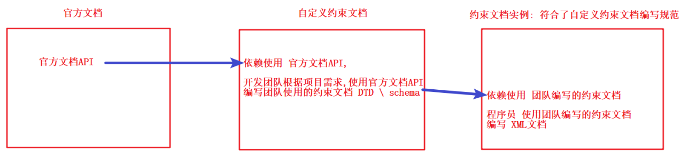
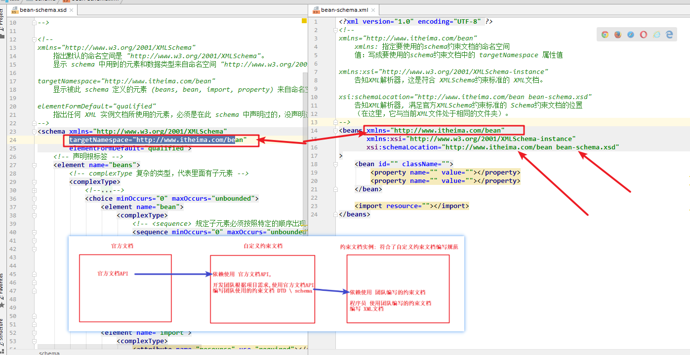
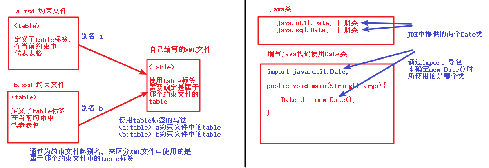

## xml约束

在XML技术里，可以通过约束文档，来约束XML文档的书写规范，这称之为XML约束。
常见的xml约束：DTD、Schema

在当初W3C提出约束规范时，就提供了“官方约束文档”。我们通过官方文档，创建“自定义约束文档”，开发中“自定义约束文档”由框架编写者(开发团队)提供。我们通过提供的“自定义约束文档”，自己编写出符合限定条件的xml文档。



### 1 DTD约束

#### 什么是DTD

DTD（Document Type Definition），文档类型定义，用来约束XML文档的书写。规定了XML文档中可书写的元素名称，子元素的名称及顺序，元素的属性等。

#### DTD重点要求

开发中，我们很少自己编写"DTD自定义约束文档"，通常情况我们都是通过框架(开发团队)提供的DTD约束文档，编写对应的XML文档。常见框架使用DTD约束有：struts2、hibernate等。

#### 通过提供的DTD约束文档 “**bean.dtd**”编写对应的XML文档

```xml
<?xml version="1.0" encoding="UTF-8"?>
<!--
	传智播客DTD教学实例文档。
	如果开发人员需要在xml使用当前DTD约束，必须包括DOCTYPE。
	格式如下：
	<!DOCTYPE beans SYSTEM "bean.dtd">
-->

<!--
	<!ELEMENT 元素名称 (元素内容)> : 声明一个元素 
	元素名称： beans、bean、property、import
	元素内容：
		(bean*,import*) 代表元素内容为 多个bean元素、多个import元素
			其中 bean* ：代表bean元素允许出现0次或多次
			其中 import* ：代表import元素允许出现0次或多次
		(property*)： 代表元素内容为 多个property元素
			其中 property*：代表property元素允许出现0次或多次
		(#PCDATA)：代表元素内容为 文本
			PCDATA，指的是可被解析的字符数据（Parsed Character Data）
			当某个 XML 元素被解析时，其标签之间的文本也会被解析
			<message>此文本也会被解析</message>
-->
<!ELEMENT beans (bean*,import*) >

<!ELEMENT bean (property*)>
<!ELEMENT property (#PCDATA)>
<!ELEMENT import (#PCDATA)>

<!-- 
	<!ATTLIST 元素名称 属性名称 属性类型 默认值>: 声明一个属性
	元素名称：bean
	属性名称：id、className、type
	属性类型：CDATA
		CDATA 指的是不应由 XML 解析器进行解析的文本数据（Unparsed Character Data）。
		CDATA 部分中的所有内容都会被解析器忽略，进行原样输出
		CDATA 格式：<![CDATA[原样输出的数据]]>
	默认值：默认值参数可使用下列值
		"值"，指定属性默认的值，当属性没有赋值时，使用该默认值
		#REQUIRED，属性值是必需填写的
		#IMPLIED，属性不是必需的, 可以不编写
		#FIXED value，属性值是固定的，为指定的value值
-->
<!ATTLIST bean id CDATA #REQUIRED
        className CDATA #REQUIRED
        type CDATA #IMPLIED
        >

<!ATTLIST property name CDATA #REQUIRED
        value CDATA #REQUIRED
        >

<!ATTLIST import resource CDATA #REQUIRED>
```

#### 案例实现

完成xml内容编写

```xml
<?xml version="1.0" encoding="utf-8" ?>
<!--
 	DTD约束文件 位于 XML 源文件的外部，那么它应通过下面的语法被封装在一个 DOCTYPE 定义中
	<!DOCTYPE 根元素 SYSTEM "文件名">
	根元素：beans
	SYSTEM：固定值，代表DTD约束文件在本地系统上
	"文件名"：bean.dtd, 代表DTD约束文件的路径
-->
<!DOCTYPE beans system "bean.dtd">
<beans>
    <bean id="" className="" type="">
        <property name="" value="">文本</property>
        <property name="" value="">文本</property>
    </bean>

    <bean id="" className="">
        <property name="" value="">文本</property>
        <property name="" value="">文本</property>
    </bean>

    <import resource="">文本</import>
    <import resource="">文本</import>

</beans>
```


### 2 Schema约束

#### 什么是Schema

Schema是新的XML文档约束；
Schema要比DTD强大很多，是DTD 替代者；
Schema本身也是XML文档，但Schema文档的扩展名为xsd，而不是xml。
Schema 功能更强大，数据类型更完善
Schema 支持名称空间

#### XML Schema 约束的作用

- 定义可出现在XML文档中的元素
- 定义可出现在XML文档中的属性
- 定义哪个元素是子元素
- 定义子元素的次序
- 定义子元素的数目
- 定义元素是否为空，或者是否可包含文本
- 定义元素和属性的数据类型
- 定义元素和属性的默认值以及固定值

#### Schema重点要求

与DTD一样，要求可以通过schema约束文档编写xml文档。常见框架使用schema的有：Spring等

通过提供“**bean-schema.xsd**”编写xml文档

```xml
<?xml version="1.0" encoding="UTF-8"?>
<!--
	传智播客Schema教学实例文档。
	如果开发人员需要在xml使用当前Schema约束，必须包括指定命名空间。
	格式如下：
	<beans xmlns="http://www.itheima.com/bean"
	   xmlns:xsi="http://www.w3.org/2001/XMLSchema-instance"
	   xsi:schemaLocation="http://www.itheima.com/bean bean-schema.xsd"
	>
-->

<!-- 
xmlns="http://www.w3.org/2001/XMLSchema"
表示 bean-schema.xsd 中用到的元素和数据类型来自命名空间"http://www.w3.org/2001/XMLSchema"。

targetNamespace="http://www.itheima.com/bean"
表示 当前约束文档bean-schema.xsd 在网络中的唯一标识(命名空间), 命名空间的值是唯一的,不可重复
 就是起个名字,让使用该约束的xml文件能够找到该约束文件

elementFormDefault="qualified"
表示 引用bean-schema.xsd约束文档的 任何XML文档所使用的元素，必须是在此 bean-schema.xsd 中声明过的，没声明过的元素不可使用
-->
<schema xmlns="http://www.w3.org/2001/XMLSchema"
        targetNamespace="http://www.itheima.com/bean"
        elementFormDefault="qualified">
    <!-- 声明根标签 -->
    <element name="beans">
        <!-- complexType 复杂的类型，代表里面有子元素 -->
        <complexType>
            <!-- 
				<choice> 规定可出现某个子元素或者可出现另外一个子元素（非此即彼）：
				<minOccurs> 规定某个元素能够出现的最小次数
				<maxOccurs> 规定某个元素可出现的最大次数
				如需使某个元素的出现次数不受限制，请使用 maxOccurs="unbounded" 这个声明
 			-->
            <choice minOccurs="0" maxOccurs="unbounded">
                <element name="bean">
                    <complexType>
                        <!-- <sequence> 规定子元素必须按照特定的顺序出现 -->
                        <sequence minOccurs="0" maxOccurs="unbounded">
                            <element name="property">
                                <complexType>
                                    <attribute name="name" use="required"></attribute>
                                    <attribute name="value" use="required"></attribute>
                                </complexType>
                            </element>
                        </sequence>
                        <attribute name="id" use="required"></attribute>
                        <attribute name="className" use="required"></attribute>
                    </complexType>
                </element>
                <element name="import">
                    <complexType>
                        <attribute name="resource" use="required"></attribute>
                    </complexType>
                </element>
            </choice>
        </complexType>
    </element>
</schema>
```

* 使用schema约束文档, 完成xml内容编写

```xml
<?xml version="1.0" encoding="UTF-8"?>
<!-- 
xmlns="http://www.itheima.com/bean"
	xmlns: 指定要使用的schema约束文档的命名空间
	值：写成要使用的schema约束文档中的 targetNamespace 属性值

xmlns:xsi="http://www.w3.org/2001/XMLSchema-instance"
	告知XML解析器，这是符合 XMLSchema约束标准的 XML文档。
	
xsi:schemaLocation="http://www.itheima.com/bean bean-schema.xsd"
	告知XML解析器, 满足官方XMLSchema约束标准的 Schema约束文档的位置
    （在这里，它与当前XML文件处于相同的文件夹）。
-->
<beans xmlns="http://www.itheima.com/bean"
       xmlns:xsi="http://www.w3.org/2001/XMLSchema-instance"
       xsi:schemaLocation="http://www.itheima.com/bean bean-schema.xsd">

    <bean id="" className=""></bean>
    <bean id="" className=""></bean>

    <import resource=""></import>
    <import resource=""></import>
</beans>
```

* 图示




#### 命名空间（语法）

##### 什么是命名空间

如果一个XML文档中使用多个Schema文件，而这些Schema文件中定义了相同名称的元素时就会出现名字冲突。这就像一个Java文件中，在使用Date类时，那么就不明确Date是哪个包下的Date了。

```java
java.util.Date; // JDK提供的日期类, 用于表示与操作系统的日期相对应
java.sql.Date; // JDK提供的日期类, 用于表示与数据库中的日期相对应
```

名称空间就是用来处理元素和属性的名称冲突问题，与Java中的包是同一用途。如果每个元素和属性都有自己的名称空间，那么就不会出现名字冲突问题，就像是每个类都有自己所在的包一样，那么类名就不会出现冲突。



##### 声明命名空间

```java
默认命名空间的格式：<xmlns=””>，使用格式:<标签>
显式命名空间的格式：<xmlns:别名=””>，使用格式:<别名:标签>
```


#### 使用显示命名空间

##### XML文档使用命名空间

代码演示：

导入jar包

```properties
spring-beans-5.0.5.RELEASE.jar
spring-context-5.0.5.RELEASE.jar
spring-webmvc-5.0.5.RELEASE.jar
```

Spring框架主配置文件 `applicationContext.xml`

```xml
<?xml version="1.0" encoding="UTF-8"?>
<beans xmlns="http://www.springframework.org/schema/beans"
    xmlns:xsi="http://www.w3.org/2001/XMLSchema-instance"
    xmlns:mvc="http://www.springframework.org/schema/mvc"
    xmlns:context="http://www.springframework.org/schema/context"
    xsi:schemaLocation="http://www.springframework.org/schema/beans
    					http://www.springframework.org/schema/beans/spring-beans.xsd
    					http://www.springframework.org/schema/mvc
    					http://www.springframework.org/schema/mvc/spring-mvc.xsd
    					http://www.springframework.org/schema/context
    					http://www.springframework.org/schema/context/spring-context.xsd">
	
	<!-- 定义controller扫描包 -->
	<context:component-scan base-package="com.example.controller" />
	<mvc:annotation-driven />
	<!-- 处理静态资源 -->
	<mvc:default-servlet-handler/>
	<!-- 配置视图解析器 -->
	<bean id="viewResolver" class="org.springframework.web.servlet.view.InternalResourceViewResolver">
	   <property name="viewClass" value="org.springframework.web.servlet.view.JstlView"/>
	   <property name="prefix" value="/WEB-INF/jsp/"/>
	   <property name="suffix" value=".jsp"/>
 	</bean>
	
</beans>
```

**注意:**

* 一个xml文件中, 可以出现多个xmlns:别名,  来表示引用不同的命名空间规范, 例如` xmlns:mvc="http://www.springframework.org/schema/mvc"`
* 使用命名空间中所指定的标签时: 需要通过`别名:标签`的方式来使用, 例如`<mvc:annotation-driven />`


