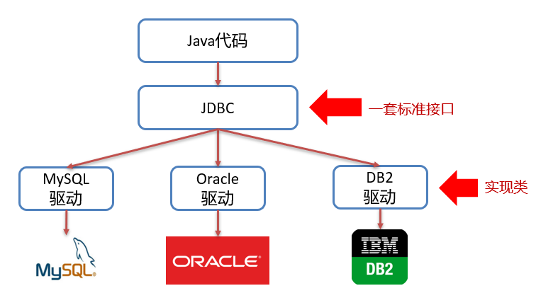
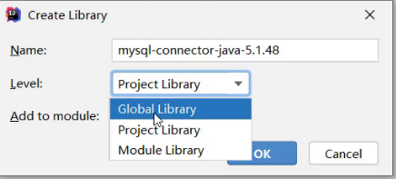
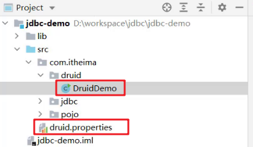

## JDBC

**今日目标**

> * 掌握JDBC的的CRUD
> * 理解JDBC中各个对象的作用
> * 掌握Druid的使用

## 1 JDBC概述

在开发中我们使用的是java语言，那么势必要通过java语言操作数据库中的数据。这就是接下来要学习的JDBC。

### 1.1  JDBC概念

> JDBC   就是使用Java语言操作关系型数据库的一套API
>
> 全称：( Java DataBase Connectivity ) Java 数据库连接



我们开发的同一套Java代码是无法操作不同的关系型数据库，因为每一个关系型数据库的底层实现细节都不一样。如果这样，问题就很大了，在公司中可以在开发阶段使用的是MySQL数据库，而上线时公司最终选用oracle数据库，我们就需要对代码进行大批量修改，这显然并不是我们想看到的。我们要做到的是同一套Java代码操作不同的关系型数据库，而此时sun公司就指定了一套标准接口（JDBC），JDBC中定义了所有操作关系型数据库的规则。众所周知接口是无法直接使用的，我们需要使用接口的实现类，而这套实现类（称之为：驱动）就由各自的数据库厂商给出。

### 1.2  JDBC本质

* 官方（sun公司）定义的一套操作所有关系型数据库的规则，即接口
* 各个数据库厂商去实现这套接口，提供数据库驱动jar包
* 我们可以使用这套接口（JDBC）编程，真正执行的代码是驱动jar包中的实现类

### 1.3  JDBC好处

* 各数据库厂商使用相同的接口，Java代码不需要针对不同数据库分别开发
* 可随时替换底层数据库，访问数据库的Java代码基本不变

以后编写操作数据库的代码只需要面向JDBC（接口），操作哪儿个关系型数据库就需要导入该数据库的驱动包，如需要操作MySQL数据库，就需要再项目中导入MySQL数据库的驱动包。如下图就是MySQL驱动包


## 2 JDBC快速入门

先来看看通过Java操作数据库的流程


第一步：编写Java代码

第二步：Java代码将SQL发送到MySQL服务端

第三步：MySQL服务端接收到SQL语句并执行该SQL语句

第四步：将SQL语句执行的结果返回给Java代码

### 2.1  编写代码步骤

* 创建工程，导入驱动jar包

  

*  注册驱动

  ```sql
  Class.forName("com.mysql.jdbc.Driver");
  ```

* 获取连接

  ```sql
  Connection conn = DriverManager.getConnection(url, username, password);
  ```

  Java代码需要发送SQL给MySQL服务端，就需要先建立连接

* 定义SQL语句

  ```sql
  String sql =  "update…" ;
  ```

* 获取执行SQL对象

  执行SQL语句需要SQL执行对象，而这个执行对象就是 PreparedStatement对象

  ```sql
  PreparedStatement ps = conn.prepareStatement(sql);
  ```

* 执行SQL

  ```sql
  ps.executeUpdate(sql);  
  ```

* 处理返回结果

* 释放资源

### 2.2  具体操作

* 创建新的空的项目


* 定义项目的名称，并指定位置


* 对项目进行设置，JDK版本、编译版本


* 创建模块，指定模块的名称及位置


* 导入驱动包

  将mysql的驱动包放在模块下的lib目录（随意命名）下，并将该jar包添加为库文件


* 在添加为库文件的时候，有如下三个选项
  * Global Library  ： 全局有效
  * Project Library :   项目有效
  * Module Library ： 模块有效



* 在src下创建类


* 编写代码如下

```java
/**
 * JDBC快速入门
 */
public class JDBCDemo {
       public static void main(String[] args) throws Exception {
        //1 注册驱动，告诉程序使用哪个数据库
        Class.forName("com.mysql.jdbc.Driver");
        //2 获取连接对象 Connection
        String url="jdbc:mysql://localhost:3306/db2";   //连接路径，表示连接哪个数据库
        String username="root";
        String password="root";
        Connection conn = DriverManager.getConnection(url,username,password);
        //3 获取执行SQL的执行者对象  PreparedStatement
        PreparedStatement ps = conn.prepareStatement("update account set money = 3000 where id=1");
        //4 执行操作
        int count = ps.executeUpdate();
        //5 处理结果
        System.out.println("影响的行数： " + count);
        //6 释放资源
        ps.close();
        conn.close();
    }
}
```


## 3 JDBC API详解

### 3.1  DriverManager

DriverManager（驱动管理类）作用：

* 注册驱动

  

  registerDriver方法是用于注册驱动的，但是我们之前做的入门案例并不是这样写的。而是如下实现

  ```sql
  Class.forName("com.mysql.jdbc.Driver");
  ```

  我们查询MySQL提供的Driver类，看它是如何实现的，源码如下：

  

  在该类中的静态代码块中已经执行了 `DriverManager` 对象的 `registerDriver()` 方法进行驱动的注册了，那么我们只需要加载 `Driver` 类，该静态代码块就会执行。而 `Class.forName("com.mysql.jdbc.Driver");` 就可以加载 `Driver` 类。

  > ==提示：==
  >
  > * MySQL 5之后的驱动包，可以省略注册驱动的步骤
  > * 自动加载jar包中META-INF/services/java.sql.Driver文件中的驱动类

* 获取数据库连接

  

  参数说明：

  * url ： 连接路径

    > 语法：jdbc:mysql://ip地址(域名):端口号/数据库名称?参数键值对1&参数键值对2…
    >
    > 示例：jdbc:mysql://127.0.0.1:3306/db1
    >
    > ==细节：==
    >
    > * 如果连接的是本机mysql服务器，并且mysql服务默认端口是3306，则url可以简写为：jdbc:mysql:///数据库名称?参数键值对
    >
    > * 配置 useSSL=false 参数，禁用安全连接方式，解决警告提示

  * user ：用户名
  * poassword ：密码

### 3.2  Connection

Connection（数据库连接对象）作用：

* 获取执行 SQL 的对象
* 管理事务

#### 3.2.1  获取执行对象PreparedStatement

* 普通执行SQL对象

  ```sql
  Statement createStatement()
  ```

  入门案例中就是通过该方法获取的执行对象。

* ==预编译SQL的执行SQL对象：防止SQL注入==

  ```sql
  PreparedStatement  prepareStatement(sql)
  ```

  通过这种方式获取的 `PreparedStatement` SQL语句执行对象是我们重点要进行讲解的，它可以防止SQL注入。

* 执行存储过程的对象

  ```sql
  CallableStatement prepareCall(sql)
  ```

  通过这种方式获取的 `CallableStatement` 执行对象是用来执行存储过程的，而存储过程在MySQL中不常用，所以这个我们将不进行讲解。

#### 3.2.2  事务管理

先回顾一下MySQL事务管理的操作：

* 开启事务 ： BEGIN; 或者 START TRANSACTION;
* 提交事务 ： COMMIT;
* 回滚事务 ： ROLLBACK;

> MySQL默认是自动提交事务

接下来学习JDBC事务管理的方法。

Connection几口中定义了3个对应的方法：

* 开启事务

  

  参与autoCommit 表示是否自动提交事务，true表示自动提交事务，false表示手动提交事务。而开启事务需要将该参数设为为false。

* 提交事务

  

* 回滚事务

  

具体代码实现如下：

```sql
/**
 * JDBC API 详解：Connection
 */
public class JDBCDemo3_Connection {

    public static void main(String[] args) throws Exception {
        //1. 注册驱动
        //Class.forName("com.mysql.jdbc.Driver");
        //2. 获取连接：如果连接的是本机mysql并且端口是默认的 3306 可以简化书写
        String url = "jdbc:mysql:///db1?useSSL=false";
        String username = "root";
        String password = "1234";
        Connection conn = DriverManager.getConnection(url, username, password);
        //3 获取执行SQL的执行者对象  PreparedStatement
        PreparedStatement ps1 = conn.prepareStatement("update account set money = money-500 where name='李四' ");
        PreparedStatement ps2 = conn.prepareStatement("update account set money = money+500 where name='张三' ");

        try {
            // ============开启事务==========
            conn.setAutoCommit(false);
            //4. 执行sql
            int count1 = ps1.executeUpdate();//受影响的行数
            //5. 处理结果
            System.out.println(count1);
            int i = 1/0;
            //4. 执行sql
            int count2 = ps2.executeUpdate();//受影响的行数
            //5. 处理结果
            System.out.println(count2);

            // ============提交事务==========
            //程序运行到此处，说明没有出现任何问题，则需求提交事务
            conn.commit();
        } catch (Exception e) {
            // ============回滚事务==========
            //程序在出现异常时会执行到这个地方，此时就需要回滚事务
            conn.rollback();
            e.printStackTrace();
        }

        //6. 释放资源
        ps1.close();
        ps2.close();
        conn.close();
    }
}
```

### 3.3  PreparedStatement

#### 3.3.1  概述

Statement对象的作用就是用来执行SQL语句。而针对不同类型的SQL语句使用的方法也不一样。

* 执行DDL、DML语句

  

* 执行DQL语句

  

  该方法涉及到了 `ResultSet` 对象，而这个对象我们还没有学习，一会再重点讲解。


#### 3.3.2  代码实现

* 执行DML语句

  ```java
  /**
    * 执行DML语句
    * @throws Exception
    */
  @Test
  public void testDML() throws  Exception {
      //1. 注册驱动
      //Class.forName("com.mysql.jdbc.Driver");
      //2. 获取连接：如果连接的是本机mysql并且端口是默认的 3306 可以简化书写
      String url = "jdbc:mysql:///db1?useSSL=false";
      String username = "root";
      String password = "1234";
      Connection conn = DriverManager.getConnection(url, username, password);
      //3. 定义sql
      String sql = "update account set money = 3000 where id = 1";
      //4. 获取执行sql的对象 PreparedStatement
      PreparedStatement ps = conn.prepareStatement(sql);
      //5. 执行sql
      int count = ps.executeUpdate();//执行完DML语句，受影响的行数
      //6. 处理结果
      //System.out.println(count);
      if(count > 0){
          System.out.println("修改成功~");
      }else{
          System.out.println("修改失败~");
      }
      //7. 释放资源
      ps.close();
      conn.close();
  }
  ```

* 执行DDL语句

  ```java
  /**
    * 执行DDL语句
    * @throws Exception
    */
  @Test
  public void testDDL() throws  Exception {
      //1. 注册驱动
      //Class.forName("com.mysql.jdbc.Driver");
      //2. 获取连接：如果连接的是本机mysql并且端口是默认的 3306 可以简化书写
      String url = "jdbc:mysql:///db1?useSSL=false";
      String username = "root";
      String password = "1234";
      Connection conn = DriverManager.getConnection(url, username, password);
      //3. 定义sql
      String sql = "drop database db2";
      //4. 获取执行sql的对象 PreparedStatement
     PreparedStatement ps = conn.prepareStatement(sql);
      //5. 执行sql
      int count = stmt.executeUpdate(sql);//执行完DDL语句，可能是0
      //6. 处理结果
      System.out.println(count);
  
      //7. 释放资源
      ps.close();
      conn.close();
  }
  ```

  > 注意：
  >
  > * 以后开发很少使用java代码操作DDL语句

#### 3.3.3  PreparedStatement动态传参

* 获取 PreparedStatement 对象

  ```java
  // SQL语句中的参数值，使用？占位符替代
  String sql = "select * from user where username = ? and password = ?";
  // 通过Connection对象获取，并传入对应的sql语句
  PreparedStatement pstmt = conn.prepareStatement(sql);
  ```

* 设置参数值

  上面的sql语句中参数使用 ? 进行占位，在之前之前肯定要设置这些 ?  的值。

  > PreparedStatement对象：setXxx(参数1，参数2)：给 ? 赋值
  >
  > * Xxx：数据类型 ； 如 setInt (参数1，参数2)
  >
  > * 参数：
  >
  >   * 参数1： ？的位置编号，从1 开始
  >
  >   * 参数2： ？的值

* 执行SQL语句

  > executeUpdate();  执行DDL语句和DML语句
  >
  > executeQuery();  执行DQL语句
  >
  > ==注意：==
  >
  > * 调用这两个方法时不需要传递SQL语句，因为获取SQL语句执行对象时已经对SQL语句进行预编译了。

#### 3.3.4  使用PreparedStatement动态传参代码实现

```java
public class JdbcDemo06 {
    public static void main(String[] args) throws Exception {
        //1 注册驱动，告诉程序使用哪个数据库
        Class.forName("com.mysql.jdbc.Driver");
        //2 获取连接对象 Connection
        String url="jdbc:mysql://localhost:3306/db2?userSSL=false";   
        String username="root";
        String password="root";
        Connection conn = DriverManager.getConnection(url,username,password);
        //3 获取执行SQL的执行者对象  Statement
        String sql="update account set money = ? where id=?";
        PreparedStatement ps = conn.prepareStatement(sql);
        //4 执行操作
        //4.1 设置两个?代替的参数
        ps.setDouble(1,3000.0);
        ps.setInt(2,1); //设置完成之后等价于update account set money = 3000.0 where id=1
        //4.2 执行操作
        int count = ps.executeUpdate();
        //5 处理结果
        System.out.println("影响的行数： " + count);
        //6 释放资源
        ps.close();
        conn.close();
    }
}
```

### 3.4  ResultSet

#### 3.4.1  概述

ResultSet（结果集对象）作用：

* ==封装了SQL查询语句的结果。==

而执行了DQL语句后就会返回该对象，对应执行DQL语句的方法如下：

```sql
ResultSet  executeQuery(sql)：执行DQL 语句，返回 ResultSet 对象
```

那么我们就需要从 `ResultSet` 对象中获取我们想要的数据。`ResultSet` 对象提供了操作查询结果数据的方法，如下：

> boolean  next()
> * 将光标从当前位置向前移动一行 
> * 判断当前行是否为有效行
>
> 方法返回值说明：
>
> * true  ： 有效航，当前行有数据
> * false ： 无效行，当前行没有数据

> xxx  getXxx(参数)：获取数据
>
> * xxx : 数据类型；如： int getInt(参数) ；String getString(参数)
> * 参数
>   * int类型的参数：列的编号，从1开始
>   * String类型的参数： 列的名称 

如下图为执行SQL语句后的结果


一开始光标指定于第一行前，如图所示红色箭头指向于表头行。当我们调用了 `next()` 方法后，光标就下移到第一行数据，并且方法返回true，此时就可以通过 `getInt("id")` 获取当前行id字段的值，也可以通过 `getString("name")` 获取当前行name字段的值。如果想获取下一行的数据，继续调用 `next()`  方法，以此类推。

#### 3.4.2  代码实现

```java
/**
  * 执行DQL
  * @throws Exception
  */
@Test
public void testResultSet() throws  Exception {
    //1. 注册驱动
    //Class.forName("com.mysql.jdbc.Driver");
    //2. 获取连接：如果连接的是本机mysql并且端口是默认的 3306 可以简化书写
    String url = "jdbc:mysql:///db1?useSSL=false";
    String username = "root";
    String password = "1234";
    Connection conn = DriverManager.getConnection(url, username, password);
    //3. 定义sql
    String sql = "select * from account";
    //4. 获取PreparedStatement对象
    PreparedStatement ps = conn.prepareStatement(sql);
    //5. 执行sql
    ResultSet rs = ps.executeQuery();
    //6. 处理结果， 遍历rs中的所有数据
    /* // 6.1 光标向下移动一行，并且判断当前行是否有数据
        while (rs.next()){
            //6.2 获取数据  getXxx()
            int id = rs.getInt(1);
            String name = rs.getString(2);
            double money = rs.getDouble(3);

            System.out.println(id);
            System.out.println(name);
            System.out.println(money);

            System.out.println("--------------");

        }*/
    // 6.1 光标向下移动一行，并且判断当前行是否有数据
    while (rs.next()){
        //6.2 获取数据  getXxx()
        int id = rs.getInt("id");
        String name = rs.getString("name");
        double money = rs.getDouble("money");

        System.out.println(id);
        System.out.println(name);
        System.out.println(money);

        System.out.println("--------------");
    }

    //7. 释放资源
    rs.close();
    ps.close();
    conn.close();
}
```

### 3.5  案例

* 需求：查询account账户表数据，封装为Account对象中，并且存储到ArrayList集合中

  

* 代码实现

  ```java
  /**
    * 查询account账户表数据，封装为Account对象中，并且存储到ArrayList集合中
    * 1. 定义实体类Account
    * 2. 查询数据，封装到Account对象中
    * 3. 将Account对象存入ArrayList集合中
    */
  @Test
  public void testResultSet2() throws  Exception {
      //1. 注册驱动
      //Class.forName("com.mysql.jdbc.Driver");
      //2. 获取连接：如果连接的是本机mysql并且端口是默认的 3306 可以简化书写
      String url = "jdbc:mysql:///db1?useSSL=false";
      String username = "root";
      String password = "1234";
      Connection conn = DriverManager.getConnection(url, username, password);
  
      //3. 定义sql
      String sql = "select * from account";
  
      //4. 获取PreparedStatement对象
      PreparedStatement ps = conn.prepareStatement(sql);
  
      //5. 执行sql
      ResultSet rs = ps.executeQuery();
  
      // 创建集合
      List<Account> list = new ArrayList<>();
      Account account = null;
      // 6.1 光标向下移动一行，并且判断当前行是否有数据
      while (rs.next()){
          account = new Account();
  
          //6.2 获取数据  getXxx()
          int id = rs.getInt("id");
          String name = rs.getString("name");
          double money = rs.getDouble("money");
  
          //赋值
          account.setId(id);
          account.setName(name);
          account.setMoney(money);
  
          // 存入集合
          list.add(account);
      }
  
      System.out.println(list);
  
      //7. 释放资源
      rs.close();
      ps.close();
      conn.close();
  }
  ```

## 4 JDBC练习

### 4.1  需求

完成商品品牌数据的增删改查操作

* 查询：查询所有数据
* 添加：添加品牌
* 修改：根据id修改
* 删除：根据id删除

### 4.2  案例实现

#### 4.2.1  环境准备

* 数据库表 `tb_brand`

  ```sql
  -- 删除tb_brand表
  drop table if exists tb_brand;
  -- 创建tb_brand表
  create table tb_brand (
      -- id 主键
      id int primary key auto_increment,
      -- 品牌名称
      brand_name varchar(20),
      -- 企业名称
      company_name varchar(20),
      -- 排序字段
      ordered int,
      -- 描述信息
      description varchar(100),
      -- 状态：0：禁用  1：启用
      status int
  );
  -- 添加数据
  insert into tb_brand (brand_name, company_name, ordered, description, status)
  values ('三只松鼠', '三只松鼠股份有限公司', 5, '好吃不上火', 0),
         ('华为', '华为技术有限公司', 100, '华为致力于把数字世界带入每个人、每个家庭、每个组织，构建万物互联的智能世界', 1),
         ('小米', '小米科技有限公司', 50, 'are you ok', 1);
  ```

* 在pojo包下实体类 Brand

  ```java
  /**
   * 品牌
   * alt + 鼠标左键：整列编辑
   * 在实体类中，基本数据类型建议使用其对应的包装类型
   */
  public class Brand {
      // id 主键
      private Integer id;
      // 品牌名称
      private String brandName;
      // 企业名称
      private String companyName;
      // 排序字段
      private Integer ordered;
      // 描述信息
      private String description;
      // 状态：0：禁用  1：启用
      private Integer status;
  
      public Integer getId() {
          return id;
      }
  
      public void setId(Integer id) {
          this.id = id;
      }
  
      public String getBrandName() {
          return brandName;
      }
  
      public void setBrandName(String brandName) {
          this.brandName = brandName;
      }
  
      public String getCompanyName() {
          return companyName;
      }
  
      public void setCompanyName(String companyName) {
          this.companyName = companyName;
      }
  
      public Integer getOrdered() {
          return ordered;
      }
  
      public void setOrdered(Integer ordered) {
          this.ordered = ordered;
      }
  
      public String getDescription() {
          return description;
      }
  
      public void setDescription(String description) {
          this.description = description;
      }
  
      public Integer getStatus() {
          return status;
      }
  
      public void setStatus(Integer status) {
          this.status = status;
      }
  
      @Override
      public String toString() {
          return "Brand{" +
                  "id=" + id +
                  ", brandName='" + brandName + '\'' +
                  ", companyName='" + companyName + '\'' +
                  ", ordered=" + ordered +
                  ", description='" + description + '\'' +
                  ", status=" + status +
                  '}';
      }
  }
  ```

#### 4.2.2  查询所有

```java
/**
 * dao：表示数据访问层，这一层的代码将来都是和数据库打交道的。
 * 也就是说，这个类中将来会提供很多方法，这些方法都是做增删改查的。
 * 其他类调用方式如下：
 *      BrandDao brandDao=new BrandDao();
 *      brandDao.xxxx方法(参数);
 */
public class BrandDao {

    /**
       * 查询所有
       * 1. SQL：select * from tb_brand;
       * 2. 参数：不需要
       * 3. 结果：List<Brand>
       */
    public List<Brand> selectAll() throws SQLException {
        //1 注册驱动，获取连接对象 Connection
        Class.forName("com.mysql.jdbc.Driver");
        String url="jdbc:mysql://localhost:3306/db2";   //连接路径，表示连接哪个数据库
        String username="root";
        String password="root";
        Connection conn = DriverManager.getConnection(url,username,password);
        //2 定义SQL
        String sql="select * from tb_brand";
        //3 获取PreparedStatement对象，预编译SQL
        PreparedStatement pstmt = conn.prepareStatement(sql);
        //4 如果SQL用有？占位符，就设置参数
        //5 执行SQL，获取结果
        ResultSet rs = pstmt.executeQuery();
        //6 处理结果
        List<Brand> brands=new ArrayList<>();
        while (rs.next()){
            //6.1 获取每一行数据
            int id = rs.getInt("id");
            String brandName = rs.getString("brand_name");
            String companyName = rs.getString("company_name");
            int ordered = rs.getInt("ordered");
            String description = rs.getString("description");
            int status = rs.getInt("status");
            //6.2 封装成Brand对象
            Brand brand=new Brand();
            brand.setId(id);
            brand.setBrandName(brandName);
            brand.setCompanyName(companyName);
            brand.setOrdered(ordered);
            brand.setDescription(description);
            brand.setStatus(status);
            //6.3 保存到List集合中
            brands.add(brand);
        }
        //7 释放资源
        rs.close();
        pstmt.close();
        conn.close();
        //返回结果
        return brands;
    } 
}
```

**测试类代码**

```java
/**
 * 测试品牌的增删改查操作
 */
public class BrandTest {
    //1 创建BrandDao对象
    private BrandDao brandDao=new BrandDao();

    /**
     * 测试查询所有品牌信息
     */
    @Test
    public void testSelectAll() throws SQLException {
        //2 调用selectAll方法，获取查询结果
        List<Brand> brands = brandDao.selectAll();
        //3 遍历打印结果
        brands.forEach(brand -> System.out.println(brand));
    }
}
```

#### 4.2.3  添加数据

```java
/**
     * 添加品牌信息
     SQL：insert into tb_brand(brand_name, company_name, ordered, description, status) values(?,?,?,?,?);
     * @param brand 要添加的品牌对象
     * @return true表示添加成功，false表示添加失败
     */
public boolean add(Brand brand) throws SQLException {
    //1 注册驱动，获取连接对象 Connection
    Class.forName("com.mysql.jdbc.Driver");
    String url="jdbc:mysql://localhost:3306/db2";   //连接路径，表示连接哪个数据库
    String username="root";
    String password="root";
    Connection conn = DriverManager.getConnection(url,username,password);
    //2 定义SQL
    String sql="insert into tb_brand values(null,?,?,?,?,?)";
    //3 获取PreparedStatement对象，预编译SQL
    PreparedStatement pstmt = conn.prepareStatement(sql);
    //4 如果SQL用有？占位符，就设置参数
    pstmt.setString(1,brand.getBrandName());
    pstmt.setString(2,brand.getCompanyName());
    pstmt.setInt(3,brand.getOrdered());
    pstmt.setString(4,brand.getDescription());
    pstmt.setInt(5,brand.getStatus());
    //5 执行SQL，获取结果
    int count = pstmt.executeUpdate();
    //6 处理结果
    //boolean flag=count>0;
    //7 释放资源
    pstmt.close();
    conn.close();
    //返回结果
    return count>0;
}
```

**测试类代码**

```java
/**
     * 测试添加品牌信息
     */
@Test
public void testAdd() throws SQLException {
    //2 调用add方法
    Brand brand=new Brand();
    brand.setBrandName("鸿星尔克");
    brand.setCompanyName("鸿星尔克");
    brand.setOrdered(100);
    brand.setDescription("to be No.1");
    brand.setStatus(1);
    boolean flag = brandDao.add(brand);
    //3 打印结果
    System.out.println(flag?"添加成功~":"添加失败~");
}
```


#### 4.2.4  修改数据

```java
/**
     * 修改品牌信息
     SQL：
         update tb_brand
             set brand_name  = ?,
             company_name= ?,
             ordered     = ?,
             description = ?,
             status      = ?
         where id = ?
     * @param brand 要修改的品牌对象
     * @return true表示修改成功，false表示修改失败
     */
public boolean update(Brand brand) throws SQLException {
    //1 注册驱动，获取连接对象 Connection
    Class.forName("com.mysql.jdbc.Driver");
    String url="jdbc:mysql://localhost:3306/db2";   //连接路径，表示连接哪个数据库
    String username="root";
    String password="root";
    Connection conn = DriverManager.getConnection(url,username,password);
    //2 定义SQL
    String sql="update tb_brand set brand_name= ?,company_name=?,ordered= ?,description = ?,status= ? where id=?";
    //3 获取PreparedStatement对象，预编译SQL
    PreparedStatement pstmt = conn.prepareStatement(sql);
    //4 如果SQL用有？占位符，就设置参数
    pstmt.setString(1,brand.getBrandName());
    pstmt.setString(2,brand.getCompanyName());
    pstmt.setInt(3,brand.getOrdered());
    pstmt.setString(4,brand.getDescription());
    pstmt.setInt(5,brand.getStatus());
    pstmt.setInt(6,brand.getId());
    //5 执行SQL，获取结果
    int count = pstmt.executeUpdate();
    //6 处理结果
    //boolean flag=count>0;
    //7 释放资源
    pstmt.close();
    conn.close();
    //返回结果
    return count>0;
}
```

**测试类代码**

```java
/**
     * 测试修改品牌信息
     */
@Test
public void testUpdate() throws SQLException {
    //2 调用update方法
    Brand brand=new Brand();
    brand.setId(4);
    brand.setBrandName("海澜之家");
    brand.setCompanyName("海澜之家");
    brand.setOrdered(100);
    brand.setDescription("男人的衣柜");
    brand.setStatus(2);
    boolean flag = brandDao.update(brand);
    //3 打印结果
    System.out.println(flag?"修改成功~":"修改失败~");
}
```

#### 4.2.5  删除数据

```java
/**
     * 删除品牌信息
     SQL：
            delete from tb_brand where id = ?
     * @param id 要删除的品牌id
     * @return true表示删除成功，false表示删除失败
     */
public boolean delete(int id) throws SQLException {
    //1 注册驱动，获取连接对象 Connection
    Class.forName("com.mysql.jdbc.Driver");
    String url="jdbc:mysql://localhost:3306/db2";   //连接路径，表示连接哪个数据库
    String username="root";
    String password="root";
    Connection conn = DriverManager.getConnection(url,username,password);
    //2 定义SQL
    String sql="delete from tb_brand where id=?";
    //3 获取PreparedStatement对象，预编译SQL
    PreparedStatement pstmt = conn.prepareStatement(sql);
    //4 如果SQL用有？占位符，就设置参数
    pstmt.setInt(1,id);
    //5 执行SQL，获取结果
    int count = pstmt.executeUpdate();
    //6 处理结果
    //boolean flag=count>0;
    //7 释放资源
    pstmt.close();
    conn.close();
    //返回结果
    return count>0;
}
```

**测试类代码**

```java
/**
     * 测试删除品牌信息
     */
@Test
public void testDelete() throws SQLException {
    //2 调用delete方法
    boolean flag = brandDao.delete(4);
    //3 打印结果
    System.out.println(flag?"删除成功~":"删除失败~");
}
```


## 5 数据库连接池

### 5.1  数据库连接池简介

> * 数据库连接池是个容器，负责分配、管理数据库连接(Connection)
>
> * 它允许应用程序重复使用一个现有的数据库连接，而不是再重新建立一个；
>  * 资源重用
>   * 提升系统响应速度
> 

之前我们代码中使用连接是没有使用都创建一个Connection对象，使用完毕就会将其销毁。这样重复创建销毁的过程是特别耗费计算机的性能的及消耗时间的。

而数据库使用了数据库连接池后，就能达到Connection对象的复用，如下图


连接池是在一开始就创建好了一些连接（Connection）对象存储起来。用户需要连接数据库时，不需要自己创建连接，而只需要从连接池中获取一个连接进行使用，使用完毕后再将连接对象归还给连接池；这样就可以起到资源重用，也节省了频繁创建连接销毁连接所花费的时间，从而提升了系统响应的速度。

### 5.2  数据库连接池实现

* 标准接口：==DataSource==

  官方(SUN) 提供的数据库连接池标准接口，由第三方组织实现此接口。该接口提供了获取连接的功能：

  ```java
  Connection getConnection()
  ```

  那么以后就不需要通过 `DriverManager` 对象获取 `Connection` 对象，而是通过连接池（DataSource）获取 `Connection` 对象。

* 常见的数据库连接池

  * DBCP
  * C3P0
  * Druid

  我们现在使用更多的是Druid，它的性能比其他两个会好一些。

* Druid（德鲁伊）

  * Druid连接池是阿里巴巴开源的数据库连接池项目 

  * 功能强大，性能优秀，是Java语言最好的数据库连接池之一

### 5.3  Driud使用

> * 导入jar包 druid-1.1.12.jar
> * 定义配置文件
> * 加载配置文件
> * 获取数据库连接池对象
> * 获取连接

现在通过代码实现，首先需要先将druid的jar包放到项目下的lib下并添加为库文件


项目结构如下：



编写配置文件如下：

```properties
driverClassName=com.mysql.jdbc.Driver
url=jdbc:mysql:///db1?useSSL=false&useServerPrepStmts=true
username=root
password=1234
# 初始化连接数量
initialSize=5
# 最大连接数
maxActive=10
# 最大等待时间
maxWait=3000
```

使用druid的代码如下：

```java
/**
 * Druid数据库连接池演示
 */
public class DruidDemo {

    public static void main(String[] args) throws Exception {
        //1.导入jar包
        //2.定义配置文件
        //3. 加载配置文件
         Properties properties=new Properties();
         //读取文件，得到inputStream输入流
         InputStream is = DruidDemo.class.getClassLoader().getResourceAsStream("druid.properties");
         //加载数据
         properties.load(is);
        //4. 获取连接池对象
        DataSource dataSource = DruidDataSourceFactory.createDataSource(properties);

        //5. 获取数据库连接 Connection
        Connection connection = dataSource.getConnection();
        System.out.println(connection); //获取到了连接后就可以继续做其他操作了

    }
}
```

### 5.4 改造JDBC练习

```java
public class BrandDao {

    /**
     * 查询所有品牌信息
     * @return
     */
    public List<Brand> selectAll() throws SQLException {
        //1 从连接池工具类中获取连接对象
        //1.1 加载配置文件
         Properties properties=new Properties();
         //读取文件，得到inputStream输入流
         InputStream is = DruidDemo.class.getClassLoader().getResourceAsStream("druid.properties");
         //加载数据
         properties.load(is);
        //1.2 获取连接池对象
        DataSource dataSource = DruidDataSourceFactory.createDataSource(properties);

        //1.3 获取数据库连接 Connection
        Connection connection = dataSource.getConnection();
        
        
        //2 定义SQL
        String sql="select * from tb_brand";
        //3 获取PreparedStatement对象，预编译SQL
        PreparedStatement pstmt = conn.prepareStatement(sql);
        //4 如果SQL用有？占位符，就设置参数
        //5 执行SQL，获取结果
        ResultSet rs = pstmt.executeQuery();
        //6 处理结果
        List<Brand> brands=new ArrayList<>();
        while (rs.next()){
            //6.1 获取每一行数据
            int id = rs.getInt("id");
            String brandName = rs.getString("brand_name");
            String companyName = rs.getString("company_name");
            int ordered = rs.getInt("ordered");
            String description = rs.getString("description");
            int status = rs.getInt("status");
            //6.2 封装成Brand对象
            Brand brand=new Brand();
            brand.setId(id);
            brand.setBrandName(brandName);
            brand.setCompanyName(companyName);
            brand.setOrdered(ordered);
            brand.setDescription(description);
            brand.setStatus(status);
            //6.3 保存到List集合中
            brands.add(brand);
        }
        //7 释放资源
        rs.close();
        pstmt.close();
        conn.close();
        //返回结果
        return brands;
    }
}
```


