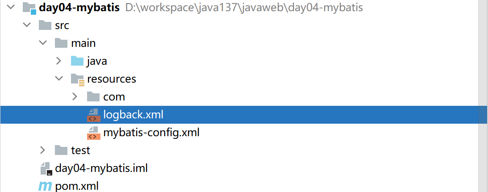
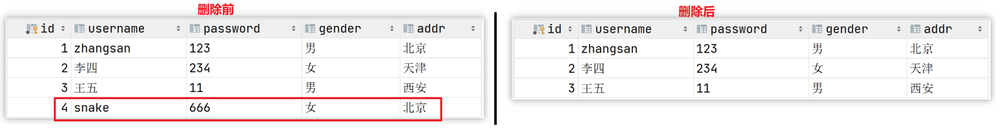
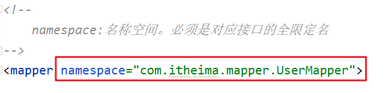

## 1  Mybatis概述

### 1.1  Mybatis概念

> * MyBatis 是一款优秀的==持久层框架==，用于简化 JDBC 开发
>
> * MyBatis 本是 Apache 的一个开源项目iBatis, 2010年这个项目由apache software foundation 迁移到了google code，并且改名为MyBatis 。2013年11月迁移到Github
>
> * 官网：https://mybatis.org/mybatis-3/zh/index.html 

**持久层：**

* 负责将数据到保存到数据库的那一层代码。

  以后开发我们会将操作数据库的Java代码作为持久层。而Mybatis就是对jdbc代码进行了封装。

* JavaEE三层架构：表现层、业务层、持久层

  三层架构在后期会给大家进行讲解，今天先简单的了解下即可。

**框架：**

* 框架就是一个半成品软件，是一套可重用的、通用的、软件基础代码模型
* 在框架的基础之上构建软件编写更加高效、规范、通用、可扩展

举例给大家简单的解释一下什么是半成品软件。大家小时候应该在公园见过给石膏娃娃涂鸦


如下图所示有一个石膏娃娃，这个就是一个半成品。你可以在这个半成品的基础上进行不同颜色的涂鸦


了解了什么是Mybatis后，接下来说说以前 `JDBC代码` 的缺点以及Mybatis又是如何解决的。

### 1.2  JDBC 缺点

下面是 JDBC 代码，我们通过该代码分析都存在什么缺点：


* 硬编码

  * 注册驱动、获取连接

    上图标1的代码有很多字符串，而这些是连接数据库的四个基本信息，以后如果要将Mysql数据库换成其他的关系型数据库的话，这四个地方都需要修改，如果放在此处就意味着要修改我们的源代码。

  * SQL语句

    上图标2的代码。如果表结构发生变化，SQL语句就要进行更改。这也不方便后期的维护。

* 操作繁琐

  * 手动设置参数

  * 手动封装结果集

    上图标4的代码是对查询到的数据进行封装，而这部分代码是没有什么技术含量，而且特别耗费时间的。

### 1.3  Mybatis 优化

* 硬编码可以配置到==配置文件==
* 操作繁琐的地方mybatis都==自动完成==

如图所示


## 2 Mybatis快速入门【重要】

**需求：查询user表中所有的数据**

### 2.1【第一大步】环境搭建

* 创建user表，添加数据

  ```sql
  create database mybatis;
  use mybatis;
  
  drop table if exists tb_user;
  
  create table tb_user(
  	id int primary key auto_increment,
  	username varchar(20),
  	password varchar(20),
  	gender char(1),
  	addr varchar(30)
  );
  
  INSERT INTO tb_user VALUES (1, 'zhangsan', '123', '男', '北京');
  INSERT INTO tb_user VALUES (2, '李四', '234', '女', '天津');
  INSERT INTO tb_user VALUES (3, '王五', '11', '男', '西安');
  ```

* 创建模块day04-mybatis，在创建好的模块中的 pom.xml 配置文件中添加依赖的坐标

  ```xml
  <dependencies>
      <!--mybatis 依赖-->
      <dependency>
          <groupId>org.mybatis</groupId>
          <artifactId>mybatis</artifactId>
          <version>3.5.6</version>
      </dependency>
  
      <!--mysql 驱动-->
      <dependency>
          <groupId>mysql</groupId>
          <artifactId>mysql-connector-java</artifactId>
          <version>5.1.46</version>
      </dependency>
  
      <!--junit 单元测试-->
      <dependency>
          <groupId>junit</groupId>
          <artifactId>junit</artifactId>
          <version>4.13</version>
          <scope>test</scope>
      </dependency>
  </dependencies>
  ```

- 创建包结构，在 `com.itheima.pojo` 包下创建和表对应的 User类


```java
public class User {
    private Integer id;
    private String username;
    private String password;
    private String gender;
    private String addr;
    
    //省略了 setter 和 getter
}
```

### 2.2【第二大步】编写核心配置文件

在resources中编写mybatis-config.xml配置文件，配置数据库的连接信息，在mybatis官网复制即可。

```xml
<?xml version="1.0" encoding="UTF-8" ?>
<!DOCTYPE configuration
        PUBLIC "-//mybatis.org//DTD Config 3.0//EN"
        "http://mybatis.org/dtd/mybatis-3-config.dtd">
<configuration>
  
    <environments default="development">
        <environment id="development">
            <transactionManager type="JDBC"/>
            <!--配置连接数据库的连接参数-->
            <dataSource type="POOLED">
                <property name="driver" value="com.mysql.jdbc.Driver"/>
                <property name="url" value="jdbc:mysql://localhost:3306/mybatis"/>
                <property name="username" value="root"/>
                <property name="password" value="root"/>
            </dataSource>
        </environment>
    </environments>

    <!--2 加载Mapper接口和SQL语句，将给的例子注释掉。后面第三大步中配置-->
    <!--<mappers>
        <mapper resource="org/mybatis/example/BlogMapper.xml"/>
    </mappers>-->
</configuration>
```

### 2.3【第三大步】编写mapper接口和SQL语句

- 【第一小步】在mapper包中编写UserMapper接口，在接口中编写查询所有的方法，并配置SQL语句

```java
public interface UserMapper {

    /**
     * 查询所有用户信息
     * @Select：定义查询语句的注解，参数为SQL语句
     */
    @Select("select * from tb_user")
    List<User> selectAll();
}
```

- 【第二小步】在mybatis-config.xml核心配置文件中加载映射配置文件

```xml
<!--加载映射配置文件-->
<mappers>
    <!--通过扫包加载该包下和所有mapper接口和接口中的SQL语句-->
    <package name="com.itheima.mapper"/>
</mappers>
```

### 2.4【第四大步】单元测试使用mybatis执行查询

```java
public class MybatisTest {

    @Test
    public void testSelectAll() throws IOException {
        //1 加载核心配置文件，获取 SqlSessionFactory对象,mybatis官网复制即可
        String resource = "mybatis-config.xml";
        InputStream inputStream = Resources.getResourceAsStream(resource);
        SqlSessionFactory sqlSessionFactory = new SqlSessionFactoryBuilder().build(inputStream);
        //2 获取 SqlSession 对象
        SqlSession sqlSession = sqlSessionFactory.openSession();
        //3 获取Mapper接口代理对象。
        UserMapper userMapper = sqlSession.getMapper(UserMapper.class);
        //4 执行方法，获取结果
        List<User> list = userMapper.selectAll();
        //5 处理结果，释放资源
        list.forEach(user -> System.out.println(user));
        sqlSession.close();
    }
}
```

### 2.5 logback打印执行过程信息【选做】

- 在pom.xml中添加依赖信息

```xml
<dependency>
    <groupId>ch.qos.logback</groupId>
    <artifactId>logback-classic</artifactId>
    <version>1.2.6</version>
</dependency>
```

- 将资料中logback.xml复制到resources中



### 2.6 快速入门总结

1、入门案例步骤：

​		环境搭建--->核心配置文件--->Mapper接口和SQL--->单元测试方法

2、核心配置文件：【重要】

​		①、配置连接数据库环境信息。

​		②、通过扫包加载和mapper接口和SQL

3、Mapper接口和SQL：【重要】

```java
@Select("select * from tb_user")
List<User> selectAll();
```

## 3  核心配置文件

核心配置文件中现有的配置之前已经给大家进行了解释，而核心配置文件中还可以配置很多内容。我们可以通过查询官网看可以配置的内容


接下来我们先对里面的一些配置进行讲解。

### 3.1.1  environments环境配置介绍

在核心配置文件的 `environments` 标签中其实是可以配置多个 `environment` ，使用 `id` 给每段环境起名，在 `environments` 中使用 `default='环境id'` 来指定使用哪儿段配置。我们一般就配置一个 `environment` 即可。

```xml
<!--environments：用于配置多种开发环境
        default="development" :表示使用下面id="development"的环境配置 -->
<environments default="development">
    <!--environment id="development" :定义连接数据库的环境，id表示该配置的唯一标识。这个标签可以出现多次-->
    <environment id="development">
        <!--事务管理器，取值如下：
                JDBC ：开启事务管理，推荐使用
                MANAGED ：不使用事务管理 -->
        <transactionManager type="JDBC"/>
        <!--内置的连接池：取值如下
                POOLED：使用连接池。UNPOOLED：不使用连接池 -->
        <dataSource type="POOLED">
            <!--连接参数-->
            <property name="driver" value="com.mysql.jdbc.Driver"/>
            <property name="url" value="jdbc:mysql://localhost:3306/mybatis"/>
            <property name="username" value="root"/>
            <property name="password" value="root"/>
        </dataSource>
    </environment>
    <!--第二个environment表示连接第二个数据库的环境-->
    <!-- 
        <environment id="test">
            <transactionManager type="JDBC"/>
            <dataSource type="POOLED">
                <property name="driver" value="com.mysql.jdbc.Driver"/>
                <property name="url" value="jdbc:mysql:///mybatis?useSSL=false"/>
                <property name="username" value="root"/>
                <property name="password" value="1234"/>
            </dataSource>
        </environment>
    -->
</environments>
```

### 3.1.2  mappers映射器配置

我们现在就要来定义 SQL 映射语句了。 但首先，我们需要告诉 MyBatis 到哪里去找到这些语句。

```xml
<!--加载映Mapper接口和SQL语句-->
<mappers>
    <!--加载一个，有多少个mapper接口就需要些多少个【不推荐】-->
    <!--<mapper class="com.itheima.mapper.UserMapper"/>-->
    <!--加载该包下所有Mapper接口中的SQL语句并存储，后期调用Mapper中方法时会执行对应SQL【推荐】-->
    <package name="com.itheima.mapper"/>
</mappers>
```

## 4 mybatis练习【重要】

### 4.1 查询用户详情

需求：根据id查询用户信息，例如：查询id=2的用户信息


#### 4.1.1 在UserMapper接口中定义方法和配置SQL语句

```java
/**
     * 根据id查询用户信息
     * @param id
     * @return
     */
@Select("select * from tb_user where id=#{id}")
public User selectById(int id);
```

#### 4.1.2 单元测试类

```java
@Test
public void testSelectById() throws IOException {
    //1 加载核心配置文件，获取 SqlSessionFactory对象
    String resource = "mybatis-config.xml";
    InputStream inputStream = Resources.getResourceAsStream(resource);
    SqlSessionFactory sqlSessionFactory = new SqlSessionFactoryBuilder().build(inputStream);
    //2 获取 SqlSession 对象
    SqlSession sqlSession = sqlSessionFactory.openSession();
    //3 获取Mapper接口代理对象，
    UserMapper userMapper = sqlSession.getMapper(UserMapper.class);
    //4 调用方法，得到结果
    User user = userMapper.selectById(2);
    //5 处理结果，释放资源
    System.out.println(user);
    sqlSession.close();
}
```

#### 4.1.3 查询总结

1、开发步骤：

  编写Mapper接口方法和SQL语句à单元测试方法

2、参数占位符：

  \#{}：执行SQL时，会将#{}占位符替换为?,将来自动设置参数值。

### 4.2 添加用户信息

需求：添加用户信息，例如：”张益达”,”123”,”男”,”武汉”


#### 4.2.1 在UserMapper接口中定义方法和配置SQL语句

```java
/**
     * 添加用户信息
     * @param user
     */
@Insert("insert into tb_user values(null,#{username},#{password},#{gender},#{addr})")
void add(User user);
```

#### 4.2.2 单元测试类

```java
@Test
public void testAdd() throws IOException {
    //1 加载核心配置文件，获取 SqlSessionFactory对象
    String resource = "mybatis-config.xml";
    InputStream inputStream = Resources.getResourceAsStream(resource);
    SqlSessionFactory sqlSessionFactory = new SqlSessionFactoryBuilder().build(inputStream);
    //2 获取 SqlSession 对象
    SqlSession sqlSession = sqlSessionFactory.openSession();
    //3 获取Mapper接口代理对象，
    UserMapper userMapper = sqlSession.getMapper(UserMapper.class);
    //4 调用方法，得到结果
    User user=new User();
    user.setUsername("张益达");
    user.setPassword("123");
    user.setAddr("湖北武汉");
    user.setGender("男");
    userMapper.add(user);
    //5 处理结果，释放资源
    sqlSession.commit(); //提交事务*****
    sqlSession.close();
}
```

#### 4.2.3 新增总结

1、对于新增我们需要进行事务管理，怎么做？

- openSession()：默认开启事务，进行增删改操作后需要使用  sqlSession.commit(); 手动提交事务

- openSession(true)：可以设置为自动提交事务（关闭事务）

2、思考：修改和删除要不要进行事务管理？

- ==要==

### 4.3 修改用户信息

需求：根据id修改用户信息，例如：将id=4的用户修改成”snake”,”666”,”女”,”北京”


#### 4.3.1 在UserMapper接口中定义方法和配置SQL语句

```java
/**
     * 修改用户信息
     * @param user
     */
@Update("update tb_user set username=#{username},password=#{password},gender=#{gender},addr=#{addr} where id=#{id}")
void update(User user);
```

#### 4.3.2 单元测试类

```java
@Test
public void testUpdate() throws IOException {
    //1 加载核心配置文件，获取 SqlSessionFactory对象
    String resource = "mybatis-config.xml";
    InputStream inputStream = Resources.getResourceAsStream(resource);
    SqlSessionFactory sqlSessionFactory = new SqlSessionFactoryBuilder().build(inputStream);
    //2 获取 SqlSession 对象
    SqlSession sqlSession = sqlSessionFactory.openSession();
    //3 获取Mapper接口代理对象，
    UserMapper userMapper = sqlSession.getMapper(UserMapper.class);
    //4 调用方法，得到结果
    User user=new User();
    user.setId(4);
    user.setUsername("snake");
    user.setPassword("666");
    user.setAddr("湖北黄冈");
    user.setGender("男");
    userMapper.update(user);
    //5 处理结果，释放资源
    sqlSession.commit(); //提交事务
    sqlSession.close();
}
```

### 4.4 删除用户信息

需求：根据id删除用户信息，例如：删除id=4的用户信息



#### 4.4.1 在UserMapper接口中定义方法和配置SQL语句

```java
/**
     * 根据id删除用户信息
     * @param id
     */
@Delete("delete from tb_user where id=#{id}")
void deleteById(int id);
```

#### 4.4.2 单元测试类

```java
@Test
public void testDeleteById() throws IOException {
    //1 加载核心配置文件，获取 SqlSessionFactory对象
    String resource = "mybatis-config.xml";
    InputStream inputStream = Resources.getResourceAsStream(resource);
    SqlSessionFactory sqlSessionFactory = new SqlSessionFactoryBuilder().build(inputStream);
    //2 获取 SqlSession 对象
    SqlSession sqlSession = sqlSessionFactory.openSession();
    //3 获取Mapper接口代理对象，
    UserMapper userMapper = sqlSession.getMapper(UserMapper.class);
    //4 调用方法，得到结果
    userMapper.deleteById(4);
    //5 处理结果，释放资源
    sqlSession.commit(); //提交事务
    sqlSession.close();
}
```

### 4.5 mybatis练习总结

1、搭建基础环境(依赖、POJO类、核心配置文件)【一次性】

2、开发步骤：Mapper接口定义方法,编写对应的SQL语句à单元测试【反复做】

==3、参数传递：在SQL中中使用#{}作为占位符。==

==4、事务处理：对于增删改操作需要进行事务控制，sqlSession.commit()表示手动提交事务,openSession(true)表示自动提交事务。==

## 5 XML方式配置SQL语句

### 5.1 映射配置文件和Mapper接口的对应关系

**==映射配置文件和Mapper接口的对应关系，必须满足以下要求：【重要】==**

```
1、映射配置文件的名称和Mapper接口名名称一致，并且将SQL映射文件和Mapper接口放置在同一目录下（文件映射）
2、设置SQL映射文件的namespace属性为Mapper接口全限定名（xml配置文件namespace）
3、映射文件中sql语句的id要和mapper接口的方法名一致，并保持参数类型和返回值类型一致（xml配置文件id=接口名）
```

### 5.2 配置实现

**1、映射配置文件的名称和Mapper接口名名称一致，并且将SQL映射文件和Mapper接口放置在同一目录下。**


为什么需要这么做，我们还是想通过mybatis-config.xml中配置的扫包的方式进行读取：


**在reousrces/com/itheima/mapper目录中创建UserMapper.xml文件，和UserMapper接口同名：**


**2、设置SQL映射文件的namespace属性为Mapper接口全限定名**



```xml
<?xml version="1.0" encoding="UTF-8" ?>
<!DOCTYPE mapper
        PUBLIC "-//mybatis.org//DTD Mapper 3.0//EN"
        "http://mybatis.org/dtd/mybatis-3-mapper.dtd">
<!--
    mapper标签：表示SQL语句映射关系
    namespace="com.itheima.mapper.UserMapper ：名称空间，用于区分每个映射配置文件，和mapper接口的全类名一致。
-->
<mapper namespace="com.itheima.mapper.UserMapper">

</mapper>
```

**3、映射文件中sql语句的id要和mapper接口的方法名一致，并保持参数类型和返回值类型一致**


```xml 
<?xml version="1.0" encoding="UTF-8" ?>
<!DOCTYPE mapper
        PUBLIC "-//mybatis.org//DTD Mapper 3.0//EN"
        "http://mybatis.org/dtd/mybatis-3-mapper.dtd">
<!--
  namespace="com.itheima.mapper.UserMapper"  :名称空间，给配置分类用的。写法为mapper接口的全类名
-->
<mapper namespace="com.itheima.mapper.UserMapper">

    <!--查询所有用户信息
        id="selectAll" :SQL的唯一标识，需要和mapper接口中的方法名一样
        resultType="com.itheima.pojo.User" ：查询的每一行数据要封装的对象类型-->
    <select id="selectAll" resultType="com.itheima.pojo.User">
        select * from tb_user
    </select>

    <!-- 根据id查询用户信息
    User selectById(int id);
    parameterType="int" :表示参数类型，如果是对象类型就需要些全类名或者别名，可以省略不写 -->
    <select id="selectById" resultType="user" parameterType="int">
        select * from tb_user where id=#{id}
    </select>


    <!--添加用户信息 void add(User user);-->
    <insert id="add" parameterType="com.itheima.pojo.User">
        insert into tb_user values(null,#{username},#{password},#{gender},#{addr})
    </insert>

    <!--修改用户信息 void update(User user);-->
    <update id="update">
        update tb_user set username=#{username},password=#{password},gender=#{gender},addr=#{addr} where id=#{id}
    </update>

    <!--根据id删除用户信息 void deleteById(int id);-->
    <delete id="deleteById">
        delete from tb_user where id=#{id}
    </delete>

</mapper>
```

### 5.3 XML方式配置SQL语句总结

1、映射配置文件有哪些要求？

  ==1.1、位置和名称要和Mapper接口一样；==

  ==1.2、Namespace+SQL的id=Mmapper接口的全类名+方法名；==

2、增删改查分页使用什么标签？

  ==<insert>、<delete>、<update>、<select>==

3、parameterType属性和resultType属性分别表示什么？

  3.1、parameterType：表示参数类型，可以省略不写；

  ==3.2、resultType：表示查询的每一行数据要封装的数据类型，引用类型要写全类名，只有<select>标签才有此属性。==

4、思考：Mapper接口中的方法能不能重载？

  ==不能==，因为方法名就是SQL的唯一标识id，不能重复

## 6 常见异常

### 异常1

#### 现象


#### 原因：

mybatis-config.xml没有放到resources目录中，而是方法resources的子目录中去了

#### 解决

将mybatis-config.xml直接放到resources目录中就行了

### 异常2

#### 现象


#### 原因

mapper接口中的方法和映射配置文件中的sql语句不对应。

①、namespace中接口的全类名写错了。

②、映射配置文件的文件名和接口的名字不一样

③、映射配置文件和接口不再一个目录中，可能是新建目录的使用用com.itheima.mapper而不是com/itheima/mapper

③、方法名和sql语句的id值不一样

#### 解决：

检查以上所有情况


### 异常3

#### 现象


#### 原因

在mybatis-config.xml中加载映射配置文件，扫包写错了或者用的不是<package name="">标签。

#### 解决：

\<package name="com.itheima.mapper"/>要写对。

### 异常4


#### 原因

不知的数据库名称

#### 解决

在mybatis-config.xml中找到<property name="url" value="jdbc:mysql://localhost:3306/mybatis"/>，检查数据库名称

### 异常5

#### 现象


#### 原因

映射配置文件中，sql语句使用的表不存在

#### 解决

修改SQL语句中的表名

```xml
<select id="selectAll" resultType="com.itheima.pojo.User">
    select * from tb_user
</select>
```

