## 1 配置文件实现CRUD


如上图所示产品原型，里面包含了品牌数据的 `查询` 、`按条件查询`、`添加`、`删除`、`批量删除`、`修改` 等功能，而这些功能其实就是对数据库表中的数据进行CRUD操作。接下来我们就使用Mybatis完成品牌数据的增删改查操作。以下是我们要完成功能列表：

> * 查询
>   * 查询所有数据
>   * 查询详情
>   * 条件查询
> * 添加
> * 修改
>   * 修改全部字段
>   * 修改动态字段
> * 删除
>   * 删除一个
>   * 批量删除

我们先将必要的环境准备一下。

### 1.1  环境准备

* 数据库表（tb_brand）及数据准备

  ```sql
  -- 删除tb_brand表
  drop table if exists tb_brand;
  -- 创建tb_brand表
  create table tb_brand
  (
      -- id 主键
      id           int primary key auto_increment,
      -- 品牌名称
      brand_name   varchar(20),
      -- 企业名称
      company_name varchar(20),
      -- 排序字段
      ordered      int,
      -- 描述信息
      description  varchar(100),
      -- 状态：0：禁用  1：启用
      status       int
  );
  -- 添加数据
  insert into tb_brand (brand_name, company_name, ordered, description, status)
  values ('三只松鼠', '三只松鼠股份有限公司', 5, '好吃不上火', 0),
         ('华为', '华为技术有限公司', 100, '华为致力于把数字世界带入每个人、每个家庭、每个组织，构建万物互联的智能世界', 1),
         ('小米', '小米科技有限公司', 50, 'are you ok', 1);
  ```

* 实体类 Brand

  在 `com.itheima.pojo` 包下创建 Brand 实体类。

  ```java
  public class Brand {
      // id 主键
      private Integer id;
      // 品牌名称
      private String brandName;
      // 企业名称
      private String companyName;
      // 排序字段
      private Integer ordered;
      // 描述信息
      private String description;
      // 状态：0：禁用  1：启用
      private Integer status;
      
      //省略 setter and getter。自己写时要补全这部分代码
  }
  ```

* 编写测试用例

  测试代码需要在 `test/java` 目录下创建包及测试用例。项目结构如下：

  

* 安装 MyBatisX 插件

  * MybatisX 是一款基于 IDEA 的快速开发插件，为效率而生。

  * 主要功能

    * XML映射配置文件 和 接口方法 间相互跳转
    * 根据接口方法生成 statement 

  * 安装方式

    点击 `file` ，选择 `settings` ，就能看到如下图所示界面

    

    > 注意：安装完毕后需要重启IDEA

  * 插件效果

    

    红色头绳的表示映射配置文件，蓝色头绳的表示mapper接口。在mapper接口点击红色头绳的小鸟图标会自动跳转到对应的映射配置文件，在映射配置文件中点击蓝色头绳的小鸟图标会自动跳转到对应的mapper接口。也可以在mapper接口中定义方法，自动生成映射配置文件中的 `statement` ，如图所示

    

### 1.2  查询所有数据

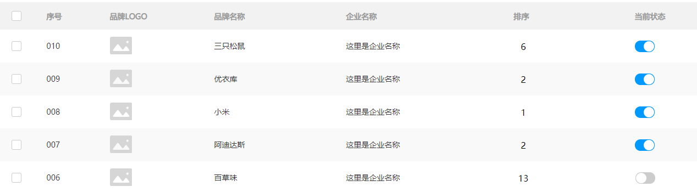

如上图所示就页面上展示的数据，而这些数据需要从数据库进行查询。接下来我们就来讲查询所有数据功能，而实现该功能我们分以下步骤进行实现：

* 编写接口方法：Mapper接口

  * 参数：无

    查询所有数据功能是不需要根据任何条件进行查询的，所以此方法不需要参数。

    

  * 结果：List<Brand>

    我们会将查询出来的每一条数据封装成一个 `Brand` 对象，而多条数据封装多个 `Brand` 对象，需要将这些对象封装到List集合中返回。

    

  * 执行方法、测试

#### 1.2.1  编写接口方法

在 `com.itheima.mapper` 包写创建名为 `BrandMapper` 的接口。并在该接口中定义 `List<Brand> selectAll()` 方法。

```java
public interface BrandMapper {

    /**
     * 查询所有
     */
    List<Brand> selectAll();
}
```

#### 1.2.2  编写SQL语句

在 `reources` 下创建 `com/itheima/mapper` 目录结构，并在该目录下创建名为 `BrandMapper.xml` 的映射配置文件

```xml
<?xml version="1.0" encoding="UTF-8" ?>
<!DOCTYPE mapper
        PUBLIC "-//mybatis.org//DTD Mapper 3.0//EN"
        "http://mybatis.org/dtd/mybatis-3-mapper.dtd">

<mapper namespace="com.itheima.mapper.BrandMapper">
    <select id="selectAll" resultType="brand">
        select *
        from tb_brand;
    </select>
</mapper>
```

#### 1.2.3  编写测试方法

在 `MybatisTest` 类中编写测试查询所有的方法

```java
@Test
public void testSelectAll() throws IOException {
    //1. 获取SqlSessionFactory
    String resource = "mybatis-config.xml";
    InputStream inputStream = Resources.getResourceAsStream(resource);
    SqlSessionFactory sqlSessionFactory = new SqlSessionFactoryBuilder().build(inputStream);

    //2. 获取SqlSession对象
    SqlSession sqlSession = sqlSessionFactory.openSession();

    //3. 获取Mapper接口的代理对象
    BrandMapper brandMapper = sqlSession.getMapper(BrandMapper.class);

    //4. 执行方法
    List<Brand> brands = brandMapper.selectAll();
    System.out.println(brands);

    //5. 释放资源
    sqlSession.close();

}
```

> 注意：现在我们感觉测试这部分代码写起来特别麻烦，我们可以先忍忍。以后我们只会写上面的第3步的代码，其他的都不需要我们来完成。

执行测试方法结果如下：


从上面结果我们看到了问题，有些数据封装成功了，而有些数据并没有封装成功。为什么这样呢？

这个问题可以通过两种方式进行解决：

* 给字段起别名
* 使用resultMap定义字段和属性的映射关系

#### 1.2.4  起别名解决上述问题

从上面结果可以看到 `brandName` 和 `companyName` 这两个属性的数据没有封装成功，查询 实体类 和 表中的字段 发现，在实体类中属性名是 `brandName` 和 `companyName` ，而表中的字段名为 `brand_name` 和 `company_name`，如下图所示 。那么我们只需要保持这两部分的名称一致这个问题就迎刃而解。


我们可以在写sql语句时给这两个字段起别名，将别名定义成和属性名一致即可。

```xml
<select id="selectAll" resultType="brand">
    select
    id, brand_name as brandName, company_name as companyName, ordered, description, status
    from tb_brand;
</select>
```

而上面的SQL语句中的字段列表书写麻烦，如果表中还有更多的字段，同时其他的功能也需要查询这些字段时就显得我们的代码不够精炼。

#### 1.2.5  使用resultMap解决上述问题

起别名，但是它也存在问题。将来很多查询都取别名麻烦，复用性差。那么我们也可以使用resultMap来定义字段和属性的映射关系的方式解决上述问题。

* 在映射配置文件中使用resultMap定义 字段 和 属性 的映射关系

  ```xml
  <resultMap id="brandResultMap" type="brand">
      <!--
              id：完成主键字段的映射
                  column：表的列名
                  property：实体类的属性名
              result：完成一般字段的映射
                  column：表的列名
                  property：实体类的属性名
          -->
      <result column="brand_name" property="brandName"/>
      <result column="company_name" property="companyName"/>
  </resultMap>
  ```

  > 注意：在上面只需要定义 字段名 和 属性名 不一样的映射，而一样的则不需要专门定义出来。

* SQL语句正常编写

  ```xml
  <select id="selectAll" resultMap="brandResultMap">
      select *
      from tb_brand;
  </select>
  ```

#### 1.2.6 开启驼峰命名自动映射

在mybatis-config.xml核心配置文件中配置使用驼峰命名法


```xml
<settings>
    <!--开启驼峰命名映射-->
    <setting name="mapUnderscoreToCamelCase" value="true"/>
</settings>
```


#### 1.2.6  小结

实体类属性名 和 数据库表列名 不一致，不能自动封装数据

* ==起别名：==在SQL语句中，对不一样的列名起别名，别名和实体类属性名一样
* ==resultMap：==定义<resultMap> 完成不一致的属性名和列名的映射

而我们最终选择使用 resultMap的方式。查询映射配置文件中查询所有的 statement 书写如下：

```xml
 <resultMap id="brandResultMap" type="brand">
     <!--
            id：完成主键字段的映射
                column：表的列名
                property：实体类的属性名
            result：完成一般字段的映射
                column：表的列名
                property：实体类的属性名
        -->
     <result column="brand_name" property="brandName"/>
     <result column="company_name" property="companyName"/>
</resultMap>


<select id="selectAll" resultMap="brandResultMap">
    select *
    from tb_brand;
</select>
```

- ==开启驼峰命名自动映射：==在mybatis-config.xml核心配置文件中配置使用驼峰命名法

```xml
<settings>
    <!--开启驼峰命名映射-->
    <setting name="mapUnderscoreToCamelCase" value="true"/>
</settings>
```


### 1.3  查询详情


有些数据的属性比较多，在页面表格中无法全部实现，而只会显示部分，而其他属性数据的查询可以通过 `查看详情` 来进行查询，如上图所示。

查看详情功能实现步骤：

* 编写接口方法：Mapper接口

  

  * 参数：id

    查看详情就是查询某一行数据，所以需要根据id进行查询。而id以后是由页面传递过来。

  * 结果：Brand

    根据id查询出来的数据只要一条，而将一条数据封装成一个Brand对象即可

* 编写SQL语句：SQL映射文件

  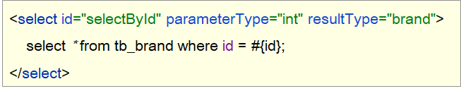

* 执行方法、进行测试

#### 1.3.1  编写接口方法

在 `BrandMapper` 接口中定义根据id查询数据的方法 

```java
/**
  * 查看详情：根据Id查询
  */
Brand selectById(int id);
```

#### 1.3.2  编写SQL语句

在 `BrandMapper.xml` 映射配置文件中编写 `statement`，使用 `resultMap` 而不是使用 `resultType`

```xml
<select id="selectById"  resultMap="brandResultMap">
    select *
    from tb_brand where id = #{id};
</select>
```

> 注意：上述SQL中的 #{id}先这样写，一 会我们再详细讲解

#### 1.3.3  编写测试方法

在 `test/java` 下的 `com.itheima.mapper`  包下的 `MybatisTest类中` 定义测试方法

```java
@Test
public void testSelectById() throws IOException {
    //1. 获取SqlSessionFactory
    String resource = "mybatis-config.xml";
    InputStream inputStream = Resources.getResourceAsStream(resource);
    SqlSessionFactory sqlSessionFactory = new SqlSessionFactoryBuilder().build(inputStream);

    //2. 获取SqlSession对象
    SqlSession sqlSession = sqlSessionFactory.openSession();

    //3. 获取Mapper接口的代理对象
    BrandMapper brandMapper = sqlSession.getMapper(BrandMapper.class);

    //4. 执行方法
    Brand brand = brandMapper.selectById(1);
    System.out.println(brand);

    //5. 释放资源
    sqlSession.close();
}
```

执行测试方法结果如下：


#### 1.3.4  参数占位符

查询到的结果很好理解就是id为1的这行数据。而这里我们需要看控制台显示的SQL语句，能看到使用？进行占位。说明我们在映射配置文件中的写的 `#{id}` 最终会被？进行占位。接下来我们就聊聊映射配置文件中的参数占位符。

mybatis提供了两种参数占位符：

* \#{} ：执行SQL时，会将 #{} 占位符替换为？，将来自动设置参数值。从上述例子可以看出使用#{} 底层使用的是 `PreparedStatement`

* \${} ：拼接SQL。底层使用的是 `Statement`，会存在SQL注入问题。如下图将 映射配置文件中的 #{} 替换成 ${} 来看效果

  ```xml
  <select id="selectById"  resultMap="brandResultMap">
      select *
      from tb_brand where id = ${id};
  </select>
  ```

  重新运行查看结果如下：

  

> ==注意：==从上面两个例子可以看出，以后开发我们使用 #{} 参数占位符。

#### 1.3.5  parameterType使用

对于有参数的mapper接口方法，我们在映射配置文件中应该配置 `ParameterType` 来指定参数类型。只不过该属性都可以省略。如下图：

```xml
<select id="selectById" parameterType="int" resultMap="brandResultMap">
    select *
    from tb_brand where id = ${id};
</select>
```

#### 1.3.6  SQL语句中特殊字段处理

以后肯定会在SQL语句中写一下特殊字符，比如某一个字段大于某个值，如下图


可以看出报错了，因为映射配置文件是xml类型的问题，而 > < 等这些字符在xml中有特殊含义，所以此时我们需要将这些符号进行转义，可以使用以下两种方式进行转义

* 转义字符

  下图的 `&lt;` 就是 `<` 的转义字符。

  

* <![CDATA[内容]]>

  


### 1.4  添加数据


如上图是我们平时在添加数据时展示的页面，而我们在该页面输入想要的数据后添加 `提交` 按钮，就会将这些数据添加到数据库中。接下来我们就来实现添加数据的操作。

* 编写接口方法

  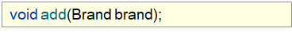

  参数：除了id之外的所有的数据。id对应的是表中主键值，而主键我们是 ==自动增长== 生成的。

* 编写SQL语句

  

* 编写测试方法并执行

明确了该功能实现的步骤后，接下来我们进行具体的操作。

#### 1.4.1  编写接口方法

在 `BrandMapper` 接口中定义添加方法。

```java
 /**
   * 添加
   */
void add(Brand brand);
```

#### 1.4.2  编写SQL语句

在 `BrandMapper.xml` 映射配置文件中编写添加数据的 `statement`

```xml
<insert id="add">
    insert into tb_brand (brand_name, company_name, ordered, description, status)
    values (#{brandName}, #{companyName}, #{ordered}, #{description}, #{status});
</insert>
```

#### 1.4.3  编写测试方法

在 `test/java` 下的 `com.itheima.mapper`  包下的 `MybatisTest类中` 定义测试方法

```java
@Test
public void testAdd() throws IOException {


    //1. 获取SqlSessionFactory
    String resource = "mybatis-config.xml";
    InputStream inputStream = Resources.getResourceAsStream(resource);
    SqlSessionFactory sqlSessionFactory = new SqlSessionFactoryBuilder().build(inputStream);
    //2. 获取SqlSession对象
    SqlSession sqlSession = sqlSessionFactory.openSession();
    //SqlSession sqlSession = sqlSessionFactory.openSession(true); //设置自动提交事务，这种情况不需要手动提交事务了
    //3. 获取Mapper接口的代理对象
    BrandMapper brandMapper = sqlSession.getMapper(BrandMapper.class);
    //准备参数对象，开发中由页面传递过来
    Brand brand = new Brand();
    brand.setStatus(1;);
    brand.setCompanyName("波导手机");
    brand.setBrandName("波导");
    brand.setDescription("手机中的战斗机");
    brand.setOrdered(100);
    //4. 执行方法
    brandMapper.add(brand);
    //提交事务
    sqlSession.commit();
    //5. 释放资源
    sqlSession.close();
}
```

执行结果如下：


#### 1.4.4  添加-主键返回

在数据添加成功后，有时候需要获取插入数据库数据的主键（主键是自增长）。

比如：添加订单和订单项，如下图就是京东上的订单

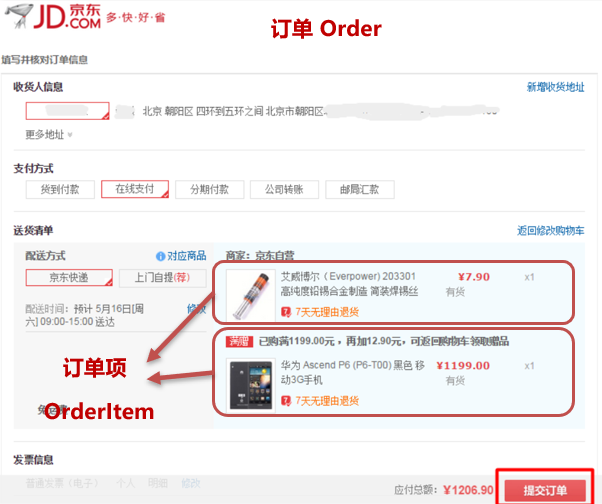

订单数据存储在订单表中，订单项存储在订单项表中。

* 添加订单数据

  

* 添加订单项数据，订单项中需要设置所属订单的id

  

明白了什么时候 `主键返回` 。接下来我们简单模拟一下，在添加完数据后打印id属性值，能打印出来说明已经获取到了。

我们将上面添加品牌数据的案例中映射配置文件里 `statement` 进行修改，如下

```xml
<insert id="add" useGeneratedKeys="true" keyProperty="id">
    insert into tb_brand (brand_name, company_name, ordered, description, status)
    values (#{brandName}, #{companyName}, #{ordered}, #{description}, #{status});
</insert>
```

> 在 insert 标签上添加如下属性：
>
> * useGeneratedKeys：是够获取自动增长的主键值。true表示获取
> * keyProperty  ：指定将获取到的主键值封装到哪儿个属性里

**注解方式新增并返回主键id：**

~~~java
@Insert("insert into tb_brand (brand_name,…) values (#{brandName},…)")
@Opetions(useGeneratedKeys = true,keyProperty = "id")
public void add(Brand brand);
~~~

### 1.5 修改数据

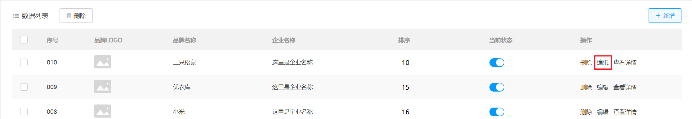

如图所示，点击条目后面的`编辑`按钮，会进入到编辑页面，展示当前品牌修改前数据。

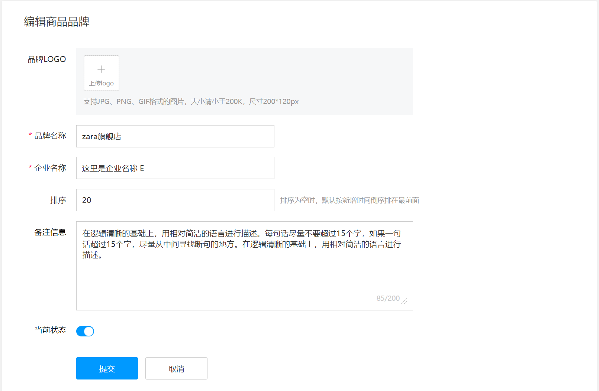

用户填写完最新的数据之后，点击提交，将修改后的数据发送给后端java程序。思考一下，后端java程序根据什么进行修改？是通过主键id修改，因为id是表中数据的唯一标识。

#### 1.5.1 编写接口方法

在 `BrandMapper` 接口中定义根据id修改方法。

```java
/**
     * 修改品牌
     * @param brand
     */
void update(Brand brand);
```

#### 1.5.2 编写SQL语句

在 `BrandMapper.xml` 映射配置文件中编写修改数据的SQL语句

```xml
<!--修改品牌-->
<update id="update">
    update tb_brand set brand_name=#{brandName}, company_name=#{companyName}, ordered=#{ordered}, description=#{description}, status=#{status} where id=#{id}
</update>
```

#### 1.5.3 编写测试方法

在 `test/java` 下的 `com.itheima.mapper`  包下的 `MybatisTest类中` 定义测试方法

```java
/**
     * 修改品牌
     */
@Test
public void testUpdate() throws IOException {
    //1 加载mybatis-config.xml核心配置文件，获取SqlSessionFactory对象
    String resource = "mybatis-config.xml";
    InputStream inputStream = Resources.getResourceAsStream(resource);
    SqlSessionFactory sqlSessionFactory = new SqlSessionFactoryBuilder().build(inputStream);

    //2 获取SqlSession对象,参数true表示要自动提交
    SqlSession sqlSession = sqlSessionFactory.openSession(true);

    //3 通过SqlSession获取BrandMapper对象
    BrandMapper brandMapper = sqlSession.getMapper(BrandMapper.class);

    //4 调用方法
    Brand brand=new Brand();
    brand.setId(3);
    brand.setBrandName("海澜之家");
    brand.setCompanyName("海澜之家");
    brand.setOrdered(100);
    brand.setDescription("男人的衣柜");
    brand.setStatus(0);
    brandMapper.update(brand);

    //5 处理结果，释放资源
    //提交事务
    //sqlSession.commit();
    sqlSession.close();
```

运行过程只要没报错，直接到数据库查询数据是否修改成功即可。

### 1.6  删除一行数据


如上图所示，每行数据后面都有一个 `删除` 按钮，当用户点击了该按钮，就会将改行数据删除掉。那我们就需要思考，这种删除是根据什么进行删除呢？是通过主键id删除，因为id是表中数据的唯一标识。

接下来就来实现该功能。

#### 1.6.1  编写接口方法

在 `BrandMapper` 接口中定义根据id删除方法。

```java
/**
  * 根据id删除
  */
void deleteById(int id);
```

#### 1.6.2  编写SQL语句

在 `BrandMapper.xml` 映射配置文件中编写删除一行数据的 `statement`

```xml
<delete id="deleteById">
    delete from tb_brand where id = #{id};
</delete>
```

#### 1.6.3  编写测试方法

在 `test/java` 下的 `com.itheima.mapper`  包下的 `MybatisTest类中` 定义测试方法

```java
 @Test
public void testDeleteById() throws IOException {
    //接收参数
    int id = 6;

    //1. 获取SqlSessionFactory
    String resource = "mybatis-config.xml";
    InputStream inputStream = Resources.getResourceAsStream(resource);
    SqlSessionFactory sqlSessionFactory = new SqlSessionFactoryBuilder().build(inputStream);
    //2. 获取SqlSession对象
    SqlSession sqlSession = sqlSessionFactory.openSession();
    //SqlSession sqlSession = sqlSessionFactory.openSession(true);
    //3. 获取Mapper接口的代理对象
    BrandMapper brandMapper = sqlSession.getMapper(BrandMapper.class);
    //4. 执行方法
    brandMapper.deleteById(id);
    //提交事务
    sqlSession.commit();
    //5. 释放资源
    sqlSession.close();
}
```

运行过程只要没报错，直接到数据库查询数据是否还存在。

## 2 动态SQL

### 2.1  多条件查询


我们经常会遇到如上图所示的多条件查询，将多条件查询的结果展示在下方的数据列表中。而我们做这个功能需要分析最终的SQL语句应该是什么样，思考两个问题

* 条件表达式
* 如何连接

条件字段 `企业名称`  和 `品牌名称` 需要进行模糊查询，所以条件应该是：


简单的分析后，我们来看功能实现的步骤：

* 编写接口方法
  * 参数：所有查询条件
  * 结果：List<Brand>
* 在映射配置文件中编写SQL语句

* 编写测试方法并执行

#### 2.1.1  编写接口方法

在 `BrandMapper` 接口中定义多条件查询的方法。

而该功能有三个参数，我们就需要考虑定义接口时，参数应该如何定义。Mybatis针对多参数有多种实现

* 使用 `@Param("参数名称")` 标记每一个参数，在映射配置文件中就需要使用 `#{参数名称}` 进行占位

  ```java
  List<Brand> selectByCondition(@Param("status") int status, @Param("companyName") String companyName,@Param("brandName") String brandName);
  ```

* 将多个参数封装成一个 实体对象 ，将该实体对象作为接口的方法参数。该方式要求在映射配置文件的SQL中使用 `#{内容}` 时，里面的内容必须和实体类属性名保持一致。

  ```java
  List<Brand> selectByCondition(Brand brand);
  ```

* 将多个参数封装到map集合中，将map集合作为接口的方法参数。该方式要求在映射配置文件的SQL中使用 `#{内容}` 时，里面的内容必须和map集合中键的名称一致。

  ```
  List<Brand> selectByCondition(Map map);
  ```

#### 2.1.2  编写SQL语句

在 `BrandMapper.xml` 映射配置文件中编写 `statement`，使用 `resultMap` 而不是使用 `resultType`

```xml
<select id="selectByCondition" resultMap="brandResultMap">
    select *
    from tb_brand
    where status = #{status}
    and company_name like concat('%',#{companyName},'%')
    and brand_name like concat('%',#{brandName},'%')
</select>
```

#### 2.1.3  编写测试方法

在 `test/java` 下的 `com.itheima.mapper`  包下的 `MybatisTest类中` 定义测试方法

```java
@Test
public void testSelectByCondition() throws IOException {
    //1. 获取SqlSessionFactory
    String resource = "mybatis-config.xml";
    InputStream inputStream = Resources.getResourceAsStream(resource);
    SqlSessionFactory sqlSessionFactory = new SqlSessionFactoryBuilder().build(inputStream);
    //2. 获取SqlSession对象
    SqlSession sqlSession = sqlSessionFactory.openSession();
    //3. 获取Mapper接口的代理对象
    BrandMapper brandMapper = sqlSession.getMapper(BrandMapper.class);

    //4. 执行方法
    //方式一 ：接口方法参数使用 @Param 方式调用的方法
    //List<Brand> brands = brandMapper.selectByCondition(1, "华为", "华为");
    //方式二 ：接口方法参数是 实体类对象 方式调用的方法
    //封装对象
    /* Brand brand = new Brand();
        brand.setStatus(1);
        brand.setCompanyName("华为");
        brand.setBrandName("华为");*/

    //List<Brand> brands = brandMapper.selectByCondition(brand);

    //方式三 ：接口方法参数是 map集合对象 方式调用的方法
    Map map = new HashMap();
    map.put("status" , 1);
    map.put("companyName", "华为");
    map.put("brandName" , "华为");
    List<Brand> brands = brandMapper.selectByCondition(map);
    System.out.println(brands);

    //5. 释放资源
    sqlSession.close();
}
```

#### 2.1.4  动态SQL

上述功能实现存在很大的问题。用户在输入条件时，肯定不会所有的条件都填写，这个时候我们的SQL语句就不能那样写的

例如用户只输入 当前状态 时，SQL语句就是

```sql
select * from tb_brand where status = #{status}
```

而用户如果只输入企业名称时，SQL语句就是

```sql
select * from tb_brand where company_name like #{companName}
```

而用户如果输入了 `当前状态` 和 `企业名称 ` 时，SQL语句又不一样

```sql
select * from tb_brand where status = #{status} and company_name like #{companName}
```

针对上述的需要，Mybatis对动态SQL有很强大的支撑：

> * if
>
> * choose (when, otherwise)
>
> * trim (where, set)
>
> * foreach

我们先学习 if 标签和 where 标签：

* if 标签：条件判断

  * test 属性：逻辑表达式

  ```xml
  <select id="selectByCondition" resultMap="brandResultMap">
      select *
      from tb_brand
      where
          <if test="status != null">
              and status = #{status}
          </if>
          <if test="companyName != null and companyName != '' ">
              and company_name like concat('%',#{companyName},'%')
          </if>
          <if test="brandName != null and brandName != '' ">
              and brand_name like  concat('%',#{brandName},'%')
          </if>
  </select>
  ```

  如上的这种SQL语句就会根据传递的参数值进行动态的拼接。如果此时status和companyName有值那么就会值拼接这两个条件。

  执行结果如下：

  

  但是它也存在问题，如果此时给的参数值是

  ```java
  Map map = new HashMap();
  // map.put("status" , 1);
  map.put("companyName", "华为");
  map.put("brandName" , "华为");
  ```

  拼接的SQL语句就变成了

  ```sql
  select * from tb_brand where and company_name like ? and brand_name like ?
  ```

  而上面的语句中 where 关键后直接跟 and 关键字，这就是一条错误的SQL语句。这个就可以使用 where 标签解决

* where 标签

  * 作用：
    * 替换where关键字
    * 会动态的去掉第一个条件前的 and 
    * 如果所有的参数没有值则不加where关键字

```xml
<select id="selectByCondition" resultMap="brandResultMap">
    select *
    from tb_brand
    <where>
        <if test="status != null">
            and status = #{status}
        </if>
        <if test="companyName != null and companyName != '' ">
            and company_name like concat('%',#{companyName},'%')
        </if>
        <if test="brandName != null and brandName != '' ">
            and brand_name like  concat('%',#{brandName},'%')
        </if>
    </where>
</select>
```

> 注意：需要给每个条件前都加上 and 关键字。

如果用注解使用的话对应的代码如下：在SQL的外面定义一组<script>标签包裹起来。

```java
/**
     * 多条件查询-动态SQL
     * @return
     */
@Select("<script>select * from tb_brand\n" +
        "        <where>\n" +
        "            <if test=\"status !=null\">\n" +
        "                status=#{status}\n" +
        "            </if>\n" +
        "            <if test=\"companyName!=null and companyName!=''\">\n" +
        "                and company_name like concat('%',#{companyName},'%')\n" +
        "            </if>\n" +
        "            <if test=\"brandName!=null and brandName!=''\">\n" +
        "                and brand_name like concat('%',#{brandName},'%')\n" +
        "            </if>\n" +
        "        </where></script>")
List<Brand> selectByCondition(Brand brand);
```

上述代码的可读性大幅度降低，所以对于复杂SQL建议大家还是在映射配置文件中定义。

### 2.2 单个条件（动态SQL）


如上图所示，在查询时只能选择 `品牌名称`、`当前状态`、`企业名称` 这三个条件中的一个，但是用户到底选择哪儿一个，我们并不能确定。这种就属于单个条件的动态SQL语句。 

这种需求需要使用到  `choose（when，otherwise）标签`  实现，  而 `choose` 标签类似于Java 中的switch语句。

通过一个案例来使用这些标签

#### 2.2.1  编写接口方法

在 `BrandMapper` 接口中定义单条件查询的方法。

```java
/**
  * 单条件动态查询
  * @param brand
  * @return
  */
List<Brand> selectByConditionSingle(Brand brand);
```

#### 2.2.2  编写SQL语句

在 `BrandMapper.xml` 映射配置文件中编写 `statement`，使用 `resultMap` 而不是使用 `resultType`

```xml
<select id="selectByConditionSingle" resultMap="brandResultMap">
    select *
    from tb_brand
    <where>
        <choose><!--相当于switch-->
            <when test="status != null"><!--相当于case-->
                status = #{status}
            </when>
            <when test="companyName != null and companyName != '' "><!--相当于case-->
                company_name like concat('%',#{companyName},'%')
            </when>
            <when test="brandName != null and brandName != ''"><!--相当于case-->
                brand_name like concat('%',#{brandName},'%')
            </when>
        </choose>
    </where>
</select>
```

#### 2.2.3  编写测试方法

在 `test/java` 下的 `com.itheima.mapper`  包下的 `MybatisTest类中` 定义测试方法

```java
@Test
public void testSelectByConditionSingle() throws IOException {
    //1. 获取SqlSessionFactory
    String resource = "mybatis-config.xml";
    InputStream inputStream = Resources.getResourceAsStream(resource);
    SqlSessionFactory sqlSessionFactory = new SqlSessionFactoryBuilder().build(inputStream);
    //2. 获取SqlSession对象
    SqlSession sqlSession = sqlSessionFactory.openSession();
    //3. 获取Mapper接口的代理对象
    BrandMapper brandMapper = sqlSession.getMapper(BrandMapper.class);
    //封装参数对象
    Brand brand = new Brand();
    //brand.setStatus(1);
    brand.setCompanyName("华为");
    //brand.setBrandName("华为");
    //4. 执行方法
    List<Brand> brands = brandMapper.selectByConditionSingle(brand);
    System.out.println(brands);

    //5. 释放资源
    sqlSession.close();
}
```

执行测试方法结果如下：


### 2.3  动态修改部分定字段

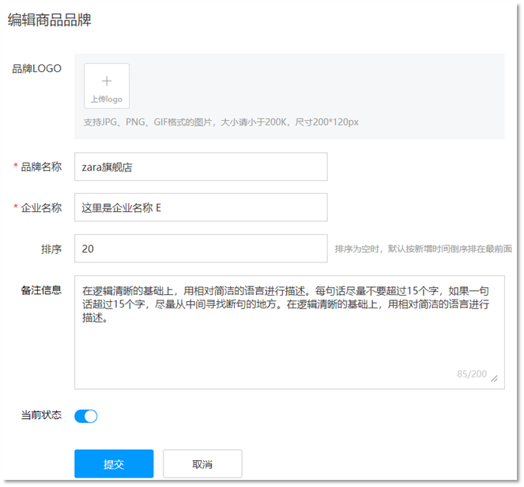

如图所示是修改页面，用户在该页面书写需要修改的数据，点击 `提交` 按钮，就会将数据库中对应的数据进行修改。注意一点，如果哪儿个输入框没有输入内容，我们是将表中数据对应字段值替换为空白还是保留字段之前的值？答案肯定是保留之前的数据。

接下来我们就具体来实现

#### 2.3.1  编写接口方法

在 `BrandMapper` 接口中定义修改方法。

```java
 /**
   * 修改
   */
void updatePart(Brand brand);
```

> 上述方法参数 Brand 就是封装了需要修改的数据，而id肯定是有数据的，这也是和添加方法的区别。

#### 2.3.2  编写SQL语句

在 `BrandMapper.xml` 映射配置文件中编写修改数据的 `statement`。

```xml
<update id="updatePart">
    update tb_brand
    <set>
        <if test="brandName != null and brandName != ''">
            brand_name = #{brandName},
        </if>
        <if test="companyName != null and companyName != ''">
            company_name = #{companyName},
        </if>
        <if test="ordered != null">
            ordered = #{ordered},
        </if>
        <if test="description != null and description != ''">
            description = #{description},
        </if>
        <if test="status != null">
            status = #{status}
        </if>
    </set>
    where id = #{id};
</update>
```

> *set* 标签可以用于动态包含需要更新的列，忽略其它不更新的列。

#### 2.3.3  编写测试方法

在 `test/java` 下的 `com.itheima.mapper`  包下的 `MybatisTest类中` 定义测试方法

```java
/**
     * 修改部分字段-动态SQL
     */
@Test
public void testUpdatePart() throws IOException {
    //1 加载mybatis-config.xml核心配置文件，获取SqlSessionFactory对象
    String resource = "mybatis-config.xml";
    InputStream inputStream = Resources.getResourceAsStream(resource);
    SqlSessionFactory sqlSessionFactory = new SqlSessionFactoryBuilder().build(inputStream);

    //2 获取SqlSession对象,参数true表示要自动提交
    SqlSession sqlSession = sqlSessionFactory.openSession(true);

    //3 通过SqlSession获取BrandMapper对象
    BrandMapper brandMapper = sqlSession.getMapper(BrandMapper.class);

    //4 调用方法
    Brand brand=new Brand();
    brand.setId(13);
    brand.setBrandName("海澜之家666");
    brand.setCompanyName("海澜之家");
    //brand.setOrdered(100);
    //brand.setDescription("男人的衣柜");
    //brand.setStatus(0);
    brandMapper.updatePart(brand);

    //5 处理结果，释放资源
    //提交事务
    //sqlSession.commit();
    sqlSession.close();
}
```

执行测试方法结果如下：

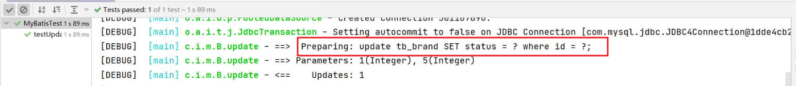

从结果中SQL语句可以看出，只修改了 `status`  字段值，因为我们给的数据中只给Brand实体对象的 `status` 属性设置值了。这就是 `set` 标签的作用。

### 2.4  批量删除


如上图所示，用户可以选择多条数据，然后点击上面的 `删除` 按钮，就会删除数据库中对应的多行数据。


#### 2.4.1  编写接口方法

在 `BrandMapper` 接口中定义删除多行数据的方法。

```java
/**
  * 批量删除
  */
void deleteByIds(int[] ids);
```

> 参数是一个数组，数组中存储的是多条数据的id

#### 2.4.2  编写SQL语句

在 `BrandMapper.xml` 映射配置文件中编写删除多条数据的 `statement`。

编写SQL时需要遍历数组来拼接SQL语句。Mybatis 提供了 `foreach` 标签供我们使用

**foreach 标签**

用来迭代任何可迭代的对象（如数组，集合）。

* collection 属性：
  * mybatis会将数组参数，封装为一个Map集合。
    * 默认：array = 数组
    * 使用@Param注解改变map集合的默认key的名称
* item 属性：本次迭代获取到的元素。
* separator 属性：集合项迭代之间的分隔符。`foreach` 标签不会错误地添加多余的分隔符。也就是最后一次迭代不会加分隔符。
* open 属性：该属性值是在拼接SQL语句之前拼接的语句，只会拼接一次
* close 属性：该属性值是在拼接SQL语句拼接后拼接的语句，只会拼接一次

```xml
<delete id="deleteByIds">
    delete from tb_brand where id in
    <foreach collection="array" item="id" separator="," open="(" close=")">
        #{id}
    </foreach>
</delete>
```

> 假如数组中的id数据是{1,2,3}，那么拼接后的sql语句就是：
>
> ```sql
> delete from tb_brand where id in (1,2,3);
> ```

#### 2.4.3  编写测试方法

在 `test/java` 下的 `com.itheima.mapper`  包下的 `MybatisTest类中` 定义测试方法

```java
@Test
public void testDeleteByIds() throws IOException {
       //1. 获取SqlSessionFactory
    String resource = "mybatis-config.xml";
    InputStream inputStream = Resources.getResourceAsStream(resource);
    SqlSessionFactory sqlSessionFactory = new SqlSessionFactoryBuilder().build(inputStream);
    //2. 获取SqlSession对象
    SqlSession sqlSession = sqlSessionFactory.openSession();
    //SqlSession sqlSession = sqlSessionFactory.openSession(true);
    //3. 获取Mapper接口的代理对象
    BrandMapper brandMapper = sqlSession.getMapper(BrandMapper.class);
    //4. 执行方法
    int[] ids = {5,7,8};
    brandMapper.deleteByIds(ids);
    //提交事务
    sqlSession.commit();
    //5. 释放资源
    sqlSession.close();
}
```

大家能够发现`<foreach collection="array" item="id" separator="," open="(" close=")">`中的`collection="array"`是mybatis内部默认针对数组参数设置的一个固定名称，我们可以使用@Param注解自己设置名称。

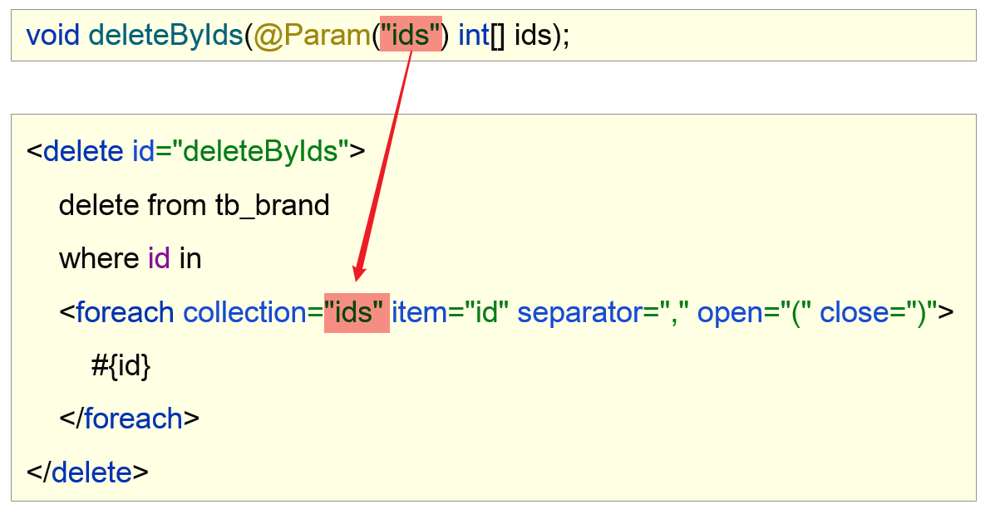

## 3 Mybatis源码分析

### 3.1 动态代理

动态代理：JDK的动态代理指的是在程序运行过程中给接口生成一个实现类对象(代理对象)。

具体做法：使用Proxy.newProxyInstance(...)方法动态生成并返回一个代理对象

语法：

```java
 //1 创建代理对象
/*
  ClassLoader loader,类加载器，用来生成代理对象的Class对象。
  Class<?>[] interfaces, 接口们的class对象
  InvocationHandler h:代理对象处理器，代理对象要做什么事就在这个处理器里面写代码
*/
ClassLoader loader=BrandMapper.class.getClassLoader(); //类加载器
//Class[] clazz=new Class[]{BrandMapper.class}; //接口们的class对象
BrandMapper obj = (BrandMapper) Proxy.newProxyInstance(loader, new Class[]{BrandMapper.class}, new InvocationHandler() {   
    /**     
    * 在invoke方法中处理代理逻辑   
    * @param proxy 代理对象   
    * @param method 调用代理对象的方法   
    * @param args 调用代理对象方法传递的参数   
    * @return     
    * @throws Throwable     
    */    
    @Override    
    public Object invoke(Object proxy, Method method, Object[] args) throws Throwable {
        //System.out.println(proxy);  //相当于调用了toString方法，此处打印会死循环
        System.out.println(method.getName());
        System.out.println(Arrays.toString(args));
	   
        if(method.getName().startsWith("select")){
            //如果是查询，就进行查询操作 
            System.out.println("查询操作");
        }else if (method.getName().startsWith("add")){
            //如果是新增，就进行新增操作  
            System.out.println("新增操作");
        }       
        //如果是修改，就进行修改操作        
        //如果是删除，就进行删除操作
        //如果是做查询，那么此处就返回查询结果，如果是做增删改，此处就返回影响的行数。
        return null;    
    }});
//2 使用代理对象调用方法
//obj.selectAll(); //看InvocationHandler的invoke方法打印结果
//obj.selectById(10); //看InvocationHandler的invoke方法打印结果
obj.add(new Brand()); //看InvocationHandler的invoke方法打印结果
```

### 3.2 getMapper方法底层源码

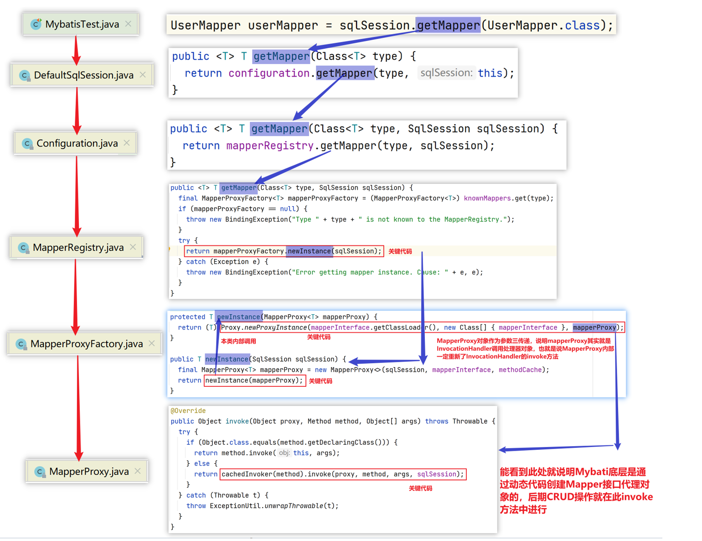

### 3.3 CRUD的底层操作

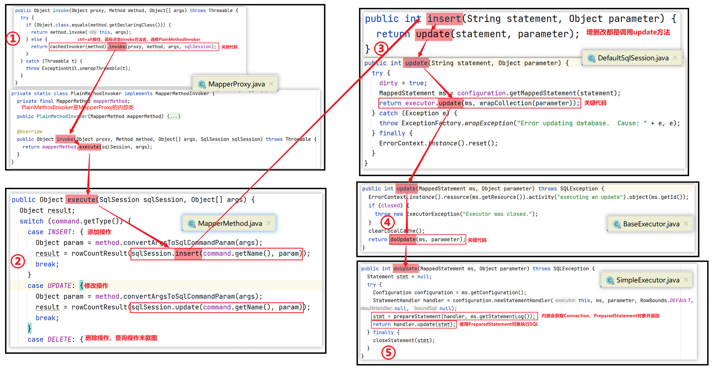

