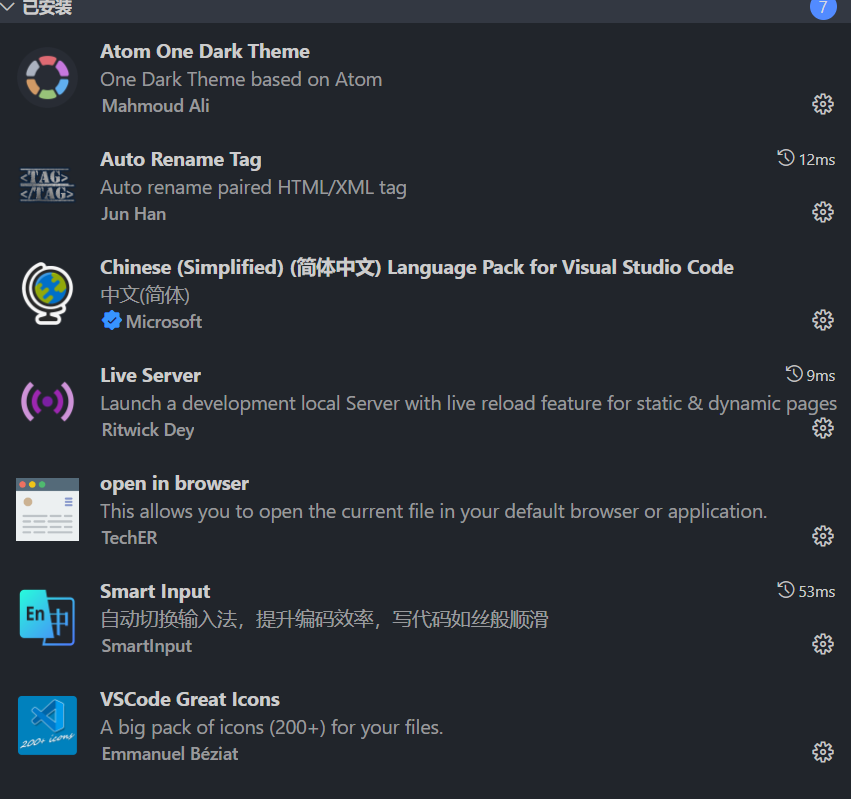
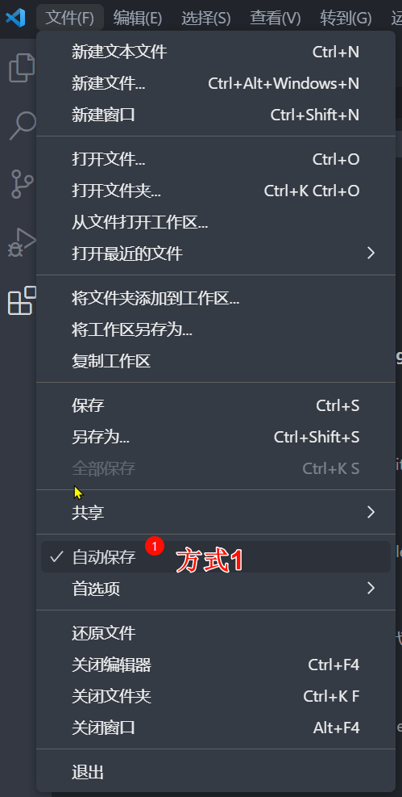
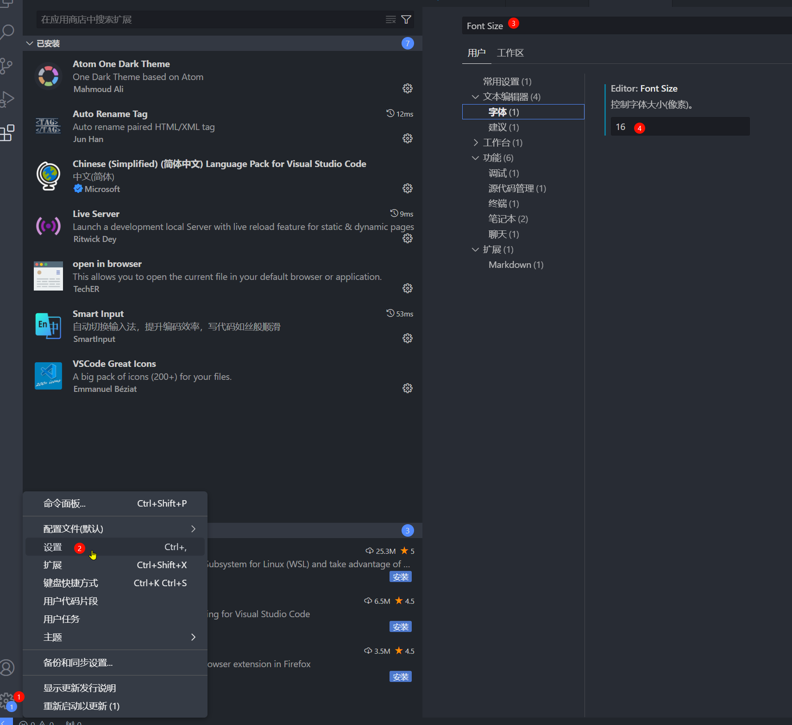
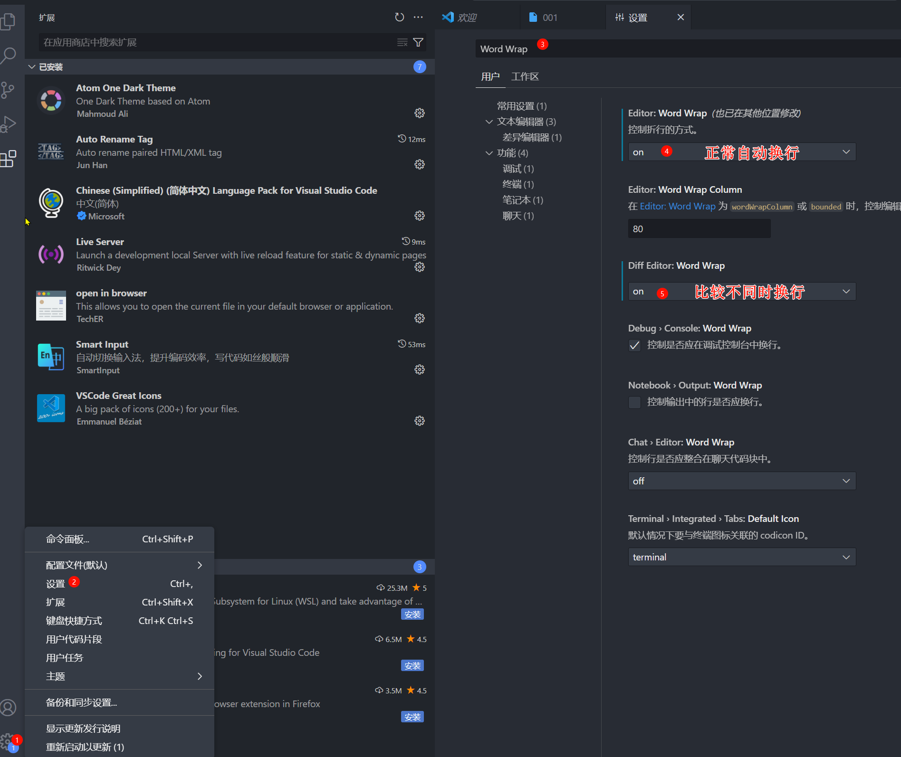
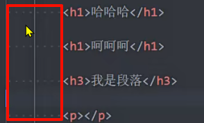
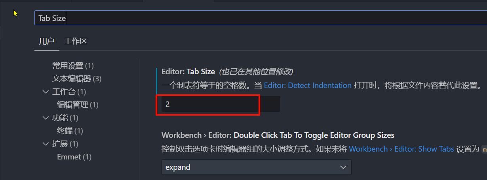

# VSCode工具 

## 1、VSCode编辑器下载-安装 

https://code.visualstudio.com/  

## 2、安装插件（增加功能）  

中文插件：Chinese

颜色主题：atom one dark

文件夹图标：VSCode Great Icons

在浏览器中打开网页：open in browser、Live Sever

自动重命名标签：auto rename tag

## 3、VSCode的配置  

Auto Save 自动保存  

Font Size 修改代码字体大小  

Word Wrap 代码自动换行  

Render Whitespace 空格的渲染方式，设置为all

Tab Size 代码缩进：推荐2个空格

## 4、VSCode的快捷键

|      快捷键      |       说明       |
| :--------------: | :--------------: |
|   ctrl + enter   | 自动切换到下一行 |
| ctrl + shift + f |    格式化代码    |
|                  |                  |
|                  |                  |
|                  |                  |
|                  |                  |
|                  |                  |
|                  |                  |
|                  |                  |

