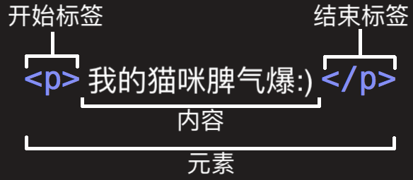

# 认识元素

我们会发现HTML本质上是由一系列的元素（Element）构成的；

## 1、什么是元素（Element）呢？

元素是网页的一部分；

一个元素可以包含一个数据项，或是一块文本，或是一张照片，亦或是什么也不包含；

那么HTML有哪些元素呢？

https://developer.mozilla.org/zh-CN/docs/Web/HTML/Element

我们会发现元素非常非常的多，这么多能记得住吗？

常用的，用的多自然就记住了；

不常用的，知道在哪里查找即可；  

## 2、元素的组成  

剖析一个HTML元素的组成：  

这个元素的主要部分有：  

1. 开始标签（Opening tag）：包含元素的名称（本例为 p），被左、右尖括号所包围。表示元素从这里开始或者开始起作用 ——在本例中即段落由此开始。
2. 结束标签（Closing tag）：与开始标签相似，只是其在元素名之前包含了一个斜杠。这表示着元素的结尾 —— 在本例中即段落在此结束。初学者常常会犯忘记包含结束标签的错误，这可能会产生一些奇怪的结果。
3. 内容（Content）：元素的内容，本例中就是所输入的文本本身。
4. 元素（Element）：开始标签、结束标签与内容相结合，便是一个完整的元素。

